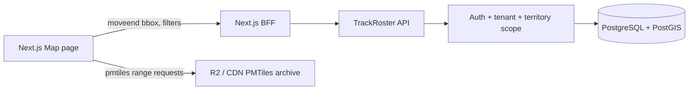

# TrackRoster Map and Location Audit

**Audit date:** 2026-09-29  
**Scope:** Existing repository only; no implementation changes are included in this audit.

## Current state

TrackRoster already has a real geospatial backend rather than a map-only prototype.
PostGIS is enabled by migration `0000_enable-postgis.sql`. Establishments retain
`latitude` and `longitude` as the writable/import representation and derive a
PostGIS `geometry(Point, 4326)` column named `location`. The establishment schema
has tenant, status, stage-related supporting indexes, and both geometry and
geography GiST indexes.

Territories are stored as validated `MultiPolygon` geometry in WGS84. Territory
assignments and explicit membership resource scopes already exist. The territory
service returns GeoJSON and filters it through the existing resource-scope
authorization predicate.

The API already exposes four authenticated, tenant-scoped map operations:

- `GET /prospects/map` — bounded viewport query with lifecycle/campaign/team/
  organization/territory/search filters, authorization, deduplicated points,
  deterministic server-side grid clustering, a 1,000-feature cap, and stage
  summaries.
- `GET /prospects/nearby` — PostGIS `ST_DWithin` search with a 50 km maximum,
  distance ordering, deduplication, and scoped cursors.
- `GET /map/heatmap` — activity/conversion grid aggregates based on authorized
  canonical actions.
- `GET /map/coverage` — authorized territory GeoJSON with prospect, assignment,
  contact, conversion, and coverage metrics.

The existing integration suite covers authentication, tenant isolation, scope
authorization, dateline-crossing viewports, boundary behavior, radius search,
clustering, lifecycle filters, aggregate redaction, and oversized-query limits.

The web application already includes MapLibre GL JS, `pmtiles`, a territory map
client, a nearby client, a map page, lifecycle legend, marker selection, and a
Near me button. The MapLibre component registers the PMTiles protocol dynamically
and creates a vector style from `NEXT_PUBLIC_PMTILES_URL`.

## Reusable components

- `apps/api/src/maps/map.service.ts` contains the protected spatial query layer.
- `apps/api/src/maps/map.controller.ts` contains the existing map contracts.
- `apps/api/src/maps/map.dto.ts` validates viewport, coordinates, radius, limits,
  filters, zoom, and activity windows.
- `apps/api/src/territories/territory.service.ts` provides authorized GeoJSON
  territory output and validated geometry writes.
- `apps/api/src/database/schema/establishments.ts` provides generated points and
  spatial indexes without duplicating coordinate storage.
- `apps/api/src/database/schema/resource-scopes.ts` and
  `apps/api/src/resource-scopes/resource-scope.service.ts` provide territory and
  campaign authorization.
- `apps/api/test/maps.integration.spec.ts` and
  `apps/api/test/geospatial.integration.spec.ts` are the foundation for additional
  PostGIS and cross-tenant tests.
- `apps/web/src/components/prospector/prospect-map.tsx` owns MapLibre setup,
  PMTiles protocol registration, territory rendering, marker rendering, and
  viewport visibility reporting.
- `apps/web/src/lib/ui/map-config.ts` centralizes the public archive URL and map
  defaults.
- The existing R2/S3 object-storage abstraction can host an immutable PMTiles
  archive, but it is currently used for generated artifacts and does not provide
  a map archive or CDN/range-serving configuration.

## Missing capability

1. The Map page (`apps/web/src/app/(app)/map/page.tsx`) loads up to 100 work-queue
   records and filters them in React. It does not call `/prospects/map`, so its
   data is not viewport-based and cannot scale to the intended thousands or
   millions of records.
2. The page search is client-side over the loaded work queue. It is not a backend
   map search and cannot search records outside that page.
3. The existing MapLibre component uses individual `Marker` objects. It does not
   consume the backend GeoJSON source or use MapLibre clustering/layers for the
   portfolio map.
4. Near me sends a browser coordinate to `/prospects/nearby`, but it does not
   center the MapLibre map, show a location indicator, or replace the viewport
   query with nearby map points.
5. Collision watch is visibly a placeholder. The page says recent collisions are
   not listed yet. Existing reservation/collision rules are implemented for
   prospect workflows, but there is no map-area collision-watch contract wired to
   this screen.
6. There is no `/map/territories` endpoint; the existing equivalent is
   `/territories/map`, which is reusable and already documented.
7. The product requirement for redacted unavailable markers is not implemented by
   the current map page. The backend currently returns only authorized map points,
   which is secure, but does not support a deliberate redacted-marker experience.
8. Geocoding status/provider/job workflow is not present in the establishment
   model. Coordinates are accepted as nullable imported/manual fields.

## Broken or incomplete capability

- `NEXT_PUBLIC_PMTILES_URL` is empty in `apps/web/.env.example` and no `.pmtiles`
  archive exists in the repository. There is no checked-in local map archive or
  local HTTP service configured to serve range requests.
- When the URL is missing or the archive cannot load, the UI exposes the technical
  variable name and HTTP-range instructions to users. Production should show a
  friendly outage/configuration state and send technical detail to logs.
- The PMTiles style uses remote Protomaps glyphs. This is separate from tile data,
  but it means a deployment with no outbound access will still have incomplete
  labels unless glyph assets are hosted or explicitly accepted as a dependency.
- No automated check verifies the configured archive supports `206 Partial
Content`, `Accept-Ranges: bytes`, CORS, content type, and immutable caching.
- The Map page's collision card is not backed by an API query.

## Security concerns

- The backend map queries correctly apply tenant and resource-scope predicates;
  frontend polygon checks must never become an authorization mechanism.
- Any future redacted-marker endpoint must avoid returning establishment names,
  contact details, reservation owners, notes, or pipeline data for unauthorized
  records.
- Search, viewport, nearby, and collision endpoints must keep tenant context and
  restricted-role/RLS behavior. Existing map tests cover application-level tenant
  isolation; restricted-role coverage should be rerun when map wiring changes.
- Bounding boxes and radius are validated, but request rate limiting and query
  latency metrics for map endpoints are not evident in the map feature itself.
- Exact browser coordinates are currently used for the nearby request and not
  persisted, which is the appropriate privacy default. Logging must continue to
  omit raw GPS coordinates.
- Marker/detail navigation must independently authorize the prospect detail route;
  the map response cannot grant access by itself.

## Recommended changes

### Backend

1. Keep the existing four map contracts and make `/prospects/map` the portfolio
   page's source. Add a lightweight typed client contract if the web package lacks
   one.
2. Add a map collision-watch read contract that returns only authorized,
   privacy-safe recent reservation signals. Reuse reservation/collision semantics
   and configuration; do not invent a second reservation system.
3. Add structured map query timing/result metrics without logging exact device
   coordinates.
4. Add PostGIS integration cases for boundary points, multiple assigned
   territories, tenant separation, unauthorized detail access, and collision
   redaction under the restricted runtime role.

### Frontend

1. Replace the work-queue fetch in the Map page with debounced, abortable
   `/prospects/map` viewport requests on `moveend`.
2. Render backend GeoJSON through MapLibre sources/layers with clustering and
   stage-colored layers; retain React for the details panel, not one DOM marker per
   prospect.
3. Make Near me center the map and show a temporary user-location indicator. Keep
   permission requests behind the button and handle denied, unavailable, timeout,
   and unsupported states.
4. Wire the collision-watch card to its backend contract and distinguish no
   collisions from an unavailable service.
5. Replace raw `NEXT_PUBLIC_PMTILES_URL` text in production-facing notices with a
   user-safe message while preserving diagnostics in logging.

### Database

No duplicate location or territory model is required. Preserve the existing
generated point and geometry columns. Add migrations only for collision-watch
read materialization/indexes or geocoding status if implementation proves they
are needed. Continue using the migration framework; do not apply manual SQL.

### Infrastructure

- Development needs a small local PMTiles archive and an HTTP server that supports
  range requests, CORS, correct content type, and immutable cache headers.
- Production should publish a regional `.pmtiles` archive to R2 behind a public
  read-only custom domain/CDN. The browser must receive `206` range responses and
  `Accept-Ranges: bytes`; the archive should not be proxied through the API.
- The R2 bucket must not contain secrets and should use a dedicated public map
  object path separate from private tenant artifacts.
- Add a deployment smoke check for the archive URL and range behavior.

## Proposed target architecture

The browser receives only lightweight authorized map data from the API. Static
basemap requests go directly to the archive/CDN.

## Ticket backlog

1. **TR-MAP-001 Audit** — this document; complete.
2. **TR-MAP-002 PMTiles configuration** — add local range-serving setup, verify
   headers, document the production R2/CDN contract, and remove raw technical UI
   messaging.
3. **TR-MAP-003 Map API web contract** — add typed `/prospects/map`, viewport,
   GeoJSON, and cancellation clients.
4. **TR-MAP-004 Viewport map integration** — use `moveend`, debounce/cancel
   requests, render GeoJSON sources, and add clustering/stage layers.
5. **TR-MAP-005 Near me** — center the map, show location state, and reuse the
   authorized nearby query.
6. **TR-MAP-006 Collision watch** — define the privacy-safe endpoint from existing
   reservation semantics and wire the panel.
7. **TR-MAP-007 Security and scale certification** — restricted-role PostGIS tests,
   API abuse/rate-limit checks, performance evidence, and E2E map flow.
8. **TR-MAP-008 Geocoding** — only after product requirements confirm that imported
   address records need asynchronous coordinate acquisition.

## Recommended first ticket

Implement **TR-MAP-002 PMTiles configuration** first. The existing MapLibre
protocol integration is reusable, but the repository has no archive, no local
range-serving path, no production header verification, and the current UI exposes
technical configuration text. Fixing those root causes makes the basemap reliable
before changing the data flow or adding more map behavior.

Per the implementation brief, work should pause here for approval before starting
TR-MAP-002.
