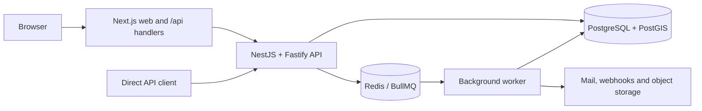

# TrackRoster codebase and API catalog

Implementation snapshot: 2026-09-29, including the integrated `main` baseline.

For development, data, and certification status, see [Current development status](../CURRENT_STATUS.md).

The application registers **389 backend method/path pairs in 90 controllers**, and the web app defines **185 browser API handlers**. Backend version aliases are not counted twice. The browser's dynamic override-decision handler accepts three decision values. These are separate API surfaces on separate application origins.

## Read the reference

| Document                                        | Contents                                                                                                        |
| ----------------------------------------------- | --------------------------------------------------------------------------------------------------------------- |
| [Backend endpoints](API_ENDPOINTS.md)           | Every implemented endpoint, path/query/body inputs, guards, headers, success status and expanded response shape |
| [Accepted request data](API_REQUEST_SCHEMAS.md) | 186 request classes/interfaces, fields, optionality, defaults, validation, nested objects and enum constraints  |
| [Browser endpoints](WEB_API_ENDPOINTS.md)       | Every Next.js API handler, its upstream route, browser query allowlist, accepted body and returned response     |

## How the codebase works

TrackRoster coordinates prospecting work across tenants, organizations, teams and campaigns. A canonical prospect is stored as an establishment. Enrolling it into a campaign creates a separate campaign-prospect record; an assignment owns that work, and a reservation temporarily claims the right to act. Collision checks, consent and cooling-off rules decide whether contact is allowed. Actions and follow-ups record the resulting work, and audit/history tables preserve changes.



| Area        | Actual responsibilities                                                                                                                                | Entry points                                                                                                                                            |
| ----------- | ------------------------------------------------------------------------------------------------------------------------------------------------------ | ------------------------------------------------------------------------------------------------------------------------------------------------------- |
| apps/web    | Next.js/React UI and server-side browser API proxies; stores access/refresh tokens in HttpOnly cookies                                                 | [Login route](../../apps/web/src/app/api/auth/login/route.ts#L1), [Authenticated proxy](../../apps/web/src/lib/server/authenticated-backend-json.ts#L1) |
| apps/api    | NestJS/Fastify modular monolith; controllers → DTO validation → guards/services → repositories/Drizzle/PostgreSQL                                      | [Bootstrap](../../apps/api/src/main.ts#L1), [Module registration](../../apps/api/src/app.module.ts#L1)                                                  |
| Database    | Drizzle schema and migrations; authenticated requests run in tenant-scoped transactions                                                                | [Schema](../../apps/api/src/database/schema/index.ts#L1), [Tenant transaction](../../apps/api/src/database/tenant-transaction.interceptor.ts#L1)        |
| apps/worker | BullMQ jobs for follow-up reminders, reservation expiry, webhook delivery, scheduled reports and compliance artifacts; no HTTP controller surface      | [Dispatcher](../../apps/worker/src/jobs/job-dispatcher.service.ts#L1)                                                                                   |
| packages    | Shared job contracts and compiler configuration; types, validation and UI packages currently have package manifests but no listed implementation files | [Job contracts](../../packages/jobs/src/index.ts#L1)                                                                                                    |

### Two different prospect IDs

- `/prospects/:prospectId` uses the canonical establishment ID.
- `/campaigns/:campaignId/prospects/:prospectId/...` and `/work-queue/:campaignId/:prospectId/...` use the campaign-prospect ID.
- Request fields named `campaignProspectId` explicitly use that campaign enrollment ID. Request fields named `establishmentId` use the canonical ID.

## Calling the APIs

The backend defaults to port **3001**. Each listed backend path is available unprefixed and under **/api/v1**; for example, `GET /prospects` and `GET /api/v1/prospects`. This is URI versioning, not a universal `/api` prefix. The Next.js app has its own `/api/...` routes. Its upstream URL is `TRACKROSTER_API_URL`, defaulting to `http://127.0.0.1:3001` outside production. [HTTP configuration](../../apps/api/src/config/http-application.ts#L1), [Web upstream configuration](../../apps/web/src/lib/server/backend-config.ts#L1).

For protected backend routes send `Authorization: Bearer <accessToken>`. Tenant and actor context come from the verified session; authentication also enforces permissions and resource scopes. An AuthGuard alone does not mean every tenant member is authorized. Public/challenge-based routes are marked by their actual guard configuration in the endpoint reference.

JSON bodies use `Content-Type: application/json`. The global validation pipe transforms DTO input and rejects non-whitelisted fields on validated DTOs. Primitive query arguments, interfaces and raw Record objects do not provide the same class-validator guarantees. Query values arrive as strings; explicit `Type`/`Transform` decorators are listed in the request reference. [Authentication and permissions](../../apps/api/src/auth/auth.guard.ts#L1).

### Headers and concurrency

| Header               | When/how to use it                                                                                                                                                            |
| -------------------- | ----------------------------------------------------------------------------------------------------------------------------------------------------------------------------- |
| Authorization        | Required where AuthGuard is listed. Bearer access token on the backend; browser handlers generally use session cookies.                                                       |
| Idempotency-Key      | Required on routes decorated Idempotent unless explicitly optional. 1–128 characters matching `[A-Za-z0-9._:-]`. Reuse for the same logical operation, not a changed payload. |
| Idempotency-Replayed | Backend response header indicates whether a saved successful response was replayed.                                                                                           |
| If-Match             | Optional on the listed conditional writes. Supply the previous ETag to detect stale updates. Missing or `*` skips the version comparison. A mismatch returns 412.             |
| ETag                 | Returned by ResourceETagInterceptor; some endpoints instead/additionally include an `etag` property in JSON. Browser forwarding varies by handler.                            |

[Idempotency constants](../../apps/api/src/idempotency/idempotency.constants.ts#L1), [Idempotency behavior](../../apps/api/src/idempotency/idempotency.interceptor.ts#L1), [Conditional writes](../../apps/api/src/http/resource-etag.ts#L1).

### Response notation

The endpoint files show **TypeScript-style JSON shapes**, not literal example payloads. `string`, `number`, `boolean`, unions and arrays describe the accepted/returned values; `?` means a field may be absent, `null` is an actual JSON null, and `undefined` properties are omitted during JSON serialization. Database Date values are represented as ISO 8601 strings. A top-level inferred `undefined` means the source does not guarantee a response object. A 204 response has no body.

Success responses are not wrapped in one global envelope: some lists return arrays, some return `{items}`, and others return `{items,nextCursor}`. Default limits and cursor formats are endpoint-specific. Shared service return types can include multiple variants; operation-specific behavior is described where verified. Arbitrary JSON and untyped SQL fragments remain `unknown` where the code does not define a fixed shape.

### Error response

```ts
type ApiError = {
  statusCode: number;
  code: string;
  message: string | string[];
  error: string;
  requestId: string;
};
```

Typical statuses: **400** validation/request error, **401** missing/expired authentication, **403** insufficient permission, **404** missing or inaccessible resource, **409** business/idempotency conflict, **412** stale resource version, **413** oversized upload, **429** rate limit, **500** unexpected failure and **503** unavailable dependency. The exact status/code depends on the operation. Browser proxies also emit **502 UPSTREAM_REQUEST_FAILED**, and locally produced browser errors may omit requestId.

The backend exception filter preserves only statusCode, code, message, error and requestId. Additional fields in a thrown exception, such as currentETag or dependencies, are not automatically returned. [Backend error filter](../../apps/api/src/errors/api-exception.filter.ts#L1), [Browser errors](../../apps/web/src/lib/server/api-error-response.ts#L1).

## Examples

### Login directly to the backend

```http
POST /api/v1/auth/login
Content-Type: application/json

{"email":"person@example.com","password":"your-password"}
```

HTTP 200 returns one of four shapes: an access/refresh token pair; a workspace selection challenge; an MFA challenge; or required MFA enrollment. The complete union is in [POST /auth/login](API_ENDPOINTS.md#post-auth-login). A browser call to `POST /api/auth/login` instead sets HttpOnly cookies on success and returns `{next:"authenticated"}`, or a next-step challenge.

### List prospects

```http
GET /api/v1/prospects?status=active&search=clinic&limit=25
Authorization: Bearer <accessToken>

HTTP/1.1 200 OK
Content-Type: application/json

{"items":[],"nextCursor":null}
```

Each nonempty item contains the establishment identity, address/contact details, category, source, status and timestamps; see [GET /prospects](API_ENDPOINTS.md#get-prospects).

### Create a planned action

```http
POST /api/v1/actions
Authorization: Bearer <accessToken>
Content-Type: application/json
Idempotency-Key: action-create-001

{
  "campaignId":"11111111-1111-4111-8111-111111111111",
  "campaignProspectId":"22222222-2222-4222-8222-222222222222",
  "type":"call",
  "subject":"Initial contact"
}
```

The IDs must refer to accessible records with the required assignment/participation. HTTP 201 returns the action and an `etag`; it does not mean contact has started. Start/complete are separate endpoints with reservation and business checks. See [POST /actions](API_ENDPOINTS.md#post-actions).

## CSV imports

`POST /imports/preview` and `POST /imports/execute` take one multipart field named `file`, a .csv filename, maximum 5 MiB, maximum 10,000 rows. Required columns are `name` and `country_code`. Supported headers are:

```text
external_reference,name,address_line1,postal_code,city,country_code,phone,website,
latitude,longitude,contact_name,contact_job_title,contact_email,contact_phone,is_primary,category
```

The staged workflow is separate: create an import job, upload its file, set mapping, validate, resolve issues and commit. [CSV limits and headers](../../apps/api/src/imports/import-preview.constants.ts#L1), [Import job endpoints](API_ENDPOINTS.md#data-jobs).

## Domain index

| Domain                                                                | Backend endpoints | Purpose                                                                                                 |
| --------------------------------------------------------------------- | ----------------: | ------------------------------------------------------------------------------------------------------- |
| [account](API_ENDPOINTS.md#account)                                   |                10 | Current profile, preferences, workspace memberships and session management.                             |
| [actions](API_ENDPOINTS.md#actions)                                   |                10 | Plan, start, complete, cancel and correct prospecting actions; unified prospect history.                |
| [activities](API_ENDPOINTS.md#activities)                             |                 2 | Append campaign-scoped activities and read their timeline.                                              |
| [assignments](API_ENDPOINTS.md#assignments)                           |                21 | Assign campaign prospects, preview/apply bulk allocation, manage rules, reassign and end ownership.     |
| [audit](API_ENDPOINTS.md#audit)                                       |                18 | Audit events, security and data-change history, access history and evidence exports.                    |
| [auth](API_ENDPOINTS.md#auth)                                         |                17 | Password login, MFA, tenant selection, token rotation, logout, password recovery and SSO provider flow. |
| [authorization](API_ENDPOINTS.md#authorization)                       |                 4 | Access grants and the signed-in user’s effective grants.                                                |
| [campaign-organizations](API_ENDPOINTS.md#campaign-organizations)     |                 4 | Attach organizations to a campaign and configure participation/collision policy.                        |
| [campaigns](API_ENDPOINTS.md#campaigns)                               |                12 | Campaign lifecycle and enrollment of establishments as campaign prospects.                              |
| [collisions](API_ENDPOINTS.md#collisions)                             |                11 | Preflight collision checks, collision events, override requests and manager decisions.                  |
| [communications](API_ENDPOINTS.md#communications)                     |                 7 | Notification preferences, devices and broadcast announcements.                                          |
| [compliance](API_ENDPOINTS.md#compliance)                             |                10 | Retention policy, privacy requests, consent evidence and access reviews.                                |
| [consents](API_ENDPOINTS.md#consents)                                 |                 2 | Read and record consent or contact opposition for a prospect.                                           |
| [data-jobs](API_ENDPOINTS.md#data-jobs)                               |                20 | Staged import jobs and asynchronous export jobs, files, status and audit.                               |
| [establishment-contacts](API_ENDPOINTS.md#establishment-contacts)     |                 4 | Legacy establishment contact creation, reading and updates.                                             |
| [establishments](API_ENDPOINTS.md#establishments)                     |                 5 | Legacy establishment CRUD and nearby search.                                                            |
| [exports](API_ENDPOINTS.md#exports)                                   |                 3 | Synchronous controlled CSV/XLSX exports of assignments, activities and follow-ups.                      |
| [follow-ups](API_ENDPOINTS.md#follow-ups)                             |                10 | Work queue, campaign-scoped follow-up creation, rescheduling and completion/cancellation.               |
| [geographic-allocation](API_ENDPOINTS.md#geographic-allocation)       |                 2 | Preview and apply campaign allocation by geographic rules.                                              |
| [health](API_ENDPOINTS.md#health)                                     |                 3 | Liveness and PostgreSQL/Redis readiness.                                                                |
| [imports](API_ENDPOINTS.md#imports)                                   |                 2 | Immediate CSV preview and execution.                                                                    |
| [integrations](API_ENDPOINTS.md#integrations)                         |                20 | External providers, API clients, webhooks, deliveries and retries.                                      |
| [maps](API_ENDPOINTS.md#maps)                                         |                 4 | Prospect map/nearby search, activity heatmap and territory coverage.                                    |
| [memberships](API_ENDPOINTS.md#memberships)                           |                10 | Tenant membership lifecycle, resource scopes and access history.                                        |
| [messaging](API_ENDPOINTS.md#messaging)                               |                13 | Conversations, participants, messages, read markers and muting.                                         |
| [notifications](API_ENDPOINTS.md#notifications)                       |                 5 | Notification inbox, unread count and marking notifications read.                                        |
| [objectives](API_ENDPOINTS.md#objectives)                             |                 5 | Operational targets, progress, risk and updates.                                                        |
| [organization-structure](API_ENDPOINTS.md#organization-structure)     |                 7 | Organization relationships and dated team memberships.                                                  |
| [outcome-settings](API_ENDPOINTS.md#outcome-settings)                 |                 2 | Configure action outcome/status policy.                                                                 |
| [participation](API_ENDPOINTS.md#participation)                       |                 8 | Campaign roster and territory assignments.                                                              |
| [permissions](API_ENDPOINTS.md#permissions)                           |                 4 | Permission catalogue, role permissions and role configuration.                                          |
| [prospect-enrichment](API_ENDPOINTS.md#prospect-enrichment)           |                15 | Tags, custom fields, duplicate review, merging and data-quality overview.                               |
| [prospect-master](API_ENDPOINTS.md#prospect-master)                   |                15 | Canonical prospect/establishment directory, addresses and contacts.                                     |
| [prospector-today](API_ENDPOINTS.md#prospector-today)                 |                 1 | Today’s prioritized work, overdue items, meetings and summary counts.                                   |
| [regions](API_ENDPOINTS.md#regions)                                   |                 5 | Hierarchical geographic regions.                                                                        |
| [reporting](API_ENDPOINTS.md#reporting)                               |                18 | Manager/director/admin dashboards and operational report endpoints.                                     |
| [reservations](API_ENDPOINTS.md#reservations)                         |                14 | Reservation rules, claims, heartbeat, extension and release.                                            |
| [routes](API_ENDPOINTS.md#routes)                                     |                12 | Field routes, stops, ordering, optimization and completion.                                             |
| [saved-views](API_ENDPOINTS.md#saved-views)                           |                 4 | Saved filters, sorting and visible columns.                                                             |
| [scheduled-reports](API_ENDPOINTS.md#scheduled-reports)               |                 5 | Report schedules and delivery history.                                                                  |
| [search](API_ENDPOINTS.md#search)                                     |                 2 | Cross-resource search and facets.                                                                       |
| [security-administration](API_ENDPOINTS.md#security-administration)   |                 6 | Invitations and tenant security/SSO policy.                                                             |
| [tenants](API_ENDPOINTS.md#tenants)                                   |                 9 | Platform administration of tenants, configuration, users and platform grants.                           |
| [territories](API_ENDPOINTS.md#territories)                           |                 9 | Territory CRUD, map geometry and campaign territory links.                                              |
| [user-management](API_ENDPOINTS.md#user-management)                   |                 3 | Legacy tenant user list, creation and status changes.                                                   |
| [work-queue](API_ENDPOINTS.md#work-queue)                             |                 3 | Prospector team/campaign options, assigned work and campaign-prospect detail.                           |
| [workspace-administration](API_ENDPOINTS.md#workspace-administration) |                13 | Organizations, teams, capacities and skill settings.                                                    |

## Verification and limits

The route inventory was extracted from controller decorators and checked against the module graph reachable from AppModule: all 389 discovered backend endpoints are registered. The 185 browser handlers were enumerated from app/api/**/route.ts. Request classes, inherited fields, validation decorators and response types were resolved using the installed TypeScript compiler. Source return expressions were inspected for the services annotated Promise<any>. Backend production-source semantic diagnostics were empty during extraction.

This is source analysis, not a live server test. No database writes, external requests, migrations or application-code changes were needed. The catalog includes configured/conditional capabilities, and does not imply every provider or production deployment is operational. The older [API_SPEC.md](API_SPEC.md) includes design-era routes such as /imports/:importId/finalize, POST /follow-ups and /overrides; use this implementation catalog for the routes actually present.
