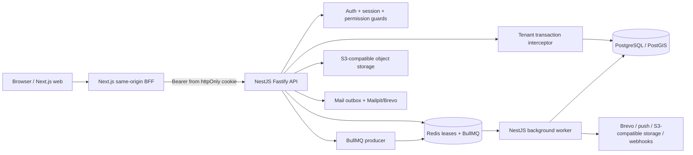

# TrackRoster production-readiness audit

**Audit date:** 2026-10-08  
**Repository:** `/Users/zainsubhani/Intertrad/TrackRoster`  
**Revision audited:** `350bd93` (`main`, same as `origin/main`)  
**Mode:** evidence-only review; application source, infrastructure, database data, dependencies, and deployment were not changed.

## Decision

**Production release: NO-GO. Staging/integration development: GO WITH EXPLICIT LIMITS.**

The repository is a substantial API-first product with a Next.js web client, NestJS API, BullMQ worker, PostgreSQL/PostGIS, Redis, object-storage and email adapters. The current local code-quality evidence is strong: API unit tests, worker unit tests, web tests, lint, formatting, migration integrity, package typechecks, API/worker builds, and a webpack production build all passed during this audit. That is not enough to certify the deployed system.

The release is blocked by environment-dependent evidence and a small number of verified implementation gaps. The highest-risk gaps are:

1. `TENANT_RLS_MODE` is validated but never consumed, so `enforce` is not an actual runtime gate and the API does not reject an owner/BYPASSRLS database connection.
2. Webhook test deliveries are inserted as `queued` database rows, but no producer call enqueues `webhook.delivery`; the worker has a consumer with no observed producer path.
3. The webhook worker signs with the stored `secret_hash` while the API returns the original raw secret once. No contract says consumers should hash the secret, so signature interoperability is unproven and likely incorrect.
4. Provider integration `test` and `sync` endpoints return stored rows instead of testing or synchronizing a provider. The UI exposes these operations through the workspace operation registry.
5. Production backup scheduling, encrypted off-account retention, second-database restore, RPO/RTO, provider delivery, observability, and deployment-environment RLS/ACL evidence are not present in the repository or were not reachable from this audit environment.

No production data, credentials, or Supabase resources were accessed. No push, merge, deployment, migration, dependency installation, or destructive database operation was performed.

## 1. Scope, evidence, and status vocabulary

The review covers repository architecture, API and worker behavior, authentication and authorization, tenant isolation, data and migration controls, frontend integration patterns, test strategy, CI/CD, backup/recovery, operational readiness, product workflow coverage, and a safe AI feasibility proposal.

Findings use the following statuses:

| Status                 | Meaning                                                                                                             |
| ---------------------- | ------------------------------------------------------------------------------------------------------------------- |
| **VERIFIED**           | Directly supported by current source or a test/check run in this audit.                                             |
| **PARTIALLY VERIFIED** | Some implementation/evidence exists, but a material boundary or environment check is missing.                       |
| **NOT IMPLEMENTED**    | The repository exposes a contract or product surface without the required behavior.                                 |
| **BLOCKED**            | A meaningful verification could not run because required external state, credentials, or services were unavailable. |
| **NOT ASSESSED**       | The audit did not claim the check; no conclusion about runtime behavior is made.                                    |

Evidence is classified as **current** when inspected or executed against revision `350bd93`; dated documents are cited as historical evidence only. Historical reports contain conflicting counts and release statements, so source code and current checks take precedence.

## 2. System inventory and actual architecture

### Repository inventory

| Area                       | Current count/evidence                                                                                                              |
| -------------------------- | ----------------------------------------------------------------------------------------------------------------------------------- |
| Web route pages            | 85 `page.tsx` files                                                                                                                 |
| Next.js BFF route handlers | 165 `apps/web/src/app/api/**/route.ts` files                                                                                        |
| Nest API controllers       | 64 controller files; 343 direct HTTP decorator occurrences                                                                          |
| API modules                | 68 module files                                                                                                                     |
| Database migrations        | 90 SQL migrations; integrity check passed with 90 contiguous journal entries                                                        |
| API tests                  | 154 spec/test files; current API unit run: 232 files, 1,738 tests passed (the config includes source and test suites)               |
| Worker tests               | 17 source unit spec files plus 4 integration files; current worker unit run: 17 files, 80 tests passed                              |
| Web tests                  | 258 spec/test files; current web run: 94 files, 753 tests passed                                                                    |
| CI                         | GitHub Actions quality job with install, migration integrity, migrations, lint, format, typecheck, tests, API integration, build    |
| Local services             | PostgreSQL/PostGIS, Redis, MinIO, Mailpit in Docker Compose; Compose is development-only and does not run web/API/worker containers |

### Actual runtime flow



The intended architecture in `docs/architecture/SYSTEM_ARCHITECTURE.md` matches this shape: a modular API-first monolith with a separate worker and external providers. The document is a proposed architecture, not a deployment certification.

### Tenant and data boundary

The API uses a request-scoped transaction interceptor to set `trackroster.tenant_id`; worker jobs carry a tenant ID and use a worker tenant transaction helper. Migrations `0070`, `0071`, `0073`, and later table-specific migrations create/force RLS policies. `trackroster_app` is provisioned as a non-owner runtime role. The code is designed for defense in depth, but the live database role, policies, and connection mode were not verified in this environment.

## 3. Product and UX workflow review

### Role and assignment workflow

The product model is coherent: client administrators manage tenant configuration, managers own team scope, prospectors work assigned prospects, directors read authorized organization scope, observers/auditors are read-only, and platform support is separate from tenant roles. The API contains assignment lifecycle, batch assignment, reassignment, deadline fields, team/campaign/territory scope checks, follow-ups, collisions, override requests, action history, and manager dashboard routes.

| Product capability                                                      | Status                 | Evidence and limitation                                                                                                                                                                                             |
| ----------------------------------------------------------------------- | ---------------------- | ------------------------------------------------------------------------------------------------------------------------------------------------------------------------------------------------------------------- |
| Admin assigns a prospect to a team/manager                              | **PARTIALLY VERIFIED** | Assignment controllers/services, manager pages, and authorization guards exist. No authenticated browser acceptance was run in this audit.                                                                          |
| Manager sees team-owned prospects and can work or reassign within scope | **PARTIALLY VERIFIED** | Manager work queue, assignment and follow-up routes exist; the six-role scope matrix is not currently re-run here.                                                                                                  |
| Prospector sees assigned portfolio and deadline/follow-up state         | **PARTIALLY VERIFIED** | `/work-queue`, `/prospector/today`, follow-up APIs, and deadline fields exist. Live role data was not accessed.                                                                                                     |
| Assigned-to visibility in prospect detail/table                         | **PARTIALLY VERIFIED** | Assignment and prospect APIs expose owner fields and the web has assignment views. A live admin table verification was not run.                                                                                     |
| Map dot opens only the selected prospect                                | **PARTIALLY VERIFIED** | Map and nearby routes exist with scoped reads; authenticated map interaction was not tested in this audit.                                                                                                          |
| Dark mode and responsive layout                                         | **PARTIALLY VERIFIED** | Shared theme and responsive CSS exist; one unauthenticated desktop login smoke check showed no horizontal overflow and no console errors. Mobile, tablet, and authenticated role screens were not assessed here.    |
| Language switching                                                      | **PARTIALLY VERIFIED** | The web has an i18n context/dictionary and French/English keys. End-to-end persistence and all role pages were not verified.                                                                                        |
| Invitation link                                                         | **PARTIALLY VERIFIED** | Invitation tokens are single-use, seven-day, fragment-delivered, and accepted by a dedicated page. The link origin is environment-configured; a production value of `localhost` would produce unusable email links. |
| Follow-up manager review/overdue queue                                  | **PARTIALLY VERIFIED** | API, worker reminder, review, and manager pages exist. The current local integration run could not reach required PostgreSQL/Redis/Supabase services.                                                               |

### UX and product risks

- The code contains a `feature-readiness` registry that intentionally labels all major write families `STAGING_ONLY` and scheduled/provider/webhook families `BLOCKED`. This is a useful honesty control, but it is mirrored from a dated 2026-09-24 audit and should be regenerated from current evidence.
- The product dossier and release-gate documents still require a signed six-role browser matrix, dashboard dimension acceptance, export artifact acceptance, import-quality acceptance, backup restore, and pilot metrics. Those are product-release gates, not merely visual polish.
- The browser acceptance evidence required by the dossier is not represented as a repeatable Playwright/Cypress job in CI. Manual evidence in historical documents must not be treated as a current automated gate.

## 4. Engineering and code-quality assessment

### Current checks executed

| Check                    | Result                                                                                                                                         |
| ------------------------ | ---------------------------------------------------------------------------------------------------------------------------------------------- |
| Migration integrity      | **PASS** — 90 journal entries, SQL files, and snapshots form one contiguous chain                                                              |
| ESLint                   | **PASS** — direct local ESLint invocation returned exit 0                                                                                      |
| Prettier check           | **PASS** — all files matched                                                                                                                   |
| API TypeScript           | **PASS** — `tsc -p apps/api/tsconfig.json --noEmit`                                                                                            |
| Worker TypeScript        | **PASS** — `tsc -p apps/worker/tsconfig.json --noEmit`                                                                                         |
| Web TypeScript           | **PASS** — `tsc -p apps/web/tsconfig.json --noEmit`                                                                                            |
| Package TypeScript       | **PASS** — jobs package check                                                                                                                  |
| API unit tests           | **PASS** — 232 files / 1,738 tests                                                                                                             |
| Worker unit tests        | **PASS** — 17 files / 80 tests                                                                                                                 |
| Web unit/component tests | **PASS** — 94 files / 753 tests                                                                                                                |
| API build                | **PASS** — Nest build                                                                                                                          |
| Worker build             | **PASS** — `tsc -p tsconfig.build.json`                                                                                                        |
| Web production build     | **PASS** with `next build --webpack`, 85 static/dynamic page routes generated                                                                  |
| Default Turbopack build  | **BLOCKED** by sandbox `Operation not permitted` while Turbopack attempted to bind a process/port for CSS processing; the webpack build passed |
| Root `pnpm` wrapper      | **BLOCKED** in this shell because the Corepack/pnpm shim hung before printing its version; direct installed binaries were used instead         |

The working tree was clean after checks. Generated build output did not remain as a tracked change.

### Code strengths

- DTO validation is globally configured with whitelist, forbidden unknown properties, and transformation.
- JWT verification pins algorithm, issuer, audience, key ID, token version, and token type. Refresh tokens are hashed and rotated; reuse revokes the session.
- Password verification uses Argon2id and a dummy hash for unknown-account timing equalization.
- The web BFF keeps access/refresh tokens in httpOnly cookies and forwards bearer tokens server-side.
- Mutating BFF requests enforce same-origin/cross-site checks, cap JSON body size at 1 MiB, and match only reviewed operation paths.
- Tenant transaction context and worker tenant context are explicit, and idempotency/queue abstractions are present.
- Worker shutdown drains BullMQ jobs with a bounded timeout.

## 5. Security, privacy, and compliance findings

| ID      | Severity | Status                 | Finding and evidence                                                                                                                                                                                                                                                                           | Impact                                                                                                                                                   | Recommendation                                                                                                                                                                                                                |
| ------- | -------- | ---------------------- | ---------------------------------------------------------------------------------------------------------------------------------------------------------------------------------------------------------------------------------------------------------------------------------------------- | -------------------------------------------------------------------------------------------------------------------------------------------------------- | ----------------------------------------------------------------------------------------------------------------------------------------------------------------------------------------------------------------------------- |
| SEC-001 | Critical | **VERIFIED**           | `TENANT_RLS_MODE` is parsed in `environment.validation.ts` but no source reads the value after validation. The default is `disabled`; `enforce` is accepted but has no runtime effect. `DATABASE_URL` is only checked for presence, not for the restricted role or a non-BYPASSRLS connection. | A deployment can claim “enforce” while relying on query predicates or an accidentally privileged connection. This is a tenant-isolation release blocker. | Make the mode an actual startup/runtime guard. In production require `enforce`, verify the connected role is not owner/SUPERUSER/BYPASSRLS, and fail closed if the check cannot be proved. Add a deployment-environment test. |
| SEC-002 | High     | **PARTIALLY VERIFIED** | RLS/force-RLS migrations and a restricted runtime role exist, but the live Supabase/PostgreSQL role, grants, force flags, and cross-tenant behavior were not reachable. Existing historical docs explicitly keep production certification open.                                                | Tenant isolation remains uncertified for the actual deployment.                                                                                          | Run the six-role cross-tenant read/write matrix against the deployment database using the runtime role and retain catalog/grant evidence.                                                                                     |
| SEC-003 | High     | **PARTIALLY VERIFIED** | `AUTH_PUBLIC_ORIGIN` accepts `http://` or `https://` in `AuthMailService`; production does not require HTTPS or reject localhost. `.env.example` uses `http://localhost:3000`.                                                                                                                 | Invitations and password resets can be delivered with links that are unreachable externally or exposed over HTTP.                                        | In production require an approved HTTPS origin, reject loopback/private hosts, and add a startup assertion plus a generated-link smoke test.                                                                                  |
| SEC-004 | High     | **NOT IMPLEMENTED**    | `IntegrationsService.test()` returns the stored integration row; `sync()` calls `test()`; no provider network test or sync implementation is present. The web operation registry exposes both commands.                                                                                        | UI can report success without proving provider connectivity or synchronizing data.                                                                       | Hide unsupported controls or return an explicit not-implemented status until provider contracts, OAuth refresh, timeouts, and tests exist.                                                                                    |
| SEC-005 | High     | **NOT IMPLEMENTED**    | `testHook()` inserts a `webhook_deliveries` row with `status='queued'`, but repository-wide search shows no API producer call that enqueues `WEBHOOK_DELIVERY_JOB`; the worker only consumes it.                                                                                               | Webhook test and event delivery can remain queued forever.                                                                                               | Add a durable outbox/producer transaction, enqueue on event creation, and test delivered/retry/dead-letter paths end to end.                                                                                                  |
| SEC-006 | High     | **PARTIALLY VERIFIED** | `WebhookDeliveryProcessor` computes HMAC with `hook.secret_hash`; `createHook()` returns the raw secret but stores only its SHA-256 hash. No consumer contract or derivation step is documented.                                                                                               | External consumers using the returned secret will likely calculate a different signature.                                                                | Store an encrypted signing secret or define and test a documented derivation contract. Rotate/revoke safely and add golden-signature tests.                                                                                   |
| SEC-007 | Medium   | **PARTIALLY VERIFIED** | Webhook URLs require HTTPS, but there is no DNS/IP/private-range/redirect policy before worker `fetch`.                                                                                                                                                                                        | A tenant administrator could configure a URL that targets internal network services (SSRF), depending on deployment network access.                      | Resolve and reject loopback, link-local, RFC1918, metadata, and non-public addresses; pin redirect policy and revalidate each hop.                                                                                            |
| SEC-008 | Medium   | **PARTIALLY VERIFIED** | Integration list returns `integrations.config` directly. The code recognizes `encryptedTokens` in config but does not redact the entire config object.                                                                                                                                         | Future provider secrets or encrypted credential metadata can be exposed to tenant users or logs.                                                         | Return an allow-listed public projection; keep secret material in a dedicated encrypted store and never serialize it from list/read endpoints.                                                                                |
| SEC-009 | Medium   | **PARTIALLY VERIFIED** | API HTTP configuration enables versioning and validation but contains no explicit Helmet/security headers, request ID/correlation ID, global timeout, or documented CORS policy. The web BFF reduces browser exposure, but the API is also a separately deployed service.                      | Security posture and incident correlation depend on an undocumented reverse proxy.                                                                       | Define headers, size/time limits, request IDs, trusted-proxy policy, and an explicit CORS decision at the edge/API boundary.                                                                                                  |
| SEC-010 | Medium   | **PARTIALLY VERIFIED** | Brevo and push provider calls in worker services use `fetch` without `AbortSignal.timeout`; webhook fetch has a five-second timeout.                                                                                                                                                           | A provider hang can occupy a worker slot and delay retries/digests.                                                                                      | Apply bounded timeouts, classify timeout errors, and expose queue/provider latency and failure metrics.                                                                                                                       |
| SEC-011 | Low      | **PARTIALLY VERIFIED** | `.env.example` contains development JWT values and default local database/role passwords. Comments label them development-only.                                                                                                                                                                | Developers can accidentally copy sample credentials into an environment.                                                                                 | Use obviously invalid placeholders for secrets and enforce secret scanning/push protection.                                                                                                                                   |

### Authentication and authorization conclusion

The implementation shows mature authentication primitives and a deliberate tenant/role model. The missing proof is operational: a deployment must prove the exact database role, RLS catalog state, six-role negative matrix, and provider configuration. No conclusion is made here about actual Supabase policies because the environment was not accessed.

## 6. QA, test coverage, and workflow matrix

### Test coverage map

| Layer              | Present                                                 | Current result                                                                                               | Gaps                                                                                          |
| ------------------ | ------------------------------------------------------- | ------------------------------------------------------------------------------------------------------------ | --------------------------------------------------------------------------------------------- |
| API unit/domain    | 98 source spec files; 232 files executed by API config  | 1,738 passed                                                                                                 | No coverage threshold or coverage artifact in CI                                              |
| Worker unit/domain | 17 source spec files                                    | 80 passed                                                                                                    | Provider timeouts and queue health need integration evidence                                  |
| Web component/page | 258 source test files; 94 files executed                | 753 passed                                                                                                   | No authenticated browser test job in CI                                                       |
| API integration    | 56 integration files                                    | **BLOCKED** in this audit: local ports were denied and the configured Supabase hostname resolved unavailable | Must run on disposable/staging deployment database with restricted role                       |
| Worker integration | 4 files                                                 | **BLOCKED** by PostgreSQL/Redis access                                                                       | Need queue/provider/restart/recovery evidence                                                 |
| Concurrency        | Focused source/tests exist for reservations/collisions  | Historical focused green evidence exists, but not rerun here                                                 | Deployment-environment race test and browser UX proof required                                |
| Browser E2E        | No Playwright/Cypress dependency/job found in CI        | **NOT ASSESSED**                                                                                             | Add repeatable six-role, mobile/tablet/desktop, forbidden-route, and critical workflow matrix |
| Accessibility      | React tests exist; no automated axe/keyboard gate found | **NOT ASSESSED**                                                                                             | Add axe/keyboard/focus/contrast checks for critical pages                                     |
| Performance        | No current k6/Artillery/threshold job found             | **NOT ASSESSED**                                                                                             | Define p95 targets for login, search, dashboard, queue, imports, exports                      |

### Browser evidence collected

An unauthenticated desktop login smoke check on the local web app rendered successfully at approximately 1885×965, reported `scrollWidth === bodyScrollWidth`, and returned no browser console errors or warnings. No login was submitted and no privileged data was accessed. This is useful smoke evidence only; it is not role, workflow, mobile, accessibility, or production evidence.

### QA release gates

The following are **release-blocking** until demonstrated in the deployment environment:

- six-role authorization and cross-tenant isolation;
- manager assignment/reassignment and prospector work queue;
- reservation concurrency, expiry, and override approval;
- action immutability and correction history;
- import dedupe/anomaly/failure recovery;
- export scope, artifact download, expiry, and audit logging;
- follow-up producer, reminder, email, push, and manager review lifecycle;
- responsive critical flows at phone, tablet, desktop, and wide desktop sizes;
- backup restore with runtime grants, migrations, RLS, and data verification.

## 7. DevOps, operations, and reliability

### What exists

- CI runs install, migration integrity, migrations, lint, format, typecheck, unit tests, API integration, and build.
- Docker Compose provides local Postgres/PostGIS, Redis, MinIO, and Mailpit with healthchecks.
- API readiness checks Postgres and Redis with deadlines and reports optional storage/email/maps/SSO configuration.
- Worker uses BullMQ retries, bounded concurrency, graceful shutdown, tenant-scoped jobs, and structured job logging.
- Backup scripts create/verify version-matched PostgreSQL custom-format archives with checksum sidecars.

### Operational gaps

| ID      | Severity | Status                 | Evidence                                                                                                                                                                         | Required closure                                                                                                                                     |
| ------- | -------- | ---------------------- | -------------------------------------------------------------------------------------------------------------------------------------------------------------------------------- | ---------------------------------------------------------------------------------------------------------------------------------------------------- |
| OPS-001 | Critical | **BLOCKED**            | `docs/operations/BACKUP_RESTORE.md` states production schedule, encrypted off-account retention, restore target, RPO/RTO, and object-store rehearsal remain pending.             | Approve RPO/RTO/retention, schedule encrypted backups, restore to a second database, verify grants/RLS/data, and retain evidence.                    |
| OPS-002 | High     | **PARTIALLY VERIFIED** | CI has no browser E2E, SAST/dependency audit, SBOM, image scan, backup/restore, deploy, or post-deploy smoke job.                                                                | Add release workflow stages and protected environments; keep deployment separate from PR quality checks.                                             |
| OPS-003 | High     | **PARTIALLY VERIFIED** | Deployment document is marked “Initial Draft” and names units but no selected hosting topology, secrets process, autoscaling, rollback, migration strategy, or incident runbook. | Choose target platform and publish a versioned deployment/rollback/runbook with owners.                                                              |
| OPS-004 | High     | **PARTIALLY VERIFIED** | Readiness validates Postgres and Redis only; object storage/email/maps/SSO are reported as configured rather than tested; worker/BullMQ is not checked.                          | Add dependency probes appropriate for startup/readiness, including worker liveness and queue lag without making optional product features mandatory. |
| OPS-005 | Medium   | **NOT IMPLEMENTED**    | No metrics/tracing/centralized log export or queue/provider alerting implementation was found in source/CI.                                                                      | Add request/job correlation, RED metrics, queue depth/lag, provider failure alerts, and an incident response playbook.                               |
| OPS-006 | Medium   | **PARTIALLY VERIFIED** | CI pins Node/pnpm and service images, but no SBOM or vulnerability threshold is enforced.                                                                                        | Add dependency lockfile audit, container scanning, SBOM publication, and remediation SLAs.                                                           |

### Availability and failure behavior

The API intentionally fails closed when Redis auth rate limiting or queue initialization is unavailable. That is safer than accepting writes blindly, but it must be paired with alerting and a documented degraded-mode policy. Provider failures should preserve durable outbox rows, expose retry state, and avoid presenting a transient failure as a permanent user-level result.

## 8. Safe AI feasibility assessment

AI is feasible as an assistive layer after the release gates above are closed. It should not decide ownership, collision overrides, compliance status, or whether contact is allowed. The first useful capabilities are:

1. **Drafting assistance:** suggest a call/e-mail/visit summary from user-entered notes, with user approval before saving.
2. **Follow-up prioritization:** rank already-authorized work using due date, campaign stage, recency, and outcome; the deterministic rules remain the source of truth.
3. **Quality coaching:** identify missing fields, inconsistent outcomes, or unusually long summaries without changing the record.
4. **Search assistance:** retrieve tenant-scoped, role-authorized history and explain why a result was returned.

### Proposed AI boundary

```mermaid
flowchart LR
  UI[User asks for draft/ranking] --> Policy[Role + tenant + purpose policy]
  Policy --> Retrieval[Authorized retrieval service]
  Retrieval --> Redact[PII minimization / redaction]
  Redact --> Model[Provider or private model]
  Model --> Guard[Schema, policy, toxicity and leakage checks]
  Guard --> Review[Human review and edit]
  Review --> Persist[Append-only action/draft/audit record]
```



Required controls are tenant-scoped retrieval, row-level authorization before retrieval, data minimization, encryption, provider data-retention review, prompt/version logging without raw sensitive content, deterministic fallback, human approval for mutations, evaluation sets in French and English, hallucination/grounding metrics, latency/cost budgets, and an opt-out policy. The product should first establish a labeled baseline: follow-up completion rate, correction rate, time-to-record, contact conversion, and unauthorized-collision rate. An AI feature is successful only if it improves a measured workflow without degrading privacy or decision correctness.

## 9. Prioritized roadmap and ticket register

### P0 — release blockers

| Ticket   | Work                                                       | Acceptance evidence                                                                                                                          | Dependencies                               | Effort    |
| -------- | ---------------------------------------------------------- | -------------------------------------------------------------------------------------------------------------------------------------------- | ------------------------------------------ | --------- |
| SEC-001  | Make RLS enforcement real and verify runtime DB identity   | Production startup fails unless `enforce`; catalog/grant check proves non-owner/non-BYPASSRLS; six-role cross-tenant matrix green            | Deployment DB access                       | 2–4 days  |
| SEC-002  | Close assignment/action/override/import/export role matrix | Authenticated browser + API matrix for six roles, tenant A/B, manager team boundaries, negative URLs/actions                                 | Disposable/staging tenant fixtures         | 4–7 days  |
| DATA-001 | Complete backup and restore rehearsal                      | Encrypted scheduled archive, second DB restore, role/grant/migration/RLS/data checks, approved RPO/RTO                                       | Backup destination and scratch DB          | 3–5 days  |
| QA-001   | Add repeatable browser E2E/release matrix                  | CI or protected nightly job covers login, invitation, assignment, reservation, action, follow-up, export and responsive phone/tablet/desktop | Browser runner and seeded staging          | 5–10 days |
| INT-001  | Finish notification provider certification                 | Brevo email and real push subscription success/failure/retry/dead-letter evidence                                                            | Provider credentials and test destinations | 2–4 days  |
| PROD-001 | Choose hosting and publish deployment/rollback/runbook     | Versioned topology, secrets, health checks, migration window, rollback, incident owner                                                       | Operations decision                        | 3–5 days  |

### P1 — high-value correctness and operability

| Ticket   | Work                                                                          | Acceptance evidence                                                                  | Effort                 |
| -------- | ----------------------------------------------------------------------------- | ------------------------------------------------------------------------------------ | ---------------------- |
| WEB-001  | Implement webhook outbox producer and correct signing secret storage/contract | Test hook reaches a controlled receiver; golden HMAC; retry/dead-letter; SSRF policy | 3–5 days               |
| INT-002  | Implement provider test/sync or remove controls                               | Provider-specific OAuth/refresh, timeout, idempotent sync, UI status contract        | 5–10 days per provider |
| OPS-001  | Add metrics, traces, request IDs, queue lag and provider alerts               | Dashboard and alert drill with incident record                                       | 3–6 days               |
| OPS-002  | Add dependency/SBOM/container gates                                           | CI artifacts and severity threshold                                                  | 1–3 days               |
| PERF-001 | Establish workload profile and performance budgets                            | p95/p99 and error-rate thresholds for login/search/dashboard/queue/import/export     | 3–5 days               |
| UX-001   | Run product-owner visual/language/responsive acceptance                       | Signed screen matrix, French/English persistence, contrast/keyboard evidence         | 2–4 days               |

### P2 — product expansion and AI readiness

| Ticket   | Work                                                                                    | Acceptance evidence                                                      |
| -------- | --------------------------------------------------------------------------------------- | ------------------------------------------------------------------------ |
| AI-001   | Build offline evaluation set and redaction/retrieval layer                              | Groundedness, leakage, cost, latency, human-approval metrics             |
| AI-002   | Pilot summary drafting and follow-up ranking                                            | Opt-in pilot, audit trail, user correction rate, no autonomous mutations |
| PROD-002 | Add scheduled reports/compliance artifacts/object storage hardening                     | Provider outage, signed URL, expiry and artifact restore tests           |
| PROD-003 | Add SSO, calendar, advanced mapping, offline and external API/webhooks as roadmap items | Product-approved contracts and separate security review                  |

## Strategic answers

**Biggest blocker before production:** prove tenant isolation and recovery in the actual deployment environment. A green unit suite cannot compensate for an unverified runtime database role, RLS mode, restore path, and six-role negative matrix.

**First metric to instrument:** end-to-end critical-workflow success rate by role and tenant, beginning with “assigned prospect → reservation/collision decision → action logged → follow-up created.” Track p95 latency, authorization failures, queue delay, provider delivery outcome, and duplicate/idempotency rate together. This measures real product reliability rather than only server uptime.

**Most valuable safe AI capability:** human-approved drafting and prioritization over already-authorized records. It reduces administrative effort while leaving ownership, collision, consent, audit, and compliance decisions deterministic and reviewable.

## Appendix A — commands and evidence locations

Current checks used in this audit:

```text
node scripts/check-migration-integrity.mjs
./node_modules/.bin/eslint .
./node_modules/.bin/prettier . --check
tsc -p apps/{api,worker,web}/tsconfig.json --noEmit
apps/api/node_modules/.bin/vitest run --config apps/api/vitest.config.ts
(cd apps/worker && node_modules/.bin/vitest run --config vitest.config.ts)
(cd apps/web && node_modules/.bin/vitest run --config vitest.config.ts)
(cd apps/api && node_modules/.bin/nest build)
(cd apps/worker && node_modules/.bin/tsc -p tsconfig.build.json)
(cd apps/web && node_modules/.bin/next build --webpack)
```

Relevant source/evidence:

- `apps/api/src/config/environment.validation.ts`
- `apps/api/src/config/http-application.ts`
- `apps/api/src/auth/auth-mail.service.ts`
- `apps/api/src/integrations/integrations.module.ts`
- `apps/api/src/database/tenant-transaction.interceptor.ts`
- `apps/worker/src/jobs/processors/webhook-delivery.processor.ts`
- `apps/worker/src/providers/worker-mail.service.ts`
- `apps/worker/src/providers/worker-push.service.ts`
- `.github/workflows/ci.yml`
- `docker-compose.yml`
- `docs/operations/DEPLOYMENT.md`
- `docs/operations/BACKUP_RESTORE.md`
- `docs/MVP_RELEASE_GATES.md`
- `docs/API_READINESS_AUDIT.md` (historical, 2026-09-24/25)
- `docs/CURRENT_STATUS.md` (dated development snapshot, 2026-09-30)

## Appendix B — audit limitations

- No Supabase, production, staging, email, push, object-storage, or external webhook endpoint was contacted.
- No database mutations, migrations, seeds, destructive commands, dependency changes, or deployment actions were run.
- The integration suite was not treated as a product failure because this audit sandbox denied local service connections and could not resolve the configured Supabase pooler hostname.
- No authenticated browser session was used; desktop smoke evidence is limited to the login shell. Mobile/tablet, role authorization, and accessibility acceptance remain open.
- The audit report is the only file added by this audit; application source and deployment configuration remain unchanged.
