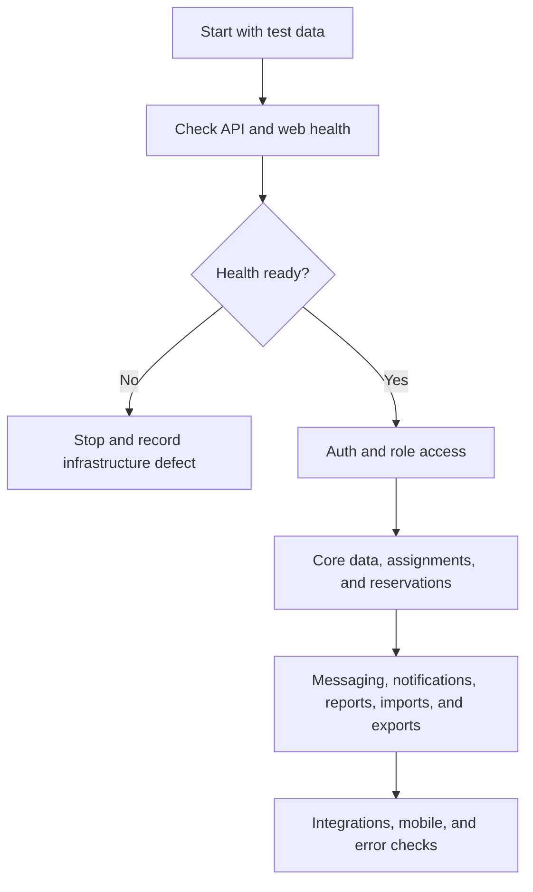

# TrackRoster feature test flow

**Purpose:** production acceptance checklist for the TrackRoster web app and API.

**How to use:** run the flow from top to bottom with synthetic accounts. Mark `[x]` only after the expected result is visible in the UI and the API request succeeds. Record the account, workspace, timestamp, and defect reference beside every failure.

**Test date:** ____________________ **Tester:** ____________________ **Environment / URL:** ____________________

**1. Master flow**

**Gate result:** `[ ] Pass` `[ ] Fail` **Defect / notes:** ________________________________________________

## 2. Test accounts and data

Create one synthetic workspace with at least two tenants or workspaces, two companies, two prospects, two contacts, one campaign, one territory, and one team. Use separate browser profiles for each role.

| Account / role       | Login tested | Workspace scope        | Expected home              | Result / defect |
| -------------------- | ------------ | ---------------------- | -------------------------- | --------------- |
| Super administrator  | `[ ]`        | Platform               | Platform overview / health |                 |
| Client administrator | `[ ]`        | Whole client workspace | Admin overview             |                 |
| Director             | `[ ]`        | Client or region       | Director overview          |                 |
| Manager              | `[ ]`        | Team                   | Manager overview           |                 |
| Prospector           | `[ ]`        | Assigned work          | My day / work queue        |                 |
| Observer / auditor   | `[ ]`        | Read-only oversight    | Observer overview / audit  |                 |

## 3. Environment and authentication

| Check                                      | Expected result                                           |    OK | Evidence / defect |
| ------------------------------------------ | --------------------------------------------------------- | ----: | ----------------- |
| API `GET /health`                          | HTTP 200 and `status: ok`                                 | `[ ]` |                   |
| API `GET /health/ready`                    | HTTP 200; PostgreSQL and Redis are up                     | `[ ]` |                   |
| Web application                            | Login page loads without console error                    | `[ ]` |                   |
| Login with valid credentials               | Correct role home opens                                   | `[ ]` |                   |
| Invalid password                           | Clear error; no session created                           | `[ ]` |                   |
| Logout                                     | Session is cleared and protected routes redirect to login | `[ ]` |                   |
| Expired session                            | User is redirected to login and can sign in again         | `[ ]` |                   |
| Workspace picker                           | Only permitted workspaces are shown                       | `[ ]` |                   |
| Invitation acceptance                      | Invite opens, accepts once, and cannot be reused          | `[ ]` |                   |
| MFA challenge / recovery                   | Valid code succeeds; invalid code is rejected             | `[ ]` |                   |
| Profile, language, timezone, notifications | Save, refresh, and re-open retain values                  | `[ ]` |                   |

## 4. Role and authorization matrix

Run each action with every role. A denied action must return a permission error and must not change data.

| Capability                       | Super admin | Client admin | Director | Manager | Prospector | Observer |
| -------------------------------- | :---------: | :----------: | :------: | :-----: | :--------: | :------: |
| View own dashboard               |    `[ ]`    |    `[ ]`     |  `[ ]`   |  `[ ]`  |   `[ ]`    |  `[ ]`   |
| Manage users, roles, and scopes  |    `[ ]`    |    `[ ]`     |  `[ ]`   |  `[ ]`  |   `[ ]`    |  `[ ]`   |
| Manage companies / organizations |    `[ ]`    |    `[ ]`     |  `[ ]`   |  `[ ]`  |   `[ ]`    |  `[ ]`   |
| Create and edit prospects        |    `[ ]`    |    `[ ]`     |  `[ ]`   |  `[ ]`  |   `[ ]`    |  `[ ]`   |
| Assign work to a team            |    `[ ]`    |    `[ ]`     |  `[ ]`   |  `[ ]`  |   `[ ]`    |  `[ ]`   |
| Claim and release reservations   |    `[ ]`    |    `[ ]`     |  `[ ]`   |  `[ ]`  |   `[ ]`    |  `[ ]`   |
| Approve collision overrides      |    `[ ]`    |    `[ ]`     |  `[ ]`   |  `[ ]`  |   `[ ]`    |  `[ ]`   |
| Export data                      |    `[ ]`    |    `[ ]`     |  `[ ]`   |  `[ ]`  |   `[ ]`    |  `[ ]`   |
| View audit / observer pages      |    `[ ]`    |    `[ ]`     |  `[ ]`   |  `[ ]`  |   `[ ]`    |  `[ ]`   |

**Negative test:** change the URL or ID to an object from the other tenant. Expected result: `403` or `404`, with no data leak.

## 5. Shared data workflows

### Companies and organizations

- `[ ]` List companies; search, status filters, incomplete profile filter, and name sort all change the visible order.
- `[ ]` Open a company; detail appears in the side panel without leaving the list.
- `[ ]` Edit name, short name, status, phone, email, website, sectors, and coordination rules.
- `[ ]` Save; the form closes, the list and detail refresh, and values survive a hard refresh.
- `[ ]` Clear optional fields; cleared values remain empty after refresh.
- `[ ]` Open the same company in two sessions; the second save returns a conflict with a latest-data recovery path. Reload, keep edits, save again, and verify the change is stored.
- `[ ]` Create and archive a company; archived status and filtering remain correct.

### Prospects, contacts, addresses, and consent

- `[ ]` Search and filter prospects; open a prospect detail page.
- `[ ]` Edit a prospect field; save; verify the record, list, and timestamp update without a manual page reload.
- `[ ]` Add, edit, clear, and remove a contact.
- `[ ]` Add, edit, and remove an address; verify region and postal-code validation.
- `[ ]` Record phone, email, SMS, and visit permissions; verify blocked channels cannot be used.
- `[ ]` Add and remove tags and custom fields.
- `[ ]` Archive and restore a prospect; verify it moves between active and archived views.
- `[ ]` Repeat the two-session conflict test and verify changed fields are preserved only after explicit review.

### Campaigns, teams, territories, and assignments

- `[ ]` Create, edit, activate, pause, and close a campaign.
- `[ ]` Add or remove campaign members, companies, prospects, and territories.
- `[ ]` Create and edit a team; add and suspend a member; verify capacity changes.
- `[ ]` Create a territory and assign it to a team or member.
- `[ ]` Preview an assignment batch; commit it; verify assignment ownership and audit event.
- `[ ]` Reassign or revoke an assignment as an authorized manager; verify a prospector cannot perform it.

## 6. Reservations, collisions, actions, and follow-ups

| Scenario              | Steps                                                     | Expected result                                                    |  OK   |
| --------------------- | --------------------------------------------------------- | ------------------------------------------------------------------ | :---: |
| Reservation claim     | Two prospectors claim the same establishment at once      | Exactly one succeeds; the other receives a stable conflict result  | `[ ]` |
| Reservation heartbeat | Keep a reservation open, then refresh                     | Lock remains until expiry or release                               | `[ ]` |
| Release / expiry      | Release or wait for expiry                                | Establishment becomes available again                              | `[ ]` |
| Cooldown              | Contact a company, then try another contact too soon      | Rule blocks or delays according to settings                        | `[ ]` |
| Consent block         | Mark a channel as refused, then attempt contact           | Channel is blocked and reason is visible                           | `[ ]` |
| Manager override      | Prospector requests override; manager approves or rejects | Decision is audited and policy is enforced                         | `[ ]` |
| Action logging        | Start, edit, complete, and correct an action              | Timeline is appended; historical meaning is not silently rewritten | `[ ]` |
| Follow-up             | Schedule, reschedule, complete, and cancel a follow-up    | Dates, overdue state, and notifications update                     | `[ ]` |
| Dashboard             | Complete activity as prospector and manager               | Counters and performance views reflect the change                  | `[ ]` |

## 7. Messaging and notifications

- `[ ]` Create a direct and team conversation.
- `[ ]` Confirm the selected conversation row, thread header, and participant panel use the same contact name.
- `[ ]` Send, edit, and delete a message where permitted.
- `[ ]` Upload an attachment; verify the message and attachment state after refresh.
- `[ ]` Mark a conversation read; unread and waiting counts update.
- `[ ]` Mute and unmute a conversation; verify the setting persists.
- `[ ]` Confirm the message composer sends on Enter and inserts a newline on Shift+Enter.
- `[ ]` Confirm removed per-message emoji, reply, and three-dot controls are absent.
- `[ ]` Open notifications; mark one and all as read; verify counts update.
- `[ ]` Trigger a permission, assignment, follow-up, and collision notification; verify the correct recipients.

## 8. Imports, exports, reports, maps, and integrations

- `[ ]` Upload a valid CSV/XLSX; map columns; preview; resolve duplicates; finalize; verify created and updated rows.
- `[ ]` Upload malformed data; verify row-level issues and that finalization is blocked until resolved.
- `[ ]` Repeat import finalization; verify idempotency and no duplicate records.
- `[ ]` Create an export with filters; preview scope; start job; download file; verify tenant and role restrictions.
- `[ ]` Open manager reports: overview, workload, actions, funnel, conversions, follow-ups, coverage, collisions, data quality, territories, and forecast.
- `[ ]` Open map and route pages; verify markers, territory scope, route stops, start, complete, and stop updates.
- `[ ]` Configure an integration; run connection test and sync; verify success or a clear provider error.
- `[ ]` Schedule a report; verify delivery history and the expected provider configuration.

## 9. Admin settings and operational pages

- `[ ]` Rules and settings: contact reservations, objectives, and workspace tabs load.
- `[ ]` Change a rule or objective; save; refresh; verify persistence and unsaved-change handling.
- `[ ]` Audit log records create, update, delete, assignment, reservation, override, import, export, and permission events.
- `[ ]` Imports, scripts and emails, companies, users, roles, and access scopes are reachable only by authorized roles.
- `[ ]` Error state: stop the API or use an invalid request; UI shows a retry message and does not lose entered form values.
- `[ ]` Loading state: slow the network; skeletons appear and controls do not double-submit.

## 10. Responsive and browser checks

| Viewport           | Critical paths                                                |  OK   | Notes |
| ------------------ | ------------------------------------------------------------- | :---: | ----- |
| 1440 × 900 desktop | Login, company edit, prospect edit, messaging, import, export | `[ ]` |       |
| 1024 × 768 tablet  | Navigation collapse, tables, drawers, forms                   | `[ ]` |       |
| 390 × 844 phone    | Login, work queue, prospect action, reservation, messaging    | `[ ]` |       |
| Safari             | Auth, forms, uploads, downloads                               | `[ ]` |       |
| Chrome             | Auth, forms, uploads, downloads                               | `[ ]` |       |
| Firefox / Edge     | Auth, forms, uploads, downloads                               | `[ ]` |       |

## 11. Coverage ledger: complete project surface

This workbook covers every item in the current project inventories. A checkbox is a test to run, not a claim that the item already passes.

| Inventory                   | Items covered | Source of truth                                |  OK   | Notes |
| --------------------------- | ------------: | ---------------------------------------------- | :---: | ----- |
| Frontend screens and states |           215 | `docs/frontend/SCREEN_MAPPING.csv`             | `[ ]` |       |
| Backend controller routes   |           340 | `docs/backend/CONTROLLER_ROUTE_INVENTORY.json` | `[ ]` |       |
| API modules                 |            68 | `apps/api/src/**/*.module.ts`                  | `[ ]` |       |
| Database migrations         |            89 | `database/migrations/*.sql`                    | `[ ]` |       |
| Cross-cutting gates         |            12 | This workbook                                  | `[ ]` |       |

**Coverage rule:** do not approve the release until every row in Appendices A–D is marked `[x]` or has a documented accepted exception.

## 12. Cross-cutting release gates

- `[ ]` Tenant isolation: a user cannot read, count, mutate, export, or receive notifications for another tenant.
- `[ ]` Authorization: every role has both positive and negative tests; denied requests do not mutate data.
- `[ ]` ETag / optimistic concurrency: stale edits show a conflict, preserve local edits, and save after explicit latest-data review.
- `[ ]` Idempotency: retries of create, import, export, assignment, reservation, and message actions do not duplicate state.
- `[ ]` Auditability: sensitive changes append an audit event with actor, tenant, target, timestamp, and outcome.
- `[ ]` Validation: invalid enums, IDs, dates, file types, sizes, and required fields return safe errors.
- `[ ]` Error recovery: network, API, provider, worker, and timeout errors show retryable UI without losing form input.
- `[ ]` Loading and double-submit protection: skeletons appear and duplicate clicks do not create duplicate requests.
- `[ ]` Pagination and sorting: lists preserve filters, cursor behavior, stable ordering, and empty states.
- `[ ]` Accessibility: keyboard navigation, labels, focus states, contrast, modal escape, and screen-reader names work.
- `[ ]` Responsive behavior: critical flows work at desktop, tablet, and phone widths.
- `[ ]` Observability and deployment: logs, health, readiness, migrations, background workers, and rollback evidence are recorded.

## Appendix A. Every frontend screen and state

Run the route with the role that owns it, exercise the primary action, refresh, and record evidence.

|   # | Screen / state                             | Route                                   | Inventory status        |  OK   | Defect / evidence                                                                                                                                                         |
| --: | ------------------------------------------ | --------------------------------------- | ----------------------- | :---: | ------------------------------------------------------------------------------------------------------------------------------------------------------------------------- |
|   1 | Welcome back                               | `/login`                                | Connected               | `[ ]` | Uses an existing live page, tab, drawer or result state.                                                                                                                  |
|   2 | Reset your password                        | `/forgot-password`                      | Connected               | `[ ]` | Uses an existing live page, tab, drawer or result state.                                                                                                                  |
|   3 | Choose a new password                      | `/reset-password/[token]`               | Connected               | `[ ]` | Uses an existing live page, tab, drawer or result state.                                                                                                                  |
|   4 | A little extra protection                  | `/mfa`                                  | Connected               | `[ ]` | Uses an existing live page, tab, drawer or result state.                                                                                                                  |
|   5 | Use a recovery code                        | `/mfa`                                  | Connected               | `[ ]` | Uses an existing live page, tab, drawer or result state.                                                                                                                  |
|   6 | Your team is waiting                       | `/invite`                               | Connected               | `[ ]` | Uses an existing live page, tab, drawer or result state.                                                                                                                  |
|   7 | Choose your workspace                      | `/select-workspace`                     | Connected               | `[ ]` | Uses an existing live page, tab, drawer or result state.                                                                                                                  |
|   8 | Connecting your workspace                  | `/login`                                | Provider work remaining | `[ ]` | Backend OAuth flow links authenticated accounts; it is not a complete unauthenticated SSO sign-in flow. Requires provider configuration and a dedicated sign-in contract. |
|   9 | Your session has ended                     | `/login`                                | Connected               | `[ ]` | Uses an existing live page, tab, drawer or result state.                                                                                                                  |
|  10 | This link has expired                      | `/reset-password/[token]`               | Connected               | `[ ]` | Uses an existing live page, tab, drawer or result state.                                                                                                                  |
|  11 | Your profile                               | `/profile`                              | Connected               | `[ ]` | Uses an existing live page, tab, drawer or result state.                                                                                                                  |
|  12 | Personal preferences                       | `/profile?tab=notifications`            | Connected               | `[ ]` | Uses an existing live page, tab, drawer or result state.                                                                                                                  |
|  13 | Notification preferences                   | `/profile?tab=notifications`            | Connected               | `[ ]` | Uses an existing live page, tab, drawer or result state.                                                                                                                  |
|  14 | Active sessions                            | `/profile?tab=sessions`                 | Connected               | `[ ]` | Uses an existing live page, tab, drawer or result state.                                                                                                                  |
|  15 | Set up two-step verification               | `/profile?tab=security`                 | Connected               | `[ ]` | Uses an existing live page, tab, drawer or result state.                                                                                                                  |
|  16 | Save your recovery codes                   | `/profile?tab=security`                 | Connected               | `[ ]` | Uses an existing live page, tab, drawer or result state.                                                                                                                  |
|  17 | Good morning, Camille.                     | `/`                                     | Connected               | `[ ]` | Uses an existing live page, tab, drawer or result state.                                                                                                                  |
|  18 | Your work queue                            | `/work-queue`                           | Connected               | `[ ]` | Uses an existing live page, tab, drawer or result state.                                                                                                                  |
|  19 | Follow-ups                                 | `/follow-ups`                           | Connected               | `[ ]` | Uses an existing live page, tab, drawer or result state.                                                                                                                  |
|  20 | Plan a follow-up                           | `/work-queue/[campaignId]/[prospectId]` | Connected               | `[ ]` | Uses an existing live page, tab, drawer or result state.                                                                                                                  |
|  21 | Reschedule follow-up                       | `/work-queue/[campaignId]/[prospectId]` | Connected               | `[ ]` | Uses an existing live page, tab, drawer or result state.                                                                                                                  |
|  22 | Call back Marie Laurent                    | `/work-queue/[campaignId]/[prospectId]` | Connected               | `[ ]` | Uses an existing live page, tab, drawer or result state.                                                                                                                  |
|  23 | Actions                                    | `/actions`                              | Connected               | `[ ]` | Uses an existing live page, tab, drawer or result state.                                                                                                                  |
|  24 | Plan an action                             | `/actions`                              | Connected               | `[ ]` | Uses an existing live page, tab, drawer or result state.                                                                                                                  |
|  25 | Introduce our interpreting service         | `/actions`                              | Connected               | `[ ]` | Uses an existing live page, tab, drawer or result state.                                                                                                                  |
|  26 | Edit planned action                        | `/actions`                              | Connected               | `[ ]` | Uses an existing live page, tab, drawer or result state.                                                                                                                  |
|  27 | Correct an action record                   | `/actions`                              | Connected               | `[ ]` | Uses an existing live page, tab, drawer or result state.                                                                                                                  |
|  28 | How did the conversation go?               | `/actions`                              | Connected               | `[ ]` | Uses an existing live page, tab, drawer or result state.                                                                                                                  |
|  29 | One conversation. A clear next step.       | `/actions`                              | Connected               | `[ ]` | Uses an existing live page, tab, drawer or result state.                                                                                                                  |
|  30 | Prospect directory                         | `/admin/prospects`                      | Connected               | `[ ]` | Uses an existing live page, tab, drawer or result state.                                                                                                                  |
|  31 | Maison Horizon                             | `/admin/prospects/[prospectId]`         | Connected               | `[ ]` | Uses an existing live page, tab, drawer or result state.                                                                                                                  |
|  32 | Maison Horizon                             | `/work-queue/[campaignId]/[prospectId]` | Connected               | `[ ]` | Uses an existing live page, tab, drawer or result state.                                                                                                                  |
|  33 | Maison Horizon                             | `/workspace/prospect-contacts`          | Connected               | `[ ]` | Connected list/detail/actions use accepted backend DTOs. Server enforces permissions.                                                                                     |
|  34 | Maison Horizon                             | `/workspace/prospect-addresses`         | Connected               | `[ ]` | Connected list/detail/actions use accepted backend DTOs. Server enforces permissions.                                                                                     |
|  35 | Maison Horizon                             | `/admin/prospects/[prospectId]`         | Connected               | `[ ]` | Uses an existing live page, tab, drawer or result state.                                                                                                                  |
|  36 | Maison Horizon                             | `/workspace/prospect-consents`          | Connected               | `[ ]` | Connected list/detail/actions use accepted backend DTOs. Server enforces permissions.                                                                                     |
|  37 | Maison Horizon                             | `/workspace/prospect-record`            | Connected               | `[ ]` | Connected list/detail/actions use accepted backend DTOs. Server enforces permissions.                                                                                     |
|  38 | Add a prospect                             | `/workspace/prospect-records`           | Connected               | `[ ]` | Connected list/detail/actions use accepted backend DTOs. Server enforces permissions.                                                                                     |
|  39 | Edit Maison Horizon                        | `/workspace/prospect-records`           | Connected               | `[ ]` | Connected list/detail/actions use accepted backend DTOs. Server enforces permissions.                                                                                     |
|  40 | Add a contact                              | `/workspace/prospect-contacts`          | Connected               | `[ ]` | Connected list/detail/actions use accepted backend DTOs. Server enforces permissions.                                                                                     |
|  41 | Edit contact                               | `/workspace/prospect-contacts`          | Connected               | `[ ]` | Connected list/detail/actions use accepted backend DTOs. Server enforces permissions.                                                                                     |
|  42 | Add an address                             | `/workspace/prospect-addresses`         | Connected               | `[ ]` | Connected list/detail/actions use accepted backend DTOs. Server enforces permissions.                                                                                     |
|  43 | Record contact permission                  | `/workspace/prospect-consents`          | Connected               | `[ ]` | Connected list/detail/actions use accepted backend DTOs. Server enforces permissions.                                                                                     |
|  44 | Archive Maison Horizon?                    | `/workspace/prospect-records`           | Connected               | `[ ]` | Connected list/detail/actions use accepted backend DTOs. Server enforces permissions.                                                                                     |
|  45 | Archived prospects                         | `/workspace/prospect-records`           | Connected               | `[ ]` | Connected list/detail/actions use accepted backend DTOs. Server enforces permissions.                                                                                     |
|  46 | Restore Maison Horizon?                    | `/workspace/prospect-records`           | Connected               | `[ ]` | Connected list/detail/actions use accepted backend DTOs. Server enforces permissions.                                                                                     |
|  47 | Ready for your next conversation           | `/work-queue/[campaignId]/[prospectId]` | Connected               | `[ ]` | Uses an existing live page, tab, drawer or result state.                                                                                                                  |
|  48 | You have the floor                         | `/work-queue/[campaignId]/[prospectId]` | Connected               | `[ ]` | Uses an existing live page, tab, drawer or result state.                                                                                                                  |
|  49 | Someone is already on this                 | `/work-queue/[campaignId]/[prospectId]` | Connected               | `[ ]` | Uses an existing live page, tab, drawer or result state.                                                                                                                  |
|  50 | A little breathing room                    | `/work-queue/[campaignId]/[prospectId]` | Connected               | `[ ]` | Uses an existing live page, tab, drawer or result state.                                                                                                                  |
|  51 | Contact is not permitted                   | `/work-queue/[campaignId]/[prospectId]` | Connected               | `[ ]` | Uses an existing live page, tab, drawer or result state.                                                                                                                  |
|  52 | Your reservation has ended                 | `/work-queue/[campaignId]/[prospectId]` | Connected               | `[ ]` | Uses an existing live page, tab, drawer or result state.                                                                                                                  |
|  53 | Release this reservation?                  | `/work-queue/[campaignId]/[prospectId]` | Connected               | `[ ]` | Uses an existing live page, tab, drawer or result state.                                                                                                                  |
|  54 | Extend your reservation                    | `/work-queue/[campaignId]/[prospectId]` | Connected               | `[ ]` | Uses an existing live page, tab, drawer or result state.                                                                                                                  |
|  55 | Ask your manager to review                 | `/work-queue/[campaignId]/[prospectId]` | Connected               | `[ ]` | Uses an existing live page, tab, drawer or result state.                                                                                                                  |
|  56 | Active reservations                        | `/workspace/reservations`               | Connected               | `[ ]` | Connected list/detail/actions use accepted backend DTOs. Server enforces permissions.                                                                                     |
|  57 | Collision history                          | `/manager/collisions`                   | Connected               | `[ ]` | Uses an existing live page, tab, drawer or result state.                                                                                                                  |
|  58 | A conversation protected                   | `/manager/collisions`                   | Connected               | `[ ]` | Uses an existing live page, tab, drawer or result state.                                                                                                                  |
|  59 | Manager approvals                          | `/manager/approvals`                    | Connected               | `[ ]` | Uses an existing live page, tab, drawer or result state.                                                                                                                  |
|  60 | Review contact exception                   | `/manager/approvals`                    | Connected               | `[ ]` | Uses an existing live page, tab, drawer or result state.                                                                                                                  |
|  61 | Your territory, at a glance                | `/map`                                  | Connected               | `[ ]` | Uses an existing live page, tab, drawer or result state.                                                                                                                  |
|  62 | Territory coverage                         | `/map`                                  | Connected               | `[ ]` | Uses an existing live page, tab, drawer or result state.                                                                                                                  |
|  63 | Contact activity                           | `/map`                                  | Visual layer remaining  | `[ ]` | Live prospect markers and territory boundaries are connected; the presentation heatmap layer is not implemented.                                                          |
|  64 | Your routes                                | `/routes`                               | Connected               | `[ ]` | Uses an existing live page, tab, drawer or result state.                                                                                                                  |
|  65 | Plan a route                               | `/routes/new`                           | Connected               | `[ ]` | Uses an existing live page, tab, drawer or result state.                                                                                                                  |
|  66 | East Paris · Monday visits                 | `/routes/[routeId]`                     | Connected               | `[ ]` | Uses an existing live page, tab, drawer or result state.                                                                                                                  |
|  67 | Your route is under way                    | `/routes/[routeId]`                     | Connected               | `[ ]` | Uses an existing live page, tab, drawer or result state.                                                                                                                  |
|  68 | A productive day in the field              | `/routes/[routeId]`                     | Connected               | `[ ]` | Uses an existing live page, tab, drawer or result state.                                                                                                                  |
|  69 | Add a route stop                           | `/routes/[routeId]`                     | Connected               | `[ ]` | Uses an existing live page, tab, drawer or result state.                                                                                                                  |
|  70 | Team momentum                              | `/manager/overview`                     | Connected               | `[ ]` | Uses an existing live page, tab, drawer or result state.                                                                                                                  |
|  71 | A connected picture                        | `/director/overview`                    | Connected               | `[ ]` | Uses an existing live page, tab, drawer or result state.                                                                                                                  |
|  72 | A healthy workspace                        | `/admin/overview`                       | Connected               | `[ ]` | Uses an existing live page, tab, drawer or result state.                                                                                                                  |
|  73 | Assignments                                | `/manager/assignments`                  | Connected               | `[ ]` | Uses an existing live page, tab, drawer or result state.                                                                                                                  |
|  74 | Ready to assign                            | `/manager/assignments`                  | Connected               | `[ ]` | Uses an existing live page, tab, drawer or result state.                                                                                                                  |
|  75 | Choose the prospects                       | `/manager/assignments`                  | Connected               | `[ ]` | Uses an existing live page, tab, drawer or result state.                                                                                                                  |
|  76 | Choose how to distribute                   | `/manager/assignments`                  | Connected               | `[ ]` | Uses an existing live page, tab, drawer or result state.                                                                                                                  |
|  77 | Review before assigning                    | `/manager/assignments`                  | Connected               | `[ ]` | Uses an existing live page, tab, drawer or result state.                                                                                                                  |
|  78 | Assignments are ready                      | `/manager/assignments`                  | Connected               | `[ ]` | Uses an existing live page, tab, drawer or result state.                                                                                                                  |
|  79 | Assignment · Maison Horizon                | `/manager/assignments/active`           | Connected               | `[ ]` | Uses an existing live page, tab, drawer or result state.                                                                                                                  |
|  80 | Reassign this prospect                     | `/manager/assignments/active`           | Connected               | `[ ]` | Uses an existing live page, tab, drawer or result state.                                                                                                                  |
|  81 | Distribution rules                         | `/workspace/assignment-rules`           | Connected               | `[ ]` | Connected list/detail/actions use accepted backend DTOs. Server enforces permissions.                                                                                     |
|  82 | Create a distribution rule                 | `/workspace/assignment-rules`           | Connected               | `[ ]` | Connected list/detail/actions use accepted backend DTOs. Server enforces permissions.                                                                                     |
|  83 | Workload and capacity                      | `/workspace/teams`                      | Connected               | `[ ]` | Connected list/detail/actions use accepted backend DTOs. Server enforces permissions.                                                                                     |
|  84 | Camille Moreau                             | `/manager/team`                         | Connected               | `[ ]` | Uses an existing live page, tab, drawer or result state.                                                                                                                  |
|  85 | Campaigns                                  | `/manager/campaigns`                    | Connected               | `[ ]` | Uses an existing live page, tab, drawer or result state.                                                                                                                  |
|  86 | Create a campaign                          | `/workspace/campaign-settings`          | Connected               | `[ ]` | Connected list/detail/actions use accepted backend DTOs. Server enforces permissions.                                                                                     |
|  87 | Edit Autumn outreach                       | `/workspace/campaign-settings`          | Connected               | `[ ]` | Connected list/detail/actions use accepted backend DTOs. Server enforces permissions.                                                                                     |
|  88 | Autumn outreach                            | `/manager/campaigns/[campaignId]`       | Connected               | `[ ]` | Uses an existing live page, tab, drawer or result state.                                                                                                                  |
|  89 | Autumn outreach                            | `/manager/campaigns/[campaignId]`       | Connected               | `[ ]` | Uses an existing live page, tab, drawer or result state.                                                                                                                  |
|  90 | Autumn outreach                            | `/workspace/campaign-members`           | Connected               | `[ ]` | Connected list/detail/actions use accepted backend DTOs. Server enforces permissions.                                                                                     |
|  91 | Autumn outreach                            | `/workspace/campaign-organizations`     | Connected               | `[ ]` | Connected list/detail/actions use accepted backend DTOs. Server enforces permissions.                                                                                     |
|  92 | Autumn outreach                            | `/workspace/campaign-territories`       | Connected               | `[ ]` | Connected list/detail/actions use accepted backend DTOs. Server enforces permissions.                                                                                     |
|  93 | Autumn outreach                            | `/workspace/campaign-settings`          | Connected               | `[ ]` | Connected list/detail/actions use accepted backend DTOs. Server enforces permissions.                                                                                     |
|  94 | Add prospects to campaign                  | `/admin/campaigns`                      | Connected               | `[ ]` | Uses an existing live page, tab, drawer or result state.                                                                                                                  |
|  95 | Add campaign member                        | `/workspace/campaign-members`           | Connected               | `[ ]` | Connected list/detail/actions use accepted backend DTOs. Server enforces permissions.                                                                                     |
|  96 | Add participating organisation             | `/workspace/campaign-organizations`     | Connected               | `[ ]` | Connected list/detail/actions use accepted backend DTOs. Server enforces permissions.                                                                                     |
|  97 | Link a territory                           | `/workspace/campaign-territories`       | Connected               | `[ ]` | Connected list/detail/actions use accepted backend DTOs. Server enforces permissions.                                                                                     |
|  98 | Import centre                              | `/admin/imports`                        | Connected               | `[ ]` | Uses an existing live page, tab, drawer or result state.                                                                                                                  |
|  99 | Bring your prospects together              | `/admin/imports`                        | Connected               | `[ ]` | Uses an existing live page, tab, drawer or result state.                                                                                                                  |
| 100 | Match your columns                         | `/admin/imports/[importId]`             | Connected               | `[ ]` | Uses an existing live page, tab, drawer or result state.                                                                                                                  |
| 101 | A quick health check                       | `/admin/imports/[importId]`             | Connected               | `[ ]` | Uses an existing live page, tab, drawer or result state.                                                                                                                  |
| 102 | Resolve before you import                  | `/admin/imports/[importId]`             | Connected               | `[ ]` | Uses an existing live page, tab, drawer or result state.                                                                                                                  |
| 103 | Ready to bring these records in?           | `/admin/imports/[importId]`             | Connected               | `[ ]` | Uses an existing live page, tab, drawer or result state.                                                                                                                  |
| 104 | Your import is complete                    | `/admin/imports/[importId]`             | Connected               | `[ ]` | Uses an existing live page, tab, drawer or result state.                                                                                                                  |
| 105 | Potential duplicates                       | `/workspace/duplicates`                 | Connected               | `[ ]` | Connected list/detail/actions use accepted backend DTOs. Server enforces permissions.                                                                                     |
| 106 | One establishment, two records?            | `/workspace/duplicates`                 | Connected               | `[ ]` | Connected list/detail/actions use accepted backend DTOs. Server enforces permissions.                                                                                     |
| 107 | Data that your team can trust              | `/workspace/data-quality`               | Connected               | `[ ]` | Connected list/detail/actions use accepted backend DTOs. Server enforces permissions.                                                                                     |
| 108 | Tags                                       | `/workspace/tags`                       | Connected               | `[ ]` | Connected list/detail/actions use accepted backend DTOs. Server enforces permissions.                                                                                     |
| 109 | Create a tag                               | `/workspace/tags`                       | Connected               | `[ ]` | Connected list/detail/actions use accepted backend DTOs. Server enforces permissions.                                                                                     |
| 110 | Custom fields                              | `/workspace/custom-fields`              | Connected               | `[ ]` | Connected list/detail/actions use accepted backend DTOs. Server enforces permissions.                                                                                     |
| 111 | Create a custom field                      | `/workspace/custom-fields`              | Connected               | `[ ]` | Connected list/detail/actions use accepted backend DTOs. Server enforces permissions.                                                                                     |
| 112 | From activity to insight                   | `/manager/reports`                      | Connected               | `[ ]` | Uses an existing live page, tab, drawer or result state.                                                                                                                  |
| 113 | Performance overview                       | `/manager/reports`                      | Connected               | `[ ]` | Uses an existing live page, tab, drawer or result state.                                                                                                                  |
| 114 | Workload                                   | `/manager/reports`                      | Connected               | `[ ]` | Uses an existing live page, tab, drawer or result state.                                                                                                                  |
| 115 | Action activity                            | `/manager/reports`                      | Connected               | `[ ]` | Uses an existing live page, tab, drawer or result state.                                                                                                                  |
| 116 | Prospect funnel                            | `/manager/reports`                      | Connected               | `[ ]` | Uses an existing live page, tab, drawer or result state.                                                                                                                  |
| 117 | Conversions                                | `/manager/reports`                      | Connected               | `[ ]` | Uses an existing live page, tab, drawer or result state.                                                                                                                  |
| 118 | Follow-up discipline                       | `/manager/reports`                      | Connected               | `[ ]` | Uses an existing live page, tab, drawer or result state.                                                                                                                  |
| 119 | Coverage                                   | `/manager/reports`                      | Connected               | `[ ]` | Uses an existing live page, tab, drawer or result state.                                                                                                                  |
| 120 | Coordination                               | `/manager/reports`                      | Connected               | `[ ]` | Uses an existing live page, tab, drawer or result state.                                                                                                                  |
| 121 | Data quality                               | `/manager/reports`                      | Connected               | `[ ]` | Uses an existing live page, tab, drawer or result state.                                                                                                                  |
| 122 | Territory performance                      | `/manager/reports`                      | Connected               | `[ ]` | Uses an existing live page, tab, drawer or result state.                                                                                                                  |
| 123 | Pipeline outlook                           | `/manager/reports`                      | Connected               | `[ ]` | Uses an existing live page, tab, drawer or result state.                                                                                                                  |
| 124 | Objectives                                 | `/workspace/objectives`                 | Connected               | `[ ]` | Connected list/detail/actions use accepted backend DTOs. Server enforces permissions.                                                                                     |
| 125 | Create an objective                        | `/workspace/objectives`                 | Connected               | `[ ]` | Connected list/detail/actions use accepted backend DTOs. Server enforces permissions.                                                                                     |
| 126 | 120 qualified prospects                    | `/workspace/objectives`                 | Connected               | `[ ]` | Connected list/detail/actions use accepted backend DTOs. Server enforces permissions.                                                                                     |
| 127 | Edit objective                             | `/workspace/objectives`                 | Connected               | `[ ]` | Connected list/detail/actions use accepted backend DTOs. Server enforces permissions.                                                                                     |
| 128 | Scheduled reports                          | `/workspace/scheduled-reports`          | Connected               | `[ ]` | Scheduling and delivery-history UI connected. Actual scheduled generation/delivery requires operational workers and providers; not end-to-end certified here.             |
| 129 | Schedule a report                          | `/workspace/scheduled-reports`          | Connected               | `[ ]` | Scheduling and delivery-history UI connected. Actual scheduled generation/delivery requires operational workers and providers; not end-to-end certified here.             |
| 130 | Report delivery history                    | `/workspace/scheduled-reports`          | Connected               | `[ ]` | Scheduling and delivery-history UI connected. Actual scheduled generation/delivery requires operational workers and providers; not end-to-end certified here.             |
| 131 | Export centre                              | `/manager/exports`                      | Connected               | `[ ]` | Uses an existing live page, tab, drawer or result state.                                                                                                                  |
| 132 | Prepare an export                          | `/manager/exports`                      | Connected               | `[ ]` | Uses an existing live page, tab, drawer or result state.                                                                                                                  |
| 133 | Check the export scope                     | `/manager/exports`                      | Connected               | `[ ]` | Uses an existing live page, tab, drawer or result state.                                                                                                                  |
| 134 | Your export is ready                       | `/manager/exports`                      | Connected               | `[ ]` | Uses an existing live page, tab, drawer or result state.                                                                                                                  |
| 135 | Conversations                              | `/messages`                             | Connected               | `[ ]` | Uses an existing live page, tab, drawer or result state.                                                                                                                  |
| 136 | Paris East team                            | `/messages`                             | Connected               | `[ ]` | Uses an existing live page, tab, drawer or result state.                                                                                                                  |
| 137 | Start a conversation                       | `/messages`                             | Connected               | `[ ]` | Uses an existing live page, tab, drawer or result state.                                                                                                                  |
| 138 | Conversation participants                  | `/workspace/conversation-members`       | Connected               | `[ ]` | Connected list/detail/actions use accepted backend DTOs. Server enforces permissions.                                                                                     |
| 139 | Your updates                               | `/workspace/notifications`              | Connected               | `[ ]` | Connected list/detail/actions use accepted backend DTOs. Server enforces permissions.                                                                                     |
| 140 | Find what you need                         | `/search`                               | Connected               | `[ ]` | Uses an existing live page, tab, drawer or result state.                                                                                                                  |
| 141 | Your saved views                           | `/workspace/saved-views`                | Connected               | `[ ]` | Connected list/detail/actions use accepted backend DTOs. Server enforces permissions.                                                                                     |
| 142 | Save this view                             | `/workspace/saved-views`                | Connected               | `[ ]` | Connected list/detail/actions use accepted backend DTOs. Server enforces permissions.                                                                                     |
| 143 | Workspace settings                         | `/workspace/workspace-settings`         | Connected               | `[ ]` | Connected list/detail/actions use accepted backend DTOs. Server enforces permissions.                                                                                     |
| 144 | Companies and brands                       | `/workspace/organizations`              | Connected               | `[ ]` | Connected list/detail/actions use accepted backend DTOs. Server enforces permissions.                                                                                     |
| 145 | Add an organisation                        | `/workspace/organizations`              | Connected               | `[ ]` | Connected list/detail/actions use accepted backend DTOs. Server enforces permissions.                                                                                     |
| 146 | INTERTRAD                                  | `/workspace/organizations`              | Connected               | `[ ]` | Connected list/detail/actions use accepted backend DTOs. Server enforces permissions.                                                                                     |
| 147 | Edit INTERTRAD                             | `/workspace/organizations`              | Connected               | `[ ]` | Connected list/detail/actions use accepted backend DTOs. Server enforces permissions.                                                                                     |
| 148 | Organisational relationships               | `/workspace/relationships`              | Connected               | `[ ]` | Connected list/detail/actions use accepted backend DTOs. Server enforces permissions.                                                                                     |
| 149 | Add a relationship                         | `/workspace/relationships`              | Connected               | `[ ]` | Connected list/detail/actions use accepted backend DTOs. Server enforces permissions.                                                                                     |
| 150 | Teams                                      | `/workspace/teams`                      | Connected               | `[ ]` | Connected list/detail/actions use accepted backend DTOs. Server enforces permissions.                                                                                     |
| 151 | Create a team                              | `/workspace/teams`                      | Connected               | `[ ]` | Connected list/detail/actions use accepted backend DTOs. Server enforces permissions.                                                                                     |
| 152 | Paris East                                 | `/workspace/teams`                      | Connected               | `[ ]` | Connected list/detail/actions use accepted backend DTOs. Server enforces permissions.                                                                                     |
| 153 | Edit Paris East                            | `/workspace/teams`                      | Connected               | `[ ]` | Connected list/detail/actions use accepted backend DTOs. Server enforces permissions.                                                                                     |
| 154 | Add team member                            | `/workspace/team-members`               | Connected               | `[ ]` | Connected list/detail/actions use accepted backend DTOs. Server enforces permissions.                                                                                     |
| 155 | People and access                          | `/admin/users`                          | Connected               | `[ ]` | Uses an existing live page, tab, drawer or result state.                                                                                                                  |
| 156 | Invite a teammate                          | `/admin/users`                          | Connected               | `[ ]` | Uses an existing live page, tab, drawer or result state.                                                                                                                  |
| 157 | Camille Moreau                             | `/admin/users`                          | Connected               | `[ ]` | Uses an existing live page, tab, drawer or result state.                                                                                                                  |
| 158 | Edit membership                            | `/admin/users`                          | Connected               | `[ ]` | Uses an existing live page, tab, drawer or result state.                                                                                                                  |
| 159 | Add access scope                           | `/workspace/membership-scopes`          | Connected               | `[ ]` | Connected list/detail/actions use accepted backend DTOs. Server enforces permissions.                                                                                     |
| 160 | Grant scoped access                        | `/workspace/access-grants`              | Connected               | `[ ]` | Connected list/detail/actions use accepted backend DTOs. Server enforces permissions.                                                                                     |
| 161 | Suspend this membership?                   | `/admin/users`                          | Connected               | `[ ]` | Uses an existing live page, tab, drawer or result state.                                                                                                                  |
| 162 | Roles and permissions                      | `/admin/users?tab=roles`                | Connected               | `[ ]` | Uses an existing live page, tab, drawer or result state.                                                                                                                  |
| 163 | Territories                                | `/workspace/territories`                | Connected               | `[ ]` | Connected list/detail/actions use accepted backend DTOs. Server enforces permissions.                                                                                     |
| 164 | Create a territory                         | `/workspace/territories`                | Connected               | `[ ]` | Connected list/detail/actions use accepted backend DTOs. Server enforces permissions.                                                                                     |
| 165 | Paris East territory                       | `/workspace/territories`                | Connected               | `[ ]` | Connected list/detail/actions use accepted backend DTOs. Server enforces permissions.                                                                                     |
| 166 | Assign a territory                         | `/workspace/territory-assignments`      | Connected               | `[ ]` | Connected list/detail/actions use accepted backend DTOs. Server enforces permissions.                                                                                     |
| 167 | Region hierarchy                           | `/workspace/regions`                    | Connected               | `[ ]` | Connected list/detail/actions use accepted backend DTOs. Server enforces permissions.                                                                                     |
| 168 | Add a region                               | `/workspace/regions`                    | Connected               | `[ ]` | Connected list/detail/actions use accepted backend DTOs. Server enforces permissions.                                                                                     |
| 169 | Reservation rules                          | `/workspace/reservation-rules`          | Connected               | `[ ]` | Connected list/detail/actions use accepted backend DTOs. Server enforces permissions.                                                                                     |
| 170 | Create a reservation rule                  | `/workspace/reservation-rules`          | Connected               | `[ ]` | Connected list/detail/actions use accepted backend DTOs. Server enforces permissions.                                                                                     |
| 171 | Action outcomes                            | `/workspace/outcomes`                   | Connected               | `[ ]` | Connected list/detail/actions use accepted backend DTOs. Server enforces permissions.                                                                                     |
| 172 | Security policy                            | `/workspace/security-policy`            | Connected               | `[ ]` | Policy configuration is connected. Enforcing an external SSO sign-in flow requires its provider and authentication contract.                                              |
| 173 | Single sign-on                             | `/workspace/security-policy`            | Connected               | `[ ]` | Policy configuration is connected. Enforcing an external SSO sign-in flow requires its provider and authentication contract.                                              |
| 174 | Connected tools                            | `/workspace/integrations`               | Connected               | `[ ]` | Configuration/test/sync APIs connected. A stored connection record does not prove provider authorization or a completed synchronization.                                  |
| 175 | Directory connection                       | `/workspace/integrations`               | Connected               | `[ ]` | Configuration/test/sync APIs connected. A stored connection record does not prove provider authorization or a completed synchronization.                                  |
| 176 | Connect a provider                         | `/workspace/integrations`               | Connected               | `[ ]` | Configuration/test/sync APIs connected. A stored connection record does not prove provider authorization or a completed synchronization.                                  |
| 177 | API clients                                | `/workspace/api-clients`                | Connected               | `[ ]` | Connected list/detail/actions use accepted backend DTOs. Server enforces permissions.                                                                                     |
| 178 | Create an API client                       | `/workspace/api-clients`                | Connected               | `[ ]` | Connected list/detail/actions use accepted backend DTOs. Server enforces permissions.                                                                                     |
| 179 | Save the client secret                     | `/workspace/api-clients`                | Connected               | `[ ]` | Connected list/detail/actions use accepted backend DTOs. Server enforces permissions.                                                                                     |
| 180 | Webhooks                                   | `/workspace/webhooks`                   | Connected               | `[ ]` | CRUD and delivery-history APIs connected; external destination delivery not exercised.                                                                                    |
| 181 | Create a webhook                           | `/workspace/webhooks`                   | Connected               | `[ ]` | CRUD and delivery-history APIs connected; external destination delivery not exercised.                                                                                    |
| 182 | Webhook deliveries                         | `/workspace/webhooks`                   | Connected               | `[ ]` | CRUD and delivery-history APIs connected; external destination delivery not exercised.                                                                                    |
| 183 | Delivery attempt                           | `/workspace/webhook-delivery`           | Connected               | `[ ]` | Connected list/detail/actions use accepted backend DTOs. Server enforces permissions.                                                                                     |
| 184 | A clear trail of decisions                 | `/workspace/audit-overview`             | Connected               | `[ ]` | Connected list/detail/actions use accepted backend DTOs. Server enforces permissions.                                                                                     |
| 185 | Event log                                  | `/workspace/audit-events`               | Connected               | `[ ]` | Connected list/detail/actions use accepted backend DTOs. Server enforces permissions.                                                                                     |
| 186 | Data changes                               | `/workspace/audit-data-changes`         | Connected               | `[ ]` | Connected list/detail/actions use accepted backend DTOs. Server enforces permissions.                                                                                     |
| 187 | Security events                            | `/workspace/audit-security`             | Connected               | `[ ]` | Connected list/detail/actions use accepted backend DTOs. Server enforces permissions.                                                                                     |
| 188 | Assignment audit                           | `/workspace/audit-assignments`          | Connected               | `[ ]` | Connected list/detail/actions use accepted backend DTOs. Server enforces permissions.                                                                                     |
| 189 | Override audit                             | `/workspace/audit-overrides`            | Connected               | `[ ]` | Connected list/detail/actions use accepted backend DTOs. Server enforces permissions.                                                                                     |
| 190 | Collision audit                            | `/workspace/audit-collisions`           | Connected               | `[ ]` | Connected list/detail/actions use accepted backend DTOs. Server enforces permissions.                                                                                     |
| 191 | Export audit                               | `/workspace/audit-exports`              | Connected               | `[ ]` | Connected list/detail/actions use accepted backend DTOs. Server enforces permissions.                                                                                     |
| 192 | Assignment changed                         | `/workspace/audit-events`               | Connected               | `[ ]` | Connected list/detail/actions use accepted backend DTOs. Server enforces permissions.                                                                                     |
| 193 | Member access review                       | `/workspace/audit-access`               | Connected               | `[ ]` | Connected list/detail/actions use accepted backend DTOs. Server enforces permissions.                                                                                     |
| 194 | Retention visibility                       | `/workspace/audit-retention`            | Connected               | `[ ]` | Connected list/detail/actions use accepted backend DTOs. Server enforces permissions.                                                                                     |
| 195 | Prepare an evidence export                 | `/workspace/audit-events`               | Connected               | `[ ]` | Request and status API connected. Audit evidence artifact generation/download still needs a verified backend worker; a queued row is not a finished file.                 |
| 196 | Access reviews                             | `/workspace/access-reviews`             | Connected               | `[ ]` | Connected list/detail/actions use accepted backend DTOs. Server enforces permissions.                                                                                     |
| 197 | September access review                    | `/workspace/access-reviews`             | Connected               | `[ ]` | Connected list/detail/actions use accepted backend DTOs. Server enforces permissions.                                                                                     |
| 198 | Compliance reports                         | `/workspace/compliance-reports`         | Connected               | `[ ]` | Request/status/download UI connected; report worker and storage delivery not end-to-end certified.                                                                        |
| 199 | Create compliance report                   | `/workspace/compliance-reports`         | Connected               | `[ ]` | Request/status/download UI connected; report worker and storage delivery not end-to-end certified.                                                                        |
| 200 | Platform overview                          | `/workspace/platform-tenants`           | Connected               | `[ ]` | Requires an active identity-level super_admin grant; a tenant admin is not a platform admin.                                                                              |
| 201 | Tenants                                    | `/workspace/platform-tenants`           | Connected               | `[ ]` | Requires an active identity-level super_admin grant; a tenant admin is not a platform admin.                                                                              |
| 202 | INTERTRAD workspace                        | `/workspace/platform-tenants`           | Connected               | `[ ]` | Requires an active identity-level super_admin grant; a tenant admin is not a platform admin.                                                                              |
| 203 | Tenant configuration                       | `/workspace/platform-tenants`           | Connected               | `[ ]` | Requires an active identity-level super_admin grant; a tenant admin is not a platform admin.                                                                              |
| 204 | Change tenant status                       | `/workspace/platform-tenants`           | Connected               | `[ ]` | Requires an active identity-level super_admin grant; a tenant admin is not a platform admin.                                                                              |
| 205 | Platform identities                        | `/workspace/platform-users`             | Connected               | `[ ]` | Connected list/detail/actions use accepted backend DTOs. Server enforces permissions.                                                                                     |
| 206 | Grant platform access                      | `/workspace/platform-users`             | Connected               | `[ ]` | Connected list/detail/actions use accepted backend DTOs. Server enforces permissions.                                                                                     |
| 207 | Service health                             | `/workspace/platform-health`            | Connected               | `[ ]` | Connected list/detail/actions use accepted backend DTOs. Server enforces permissions.                                                                                     |
| 208 | Getting your workspace ready               | `/workspace/[module]`                   | Connected               | `[ ]` | Shared loading, empty, retry, offline, authorization, 412 conflict and missing-tool states; states are not separate destinations.                                         |
| 209 | A fresh start                              | `/workspace/[module]`                   | Connected               | `[ ]` | Shared loading, empty, retry, offline, authorization, 412 conflict and missing-tool states; states are not separate destinations.                                         |
| 210 | We couldn’t load this view                 | `/workspace/[module]`                   | Connected               | `[ ]` | Shared loading, empty, retry, offline, authorization, 412 conflict and missing-tool states; states are not separate destinations.                                         |
| 211 | You’re currently offline                   | `/workspace/[module]`                   | Connected               | `[ ]` | Shared loading, empty, retry, offline, authorization, 412 conflict and missing-tool states; states are not separate destinations.                                         |
| 212 | This view is outside your access           | `/workspace/[module]`                   | Connected               | `[ ]` | Shared loading, empty, retry, offline, authorization, 412 conflict and missing-tool states; states are not separate destinations.                                         |
| 213 | This record changed while you were working | `/workspace/[module]`                   | Connected               | `[ ]` | Shared loading, empty, retry, offline, authorization, 412 conflict and missing-tool states; states are not separate destinations.                                         |
| 214 | We couldn’t find that record               | `/workspace/[module]`                   | Connected               | `[ ]` | Shared loading, empty, retry, offline, authorization, 412 conflict and missing-tool states; states are not separate destinations.                                         |
| 215 | The TrackRoster design language            | `apps/web/DESIGN.md + UX-CONTRACT.md`   | Design reference        | `[ ]` | Shared components and tokens; not a production application page.                                                                                                          |

## Appendix B. Every backend controller route

For each route, test the authorized success case, invalid input, unauthorized role, tenant boundary, and persistence or side effect.

|   # | Method   | Endpoint                                                                                | Source                                                                             | Ledger status                                                                                                                   |  OK   | Evidence / defect |
| --: | -------- | --------------------------------------------------------------------------------------- | ---------------------------------------------------------------------------------- | ------------------------------------------------------------------------------------------------------------------------------- | :---: | ----------------- |
|   1 | `GET`    | `/api/v1/actions`                                                                       | `apps/api/src/actions/action.controller.ts:68`                                     | Verified: scoped lifecycle, atomic database completion, durable delivery intents and append-only evidence                       | `[ ]` |                   |
|   2 | `POST`   | `/api/v1/actions`                                                                       | `apps/api/src/actions/action.controller.ts:71`                                     | Verified: scoped lifecycle, atomic database completion, durable delivery intents and append-only evidence                       | `[ ]` |                   |
|   3 | `GET`    | `/api/v1/actions/:actionId`                                                             | `apps/api/src/actions/action.controller.ts:78`                                     | Verified: scoped lifecycle, atomic database completion, durable delivery intents and append-only evidence                       | `[ ]` |                   |
|   4 | `PATCH`  | `/api/v1/actions/:actionId`                                                             | `apps/api/src/actions/action.controller.ts:91`                                     | Verified: scoped lifecycle, atomic database completion, durable delivery intents and append-only evidence                       | `[ ]` |                   |
|   5 | `POST`   | `/api/v1/actions/:actionId/cancel`                                                      | `apps/api/src/actions/action.controller.ts:126`                                    | Verified: scoped lifecycle, atomic database completion, durable delivery intents and append-only evidence                       | `[ ]` |                   |
|   6 | `POST`   | `/api/v1/actions/:actionId/complete`                                                    | `apps/api/src/actions/action.controller.ts:114`                                    | Verified: scoped lifecycle, atomic database completion, durable delivery intents and append-only evidence                       | `[ ]` |                   |
|   7 | `POST`   | `/api/v1/actions/:actionId/corrections`                                                 | `apps/api/src/actions/action.controller.ts:138`                                    | Verified: scoped lifecycle, atomic database completion, durable delivery intents and append-only evidence                       | `[ ]` |                   |
|   8 | `GET`    | `/api/v1/actions/:actionId/events`                                                      | `apps/api/src/actions/action.controller.ts:84`                                     | Verified: scoped lifecycle, atomic database completion, durable delivery intents and append-only evidence                       | `[ ]` |                   |
|   9 | `POST`   | `/api/v1/actions/:actionId/start`                                                       | `apps/api/src/actions/action.controller.ts:102`                                    | Verified: scoped lifecycle, atomic database completion, durable delivery intents and append-only evidence                       | `[ ]` |                   |
|  10 | `GET`    | `/api/v1/assignment-rules`                                                              | `apps/api/src/assignments/assignment-batch.controller.ts:101`                      | Verified: campaign-authorized paginated rules ordered by priority and ID                                                        | `[ ]` |                   |
|  11 | `POST`   | `/api/v1/assignment-rules`                                                              | `apps/api/src/assignments/assignment-batch.controller.ts:104`                      | Verified: capacity/round-robin/skill/proximity rule configuration with authority, audit and validation                          | `[ ]` |                   |
|  12 | `DELETE` | `/api/v1/assignment-rules/:ruleId`                                                      | `apps/api/src/assignments/assignment-batch.controller.ts:119`                      | Verified: audited soft deactivation with current authority                                                                      | `[ ]` |                   |
|  13 | `PATCH`  | `/api/v1/assignment-rules/:ruleId`                                                      | `apps/api/src/assignments/assignment-batch.controller.ts:109`                      | Verified: conditional rule/target/strategy/order/active-state updates for supported strategies                                  | `[ ]` |                   |
|  14 | `POST`   | `/api/v1/assignment-rules/:ruleId/simulate`                                             | `apps/api/src/assignments/assignment-batch.controller.ts:128`                      | Verified: live eligibility/ownership/capacity simulation without writes or cursor movement                                      | `[ ]` |                   |
|  15 | `GET`    | `/api/v1/assignment-suggestions`                                                        | `apps/api/src/assignments/assignment-batch.controller.ts:144`                      | Verified: scoped live capacity/skill/proximity ranked candidates using an explicit active rule                                  | `[ ]` |                   |
|  16 | `GET`    | `/api/v1/assignments`                                                                   | `apps/api/src/assignments/assignment-lifecycle.controller.ts:70`                   | Verified: current-grant scoped history list with campaign/team/user/status filters and pagination                               | `[ ]` |                   |
|  17 | `POST`   | `/api/v1/assignments`                                                                   | `apps/api/src/assignments/assignment-lifecycle.controller.ts:79`                   | Verified: canonical single assignment using transactional capacity/authority checks                                             | `[ ]` |                   |
|  18 | `GET`    | `/api/v1/assignments/:assignmentId`                                                     | `apps/api/src/assignments/assignment-lifecycle.controller.ts:85`                   | Verified: scoped ownership record, bounded history/events and record ETag                                                       | `[ ]` |                   |
|  19 | `PATCH`  | `/api/v1/assignments/:assignmentId`                                                     | `apps/api/src/assignments/assignment-lifecycle.controller.ts:91`                   | Verified: conditional priority and active/paused state changes with contact enforcement                                         | `[ ]` |                   |
|  20 | `POST`   | `/api/v1/assignments/:assignmentId/complete`                                            | `apps/api/src/assignments/assignment-lifecycle.controller.ts:114`                  | Verified: reasoned terminal completion, immutable ownership history and audit                                                   | `[ ]` |                   |
|  21 | `POST`   | `/api/v1/assignments/:assignmentId/reassign`                                            | `apps/api/src/assignments/assignment-lifecycle.controller.ts:102`                  | Verified: atomic source end/replacement/audit with source and target authority and capacity                                     | `[ ]` |                   |
|  22 | `POST`   | `/api/v1/assignments/:assignmentId/revoke`                                              | `apps/api/src/assignments/assignment-lifecycle.controller.ts:126`                  | Verified: reasoned terminal revocation, immutable ownership history and audit                                                   | `[ ]` |                   |
|  23 | `POST`   | `/api/v1/assignments/bulk`                                                              | `apps/api/src/assignments/assignment-batch.controller.ts:88`                       | Verified: all-or-nothing capacity-aware assignment, current authority, idempotency and transactional audit                      | `[ ]` |                   |
|  24 | `POST`   | `/api/v1/assignments/preview`                                                           | `apps/api/src/assignments/assignment-batch.controller.ts:83`                       | Verified: scoped bounded selection, ownership/eligibility conflicts and live capacity preview                                   | `[ ]` |                   |
|  25 | `GET`    | `/api/v1/assignments/unassigned`                                                        | `apps/api/src/assignments/assignment-lifecycle.controller.ts:73`                   | Verified: assignment-authorized campaign queue without current ownership                                                        | `[ ]` |                   |
|  26 | `GET`    | `/api/v1/audit/assignments`                                                             | `apps/api/src/audit/audit.controller.ts:105`                                       | Pending verification                                                                                                            | `[ ]` |                   |
|  27 | `GET`    | `/api/v1/audit/assignments/:assignmentId`                                               | `apps/api/src/audit/audit.controller.ts:108`                                       | Pending verification                                                                                                            | `[ ]` |                   |
|  28 | `GET`    | `/api/v1/audit/collisions`                                                              | `apps/api/src/audit/audit.controller.ts:120`                                       | Pending verification                                                                                                            | `[ ]` |                   |
|  29 | `GET`    | `/api/v1/audit/collisions/:collisionId`                                                 | `apps/api/src/audit/audit.controller.ts:123`                                       | Pending verification                                                                                                            | `[ ]` |                   |
|  30 | `GET`    | `/api/v1/audit/data-changes`                                                            | `apps/api/src/audit/audit.controller.ts:93`                                        | Pending verification                                                                                                            | `[ ]` |                   |
|  31 | `GET`    | `/api/v1/audit/events`                                                                  | `apps/api/src/audit/audit.controller.ts:33`                                        | Pending verification                                                                                                            | `[ ]` |                   |
|  32 | `GET`    | `/api/v1/audit/events/:eventId`                                                         | `apps/api/src/audit/audit.controller.ts:57`                                        | Pending verification                                                                                                            | `[ ]` |                   |
|  33 | `POST`   | `/api/v1/audit/evidence-exports`                                                        | `apps/api/src/audit/audit.controller.ts:138`                                       | Pending verification                                                                                                            | `[ ]` |                   |
|  34 | `GET`    | `/api/v1/audit/evidence-exports/:exportId`                                              | `apps/api/src/audit/audit.controller.ts:155`                                       | Pending verification                                                                                                            | `[ ]` |                   |
|  35 | `GET`    | `/api/v1/audit/exports`                                                                 | `apps/api/src/audit/audit.controller.ts:129`                                       | Pending verification                                                                                                            | `[ ]` |                   |
|  36 | `GET`    | `/api/v1/audit/exports/:exportId`                                                       | `apps/api/src/audit/audit.controller.ts:132`                                       | Pending verification                                                                                                            | `[ ]` |                   |
|  37 | `GET`    | `/api/v1/audit/overrides`                                                               | `apps/api/src/audit/audit.controller.ts:114`                                       | Pending verification                                                                                                            | `[ ]` |                   |
|  38 | `GET`    | `/api/v1/audit/overrides/:overrideId`                                                   | `apps/api/src/audit/audit.controller.ts:117`                                       | Pending verification                                                                                                            | `[ ]` |                   |
|  39 | `GET`    | `/api/v1/audit/overview`                                                                | `apps/api/src/audit/audit.controller.ts:69`                                        | Pending verification                                                                                                            | `[ ]` |                   |
|  40 | `GET`    | `/api/v1/audit/retention`                                                               | `apps/api/src/audit/audit.controller.ts:135`                                       | Pending verification                                                                                                            | `[ ]` |                   |
|  41 | `GET`    | `/api/v1/audit/security-events`                                                         | `apps/api/src/audit/audit.controller.ts:96`                                        | Pending verification                                                                                                            | `[ ]` |                   |
|  42 | `GET`    | `/api/v1/audit/security-events/:eventId`                                                | `apps/api/src/audit/audit.controller.ts:99`                                        | Pending verification                                                                                                            | `[ ]` |                   |
|  43 | `GET`    | `/api/v1/audit/users/:membershipId/access`                                              | `apps/api/src/audit/audit.controller.ts:81`                                        | Pending verification                                                                                                            | `[ ]` |                   |
|  44 | `GET`    | `/api/v1/auth/config`                                                                   | `apps/api/src/auth/auth.controller.ts:29`                                          | Verified: non-secret capabilities; SSO explicitly disabled                                                                      | `[ ]` |                   |
|  45 | `POST`   | `/api/v1/auth/login`                                                                    | `apps/api/src/auth/auth.controller.ts:44`                                          | Verified: password, MFA, required enrollment, workspace selection and throttling                                                | `[ ]` |                   |
|  46 | `POST`   | `/api/v1/auth/logout`                                                                   | `apps/api/src/auth/auth.controller.ts:67`                                          | Verified: revocation and audit                                                                                                  | `[ ]` |                   |
|  47 | `GET`    | `/api/v1/auth/me`                                                                       | `apps/api/src/auth/auth.controller.ts:73`                                          | Outside matched product ledger; not certified by this inventory                                                                 | `[ ]` |                   |
|  48 | `GET`    | `/api/v1/auth/me/access-grants`                                                         | `apps/api/src/authorization/self-access.controller.ts:14`                          | Outside matched product ledger; not certified by this inventory                                                                 | `[ ]` |                   |
|  49 | `DELETE` | `/api/v1/auth/mfa`                                                                      | `apps/api/src/auth/mfa.controller.ts:44`                                           | Verified: step-up, workspace policy check and session revocation                                                                | `[ ]` |                   |
|  50 | `POST`   | `/api/v1/auth/mfa/enroll`                                                               | `apps/api/src/auth/mfa.controller.ts:18`                                           | Verified: password step-up, encrypted secret and expiring enrollment challenge                                                  | `[ ]` |                   |
|  51 | `POST`   | `/api/v1/auth/mfa/recovery`                                                             | `apps/api/src/auth/mfa.controller.ts:31`                                           | Verified: single-use recovery codes tied to password-authenticated login                                                        | `[ ]` |                   |
|  52 | `POST`   | `/api/v1/auth/mfa/recovery-codes/regenerate`                                            | `apps/api/src/auth/mfa.controller.ts:37`                                           | Verified: password/TOTP step-up, replacement and session revocation                                                             | `[ ]` |                   |
|  53 | `POST`   | `/api/v1/auth/mfa/verify`                                                               | `apps/api/src/auth/mfa.controller.ts:25`                                           | Verified: TOTP enrollment/login, bounded attempts, drift and replay checks                                                      | `[ ]` |                   |
|  54 | `GET`    | `/api/v1/auth/password-reset/:token/status`                                             | `apps/api/src/auth/password-recovery.controller.ts:30`                             | Verified: validity only, without consuming token                                                                                | `[ ]` |                   |
|  55 | `POST`   | `/api/v1/auth/password/forgot`                                                          | `apps/api/src/auth/password-recovery.controller.ts:24`                             | Verified locally: private acknowledgement and encrypted durable email outbox                                                    | `[ ]` |                   |
|  56 | `POST`   | `/api/v1/auth/password/reset`                                                           | `apps/api/src/auth/password-recovery.controller.ts:36`                             | Verified: one-time reset, tenant password policy, session revocation; MFA retained                                              | `[ ]` |                   |
|  57 | `POST`   | `/api/v1/auth/refresh`                                                                  | `apps/api/src/auth/auth.controller.ts:60`                                          | Verified: rotating refresh tokens and throttling                                                                                | `[ ]` |                   |
|  58 | `POST`   | `/api/v1/auth/select-tenant`                                                            | `apps/api/src/auth/auth.controller.ts:52`                                          | Outside matched product ledger; not certified by this inventory                                                                 | `[ ]` |                   |
|  59 | `GET`    | `/api/v1/auth/sso/:provider/callback`                                                   | `apps/api/src/auth/oauth-provider.controller.ts:15`                                | Pending verification                                                                                                            | `[ ]` |                   |
|  60 | `POST`   | `/api/v1/auth/sso/:provider/refresh`                                                    | `apps/api/src/auth/oauth-provider.controller.ts:22`                                | Outside matched product ledger; not certified by this inventory                                                                 | `[ ]` |                   |
|  61 | `GET`    | `/api/v1/auth/sso/:provider/start`                                                      | `apps/api/src/auth/oauth-provider.controller.ts:9`                                 | Outside matched product ledger; not certified by this inventory                                                                 | `[ ]` |                   |
|  62 | `DELETE` | `/api/v1/campaign-members/:id`                                                          | `apps/api/src/participation/participation.controller.ts:111`                       | Verified: terminal cancellation and live access revocation                                                                      | `[ ]` |                   |
|  63 | `PATCH`  | `/api/v1/campaign-members/:id`                                                          | `apps/api/src/participation/participation.controller.ts:99`                        | Verified: role/date changes without administrative privilege escalation                                                         | `[ ]` |                   |
|  64 | `GET`    | `/api/v1/campaigns`                                                                     | `apps/api/src/campaigns/campaign.controller.ts:55`                                 | Verified: scoped advanced filters, stable cursor sorting and legacy no-query compatibility                                      | `[ ]` |                   |
|  65 | `POST`   | `/api/v1/campaigns`                                                                     | `apps/api/src/campaigns/campaign.controller.ts:41`                                 | Verified: authorized draft creation, active organization validation, audit, idempotency and ETag                                | `[ ]` |                   |
|  66 | `DELETE` | `/api/v1/campaigns/:campaignId`                                                         | `apps/api/src/campaigns/campaign.controller.ts:108`                                | Verified: conditional audited archival with open-work and concurrent-write protection                                           | `[ ]` |                   |
|  67 | `GET`    | `/api/v1/campaigns/:campaignId`                                                         | `apps/api/src/campaigns/campaign.controller.ts:64`                                 | Verified: campaign metadata and prospect-authorized operational summary                                                         | `[ ]` |                   |
|  68 | `PATCH`  | `/api/v1/campaigns/:campaignId`                                                         | `apps/api/src/campaigns/campaign.controller.ts:76`                                 | Verified: metadata/lifecycle authority and transaction recheck; optional legacy idempotency                                     | `[ ]` |                   |
|  69 | `POST`   | `/api/v1/campaigns/:campaignId/geographic-allocation/apply`                             | `apps/api/src/geographic-allocation/allocation.controller.ts:51`                   | Outside matched product ledger; not certified by this inventory                                                                 | `[ ]` |                   |
|  70 | `POST`   | `/api/v1/campaigns/:campaignId/geographic-allocation/preview`                           | `apps/api/src/geographic-allocation/allocation.controller.ts:42`                   | Outside matched product ledger; not certified by this inventory                                                                 | `[ ]` |                   |
|  71 | `GET`    | `/api/v1/campaigns/:campaignId/members`                                                 | `apps/api/src/participation/participation.controller.ts:75`                        | Verified: visible user/team roster with effective dates and history                                                             | `[ ]` |                   |
|  72 | `POST`   | `/api/v1/campaigns/:campaignId/members`                                                 | `apps/api/src/participation/participation.controller.ts:82`                        | Verified: member/team participation, dated read access and overlap protection                                                   | `[ ]` |                   |
|  73 | `GET`    | `/api/v1/campaigns/:campaignId/organizations`                                           | `apps/api/src/campaign-organizations/campaign-organization.controller.ts:54`       | Verified: mode-aware access, fixed owner, retained history and transactional authorization; see campaign organization contracts | `[ ]` |                   |
|  74 | `POST`   | `/api/v1/campaigns/:campaignId/organizations`                                           | `apps/api/src/campaign-organizations/campaign-organization.controller.ts:61`       | Verified: mode-aware access, fixed owner, retained history and transactional authorization; see campaign organization contracts | `[ ]` |                   |
|  75 | `DELETE` | `/api/v1/campaigns/:campaignId/organizations/:organizationId`                           | `apps/api/src/campaign-organizations/campaign-organization.controller.ts:83`       | Verified: mode-aware access, fixed owner, retained history and transactional authorization; see campaign organization contracts | `[ ]` |                   |
|  76 | `PATCH`  | `/api/v1/campaigns/:campaignId/organizations/:organizationId`                           | `apps/api/src/campaign-organizations/campaign-organization.controller.ts:71`       | Verified: mode-aware access, fixed owner, retained history and transactional authorization; see campaign organization contracts | `[ ]` |                   |
|  77 | `GET`    | `/api/v1/campaigns/:campaignId/prospects`                                               | `apps/api/src/campaigns/campaign-prospect.controller.ts:104`                       | Outside matched product ledger; not certified by this inventory                                                                 | `[ ]` |                   |
|  78 | `POST`   | `/api/v1/campaigns/:campaignId/prospects`                                               | `apps/api/src/campaigns/campaign-prospect.controller.ts:34`                        | Outside matched product ledger; not certified by this inventory                                                                 | `[ ]` |                   |
|  79 | `GET`    | `/api/v1/campaigns/:campaignId/prospects/:prospectId`                                   | `apps/api/src/campaigns/campaign-prospect.controller.ts:116`                       | Outside matched product ledger; not certified by this inventory                                                                 | `[ ]` |                   |
|  80 | `PATCH`  | `/api/v1/campaigns/:campaignId/prospects/:prospectId`                                   | `apps/api/src/campaigns/campaign-prospect.controller.ts:130`                       | Outside matched product ledger; not certified by this inventory                                                                 | `[ ]` |                   |
|  81 | `POST`   | `/api/v1/campaigns/:campaignId/prospects/:prospectId/activities`                        | `apps/api/src/activities/prospect-activity.controller.ts:19`                       | Outside matched product ledger; not certified by this inventory                                                                 | `[ ]` |                   |
|  82 | `DELETE` | `/api/v1/campaigns/:campaignId/prospects/:prospectId/assignment`                        | `apps/api/src/assignments/campaign-prospect-assignment.controller.ts:97`           | Outside matched product ledger; not certified by this inventory                                                                 | `[ ]` |                   |
|  83 | `GET`    | `/api/v1/campaigns/:campaignId/prospects/:prospectId/assignment`                        | `apps/api/src/assignments/campaign-prospect-assignment.controller.ts:119`          | Outside matched product ledger; not certified by this inventory                                                                 | `[ ]` |                   |
|  84 | `POST`   | `/api/v1/campaigns/:campaignId/prospects/:prospectId/assignment`                        | `apps/api/src/assignments/campaign-prospect-assignment.controller.ts:31`           | Outside matched product ledger; not certified by this inventory                                                                 | `[ ]` |                   |
|  85 | `PUT`    | `/api/v1/campaigns/:campaignId/prospects/:prospectId/assignment`                        | `apps/api/src/assignments/campaign-prospect-assignment.controller.ts:61`           | Outside matched product ledger; not certified by this inventory                                                                 | `[ ]` |                   |
|  86 | `GET`    | `/api/v1/campaigns/:campaignId/prospects/:prospectId/assignment-history`                | `apps/api/src/assignments/campaign-prospect-assignment.controller.ts:134`          | Outside matched product ledger; not certified by this inventory                                                                 | `[ ]` |                   |
|  87 | `GET`    | `/api/v1/campaigns/:campaignId/prospects/:prospectId/collision-decision`                | `apps/api/src/collisions/collision-decision.controller.ts:18`                      | Outside matched product ledger; not certified by this inventory                                                                 | `[ ]` |                   |
|  88 | `POST`   | `/api/v1/campaigns/:campaignId/prospects/:prospectId/collision-overrides`               | `apps/api/src/collisions/manager-override.controller.ts:19`                        | Outside matched product ledger; not certified by this inventory                                                                 | `[ ]` |                   |
|  89 | `GET`    | `/api/v1/campaigns/:campaignId/prospects/:prospectId/follow-ups`                        | `apps/api/src/follow-ups/prospect-follow-up.controller.ts:37`                      | Outside matched product ledger; not certified by this inventory                                                                 | `[ ]` |                   |
|  90 | `POST`   | `/api/v1/campaigns/:campaignId/prospects/:prospectId/follow-ups`                        | `apps/api/src/follow-ups/prospect-follow-up.controller.ts:59`                      | Outside matched product ledger; not certified by this inventory                                                                 | `[ ]` |                   |
|  91 | `POST`   | `/api/v1/campaigns/:campaignId/prospects/:prospectId/follow-ups/:followUpId/cancel`     | `apps/api/src/follow-ups/prospect-follow-up.controller.ts:151`                     | Outside matched product ledger; not certified by this inventory                                                                 | `[ ]` |                   |
|  92 | `POST`   | `/api/v1/campaigns/:campaignId/prospects/:prospectId/follow-ups/:followUpId/complete`   | `apps/api/src/follow-ups/prospect-follow-up.controller.ts:124`                     | Outside matched product ledger; not certified by this inventory                                                                 | `[ ]` |                   |
|  93 | `PATCH`  | `/api/v1/campaigns/:campaignId/prospects/:prospectId/follow-ups/:followUpId/reschedule` | `apps/api/src/follow-ups/prospect-follow-up.controller.ts:92`                      | Outside matched product ledger; not certified by this inventory                                                                 | `[ ]` |                   |
|  94 | `GET`    | `/api/v1/campaigns/:campaignId/prospects/:prospectId/reservation`                       | `apps/api/src/reservations/reservation.controller.ts:57`                           | Outside matched product ledger; not certified by this inventory                                                                 | `[ ]` |                   |
|  95 | `POST`   | `/api/v1/campaigns/:campaignId/prospects/:prospectId/reservation`                       | `apps/api/src/reservations/reservation.controller.ts:30`                           | Outside matched product ledger; not certified by this inventory                                                                 | `[ ]` |                   |
|  96 | `DELETE` | `/api/v1/campaigns/:campaignId/prospects/:prospectId/reservation/:reservationId`        | `apps/api/src/reservations/reservation.controller.ts:79`                           | Outside matched product ledger; not certified by this inventory                                                                 | `[ ]` |                   |
|  97 | `GET`    | `/api/v1/campaigns/:campaignId/prospects/:prospectId/timeline`                          | `apps/api/src/activities/prospect-timeline.controller.ts:19`                       | Outside matched product ledger; not certified by this inventory                                                                 | `[ ]` |                   |
|  98 | `POST`   | `/api/v1/campaigns/:campaignId/prospects/bulk`                                          | `apps/api/src/campaigns/campaign-prospect.controller.ts:82`                        | Outside matched product ledger; not certified by this inventory                                                                 | `[ ]` |                   |
|  99 | `POST`   | `/api/v1/campaigns/:campaignId/prospects/bulk/preview`                                  | `apps/api/src/campaigns/campaign-prospect.controller.ts:61`                        | Outside matched product ledger; not certified by this inventory                                                                 | `[ ]` |                   |
| 100 | `POST`   | `/api/v1/campaigns/:campaignId/status`                                                  | `apps/api/src/campaigns/campaign.controller.ts:94`                                 | Verified: authorized lifecycle transitions, open-work blockers, audit, replay and conditional updates                           | `[ ]` |                   |
| 101 | `GET`    | `/api/v1/campaigns/:campaignId/territories`                                             | `apps/api/src/territories/territory.controller.ts:76`                              | Verified: both campaign and territory visibility enforced                                                                       | `[ ]` |                   |
| 102 | `POST`   | `/api/v1/campaigns/:campaignId/territories`                                             | `apps/api/src/territories/territory.controller.ts:82`                              | Verified: manage/read authority, tenant-safe link, audit and idempotency                                                        | `[ ]` |                   |
| 103 | `DELETE` | `/api/v1/campaigns/:campaignId/territories/:territoryId`                                | `apps/api/src/territories/territory.controller.ts:93`                              | Verified: authority on both resources, audit and idempotency                                                                    | `[ ]` |                   |
| 104 | `GET`    | `/api/v1/collision-events`                                                              | `apps/api/src/collisions/collision-workflow.controller.ts:69`                      | Verified: current-scope filtered cursor list of new check-workflow evidence                                                     | `[ ]` |                   |
| 105 | `GET`    | `/api/v1/collision-events/:collisionId`                                                 | `apps/api/src/collisions/collision-workflow.controller.ts:73`                      | Verified: immutable evaluation/policy context with conflicting identifiers redacted                                             | `[ ]` |                   |
| 106 | `POST`   | `/api/v1/collision-events/:collisionId/override-request`                                | `apps/api/src/collisions/collision-workflow.controller.ts:80`                      | Verified: fresh exact-context own request, one pending request and transactional audit                                          | `[ ]` |                   |
| 107 | `GET`    | `/api/v1/custom-fields`                                                                 | `apps/api/src/prospect-enrichment/enrichment.controller.ts:82`                     | Pending verification                                                                                                            | `[ ]` |                   |
| 108 | `POST`   | `/api/v1/custom-fields`                                                                 | `apps/api/src/prospect-enrichment/enrichment.controller.ts:85`                     | Pending verification                                                                                                            | `[ ]` |                   |
| 109 | `DELETE` | `/api/v1/custom-fields/:fieldId`                                                        | `apps/api/src/prospect-enrichment/enrichment.controller.ts:103`                    | Pending verification                                                                                                            | `[ ]` |                   |
| 110 | `PATCH`  | `/api/v1/custom-fields/:fieldId`                                                        | `apps/api/src/prospect-enrichment/enrichment.controller.ts:92`                     | Pending verification                                                                                                            | `[ ]` |                   |
| 111 | `GET`    | `/api/v1/dashboard/admin`                                                               | `apps/api/src/reporting/canonical-dashboard.controller.ts:168`                     | Verified: tenant operational readiness, session counts, alerts and data-quality counts                                          | `[ ]` |                   |
| 112 | `GET`    | `/api/v1/dashboard/director`                                                            | `apps/api/src/reporting/canonical-dashboard.controller.ts:162`                     | Verified: scoped performance, organization comparison and objective-risk calculations                                           | `[ ]` |                   |
| 113 | `GET`    | `/api/v1/dashboard/manager`                                                             | `apps/api/src/reporting/canonical-dashboard.controller.ts:156`                     | Verified: scoped performance, workload, paused exceptions and campaign-linked territories                                       | `[ ]` |                   |
| 114 | `GET`    | `/api/v1/dashboard/today`                                                               | `apps/api/src/reporting/canonical-dashboard.controller.ts:150`                     | Verified: authorized daily priorities and persisted local-day route summary                                                     | `[ ]` |                   |
| 115 | `GET`    | `/api/v1/data-quality/overview`                                                         | `apps/api/src/prospect-enrichment/enrichment.controller.ts:172`                    | Pending verification                                                                                                            | `[ ]` |                   |
| 116 | `GET`    | `/api/v1/establishments`                                                                | `apps/api/src/establishments/establishment.controller.ts:49`                       | Outside matched product ledger; not certified by this inventory                                                                 | `[ ]` |                   |
| 117 | `POST`   | `/api/v1/establishments`                                                                | `apps/api/src/establishments/establishment.controller.ts:32`                       | Outside matched product ledger; not certified by this inventory                                                                 | `[ ]` |                   |
| 118 | `GET`    | `/api/v1/establishments/:establishmentId`                                               | `apps/api/src/establishments/establishment.controller.ts:83`                       | Outside matched product ledger; not certified by this inventory                                                                 | `[ ]` |                   |
| 119 | `PATCH`  | `/api/v1/establishments/:establishmentId`                                               | `apps/api/src/establishments/establishment.controller.ts:98`                       | Outside matched product ledger; not certified by this inventory                                                                 | `[ ]` |                   |
| 120 | `GET`    | `/api/v1/establishments/:establishmentId/contacts`                                      | `apps/api/src/establishment-contacts/establishment-contact.controller.ts:48`       | Outside matched product ledger; not certified by this inventory                                                                 | `[ ]` |                   |
| 121 | `POST`   | `/api/v1/establishments/:establishmentId/contacts`                                      | `apps/api/src/establishment-contacts/establishment-contact.controller.ts:29`       | Outside matched product ledger; not certified by this inventory                                                                 | `[ ]` |                   |
| 122 | `GET`    | `/api/v1/establishments/:establishmentId/contacts/:contactId`                           | `apps/api/src/establishment-contacts/establishment-contact.controller.ts:59`       | Outside matched product ledger; not certified by this inventory                                                                 | `[ ]` |                   |
| 123 | `PATCH`  | `/api/v1/establishments/:establishmentId/contacts/:contactId`                           | `apps/api/src/establishment-contacts/establishment-contact.controller.ts:73`       | Outside matched product ledger; not certified by this inventory                                                                 | `[ ]` |                   |
| 124 | `GET`    | `/api/v1/establishments/nearby`                                                         | `apps/api/src/establishments/establishment.controller.ts:62`                       | Outside matched product ledger; not certified by this inventory                                                                 | `[ ]` |                   |
| 125 | `GET`    | `/api/v1/exports`                                                                       | `apps/api/src/data-jobs/export-job.controller.ts:53`                               | Verified: scoped durable export jobs and authenticated expiring downloads                                                       | `[ ]` |                   |
| 126 | `POST`   | `/api/v1/exports`                                                                       | `apps/api/src/data-jobs/export-job.controller.ts:56`                               | Verified: scoped durable export jobs and authenticated expiring downloads                                                       | `[ ]` |                   |
| 127 | `GET`    | `/api/v1/exports/:exportId`                                                             | `apps/api/src/data-jobs/export-job.controller.ts:62`                               | Verified: scoped durable export jobs and authenticated expiring downloads                                                       | `[ ]` |                   |
| 128 | `GET`    | `/api/v1/exports/:exportId/audit`                                                       | `apps/api/src/data-jobs/export-job.controller.ts:80`                               | Verified: scoped durable export jobs and authenticated expiring downloads                                                       | `[ ]` |                   |
| 129 | `POST`   | `/api/v1/exports/:exportId/cancel`                                                      | `apps/api/src/data-jobs/export-job.controller.ts:68`                               | Verified: scoped durable export jobs and authenticated expiring downloads                                                       | `[ ]` |                   |
| 130 | `GET`    | `/api/v1/exports/:exportId/download`                                                    | `apps/api/src/data-jobs/export-job.controller.ts:74`                               | Verified: scoped durable export jobs and authenticated expiring downloads                                                       | `[ ]` |                   |
| 131 | `GET`    | `/api/v1/exports/:exportId/file`                                                        | `apps/api/src/data-jobs/export-job.controller.ts:87`                               | Outside matched product ledger; not certified by this inventory                                                                 | `[ ]` |                   |
| 132 | `GET`    | `/api/v1/exports/activities`                                                            | `apps/api/src/exports/controlled-export.controller.ts:26`                          | Outside matched product ledger; not certified by this inventory                                                                 | `[ ]` |                   |
| 133 | `GET`    | `/api/v1/exports/assignments`                                                           | `apps/api/src/exports/controlled-export.controller.ts:20`                          | Outside matched product ledger; not certified by this inventory                                                                 | `[ ]` |                   |
| 134 | `GET`    | `/api/v1/exports/follow_ups`                                                            | `apps/api/src/exports/controlled-export.controller.ts:32`                          | Outside matched product ledger; not certified by this inventory                                                                 | `[ ]` |                   |
| 135 | `POST`   | `/api/v1/exports/preview`                                                               | `apps/api/src/data-jobs/export-job.controller.ts:47`                               | Verified: scoped durable export jobs and authenticated expiring downloads                                                       | `[ ]` |                   |
| 136 | `GET`    | `/api/v1/follow-ups`                                                                    | `apps/api/src/follow-ups/follow-up-queue.controller.ts:24`                         | Verified: scoped lifecycle lists and cursor pagination; legacy team queue retained                                              | `[ ]` |                   |
| 137 | `GET`    | `/api/v1/follow-ups/:followUpId`                                                        | `apps/api/src/follow-ups/canonical-follow-up.controller.ts:58`                     | Verified: scoped historical detail, source, next action and audit history                                                       | `[ ]` |                   |
| 138 | `PATCH`  | `/api/v1/follow-ups/:followUpId`                                                        | `apps/api/src/follow-ups/canonical-follow-up.controller.ts:64`                     | Verified: conditional open follow-up edits with reminder scheduling and audit                                                   | `[ ]` |                   |
| 139 | `POST`   | `/api/v1/follow-ups/:followUpId/cancel`                                                 | `apps/api/src/follow-ups/canonical-follow-up.controller.ts:83`                     | Verified: reasoned cancellation, obsolete ownership cleanup and audit                                                           | `[ ]` |                   |
| 140 | `POST`   | `/api/v1/follow-ups/:followUpId/complete`                                               | `apps/api/src/follow-ups/canonical-follow-up.controller.ts:72`                     | Verified: authorized atomic completion with idempotency and audit                                                               | `[ ]` |                   |
| 141 | `GET`    | `/api/v1/health`                                                                        | `apps/api/src/health/health.controller.ts:5`                                       | Outside matched product ledger; not certified by this inventory                                                                 | `[ ]` |                   |
| 142 | `GET`    | `/api/v1/health/live`                                                                   | `apps/api/src/health/readiness.controller.ts:13`                                   | Outside matched product ledger; not certified by this inventory                                                                 | `[ ]` |                   |
| 143 | `GET`    | `/api/v1/health/ready`                                                                  | `apps/api/src/health/readiness.controller.ts:18`                                   | Outside matched product ledger; not certified by this inventory                                                                 | `[ ]` |                   |
| 144 | `PATCH`  | `/api/v1/import-issues/:issueId`                                                        | `apps/api/src/data-jobs/import-job.controller.ts:142`                              | Verified: staged CSV/XLSX import, explicit resolution and atomic commit                                                         | `[ ]` |                   |
| 145 | `GET`    | `/api/v1/imports`                                                                       | `apps/api/src/data-jobs/import-job.controller.ts:50`                               | Verified: staged CSV/XLSX import, explicit resolution and atomic commit                                                         | `[ ]` |                   |
| 146 | `POST`   | `/api/v1/imports`                                                                       | `apps/api/src/data-jobs/import-job.controller.ts:53`                               | Verified: staged CSV/XLSX import, explicit resolution and atomic commit                                                         | `[ ]` |                   |
| 147 | `GET`    | `/api/v1/imports/:importId`                                                             | `apps/api/src/data-jobs/import-job.controller.ts:56`                               | Verified: staged CSV/XLSX import, explicit resolution and atomic commit                                                         | `[ ]` |                   |
| 148 | `POST`   | `/api/v1/imports/:importId/cancel`                                                      | `apps/api/src/data-jobs/import-job.controller.ts:119`                              | Verified: staged CSV/XLSX import, explicit resolution and atomic commit                                                         | `[ ]` |                   |
| 149 | `POST`   | `/api/v1/imports/:importId/commit`                                                      | `apps/api/src/data-jobs/import-job.controller.ts:112`                              | Verified: staged CSV/XLSX import, explicit resolution and atomic commit                                                         | `[ ]` |                   |
| 150 | `POST`   | `/api/v1/imports/:importId/file`                                                        | `apps/api/src/data-jobs/import-job.controller.ts:62`                               | Verified: staged CSV/XLSX import, explicit resolution and atomic commit                                                         | `[ ]` |                   |
| 151 | `GET`    | `/api/v1/imports/:importId/issues`                                                      | `apps/api/src/data-jobs/import-job.controller.ts:105`                              | Verified: staged CSV/XLSX import, explicit resolution and atomic commit                                                         | `[ ]` |                   |
| 152 | `PUT`    | `/api/v1/imports/:importId/mapping`                                                     | `apps/api/src/data-jobs/import-job.controller.ts:83`                               | Verified: staged CSV/XLSX import, explicit resolution and atomic commit                                                         | `[ ]` |                   |
| 153 | `GET`    | `/api/v1/imports/:importId/report`                                                      | `apps/api/src/data-jobs/import-job.controller.ts:126`                              | Verified: staged CSV/XLSX import, explicit resolution and atomic commit                                                         | `[ ]` |                   |
| 154 | `GET`    | `/api/v1/imports/:importId/rows`                                                        | `apps/api/src/data-jobs/import-job.controller.ts:98`                               | Verified: staged CSV/XLSX import, explicit resolution and atomic commit                                                         | `[ ]` |                   |
| 155 | `POST`   | `/api/v1/imports/:importId/validate`                                                    | `apps/api/src/data-jobs/import-job.controller.ts:91`                               | Verified: staged CSV/XLSX import, explicit resolution and atomic commit                                                         | `[ ]` |                   |
| 156 | `POST`   | `/api/v1/imports/execute`                                                               | `apps/api/src/imports/import-execution.controller.ts:41`                           | Outside matched product ledger; not certified by this inventory                                                                 | `[ ]` |                   |
| 157 | `POST`   | `/api/v1/imports/preview`                                                               | `apps/api/src/imports/import-preview.controller.ts:35`                             | Outside matched product ledger; not certified by this inventory                                                                 | `[ ]` |                   |
| 158 | `GET`    | `/api/v1/invitations/:token`                                                            | `apps/api/src/security-administration/invitation.controller.ts:43`                 | Verified: safe workspace information and masked email                                                                           | `[ ]` |                   |
| 159 | `POST`   | `/api/v1/invitations/:token/accept`                                                     | `apps/api/src/security-administration/invitation.controller.ts:49`                 | Verified: one-time acceptance; existing password/MFA preserved                                                                  | `[ ]` |                   |
| 160 | `GET`    | `/api/v1/manager/dashboard`                                                             | `apps/api/src/reporting/manager-dashboard.controller.ts:15`                        | Outside matched product ledger; not certified by this inventory                                                                 | `[ ]` |                   |
| 161 | `GET`    | `/api/v1/map/collisions`                                                                | `apps/api/src/maps/map.controller.ts:36`                                           | Outside matched product ledger; not certified by this inventory                                                                 | `[ ]` |                   |
| 162 | `GET`    | `/api/v1/map/coverage`                                                                  | `apps/api/src/maps/map.controller.ts:33`                                           | Verified: territory/prospect scope intersection, boundary-inclusive contact coverage and counts                                 | `[ ]` |                   |
| 163 | `GET`    | `/api/v1/map/heatmap`                                                                   | `apps/api/src/maps/map.controller.ts:30`                                           | Verified: authorized canonical activity and current-conversion grid aggregates                                                  | `[ ]` |                   |
| 164 | `GET`    | `/api/v1/me`                                                                            | `apps/api/src/account/account.controller.ts:41`                                    | Verified: identity, membership, public role names, workspace and settings                                                       | `[ ]` |                   |
| 165 | `PATCH`  | `/api/v1/me`                                                                            | `apps/api/src/account/account.controller.ts:46`                                    | Verified: HTTPS avatar metadata, profile fields, audit and conditional updates                                                  | `[ ]` |                   |
| 166 | `POST`   | `/api/v1/me/active-membership`                                                          | `apps/api/src/account/account.controller.ts:66`                                    | Verified: atomic switch and source-session revocation                                                                           | `[ ]` |                   |
| 167 | `GET`    | `/api/v1/me/memberships`                                                                | `apps/api/src/account/account.controller.ts:56`                                    | Verified: available active workspaces and roles                                                                                 | `[ ]` |                   |
| 168 | `GET`    | `/api/v1/me/permissions`                                                                | `apps/api/src/account/account.controller.ts:61`                                    | Verified for published catalogue: effective scoped capabilities and grants                                                      | `[ ]` |                   |
| 169 | `GET`    | `/api/v1/me/preferences`                                                                | `apps/api/src/account/account.controller.ts:75`                                    | Verified: theme/density/accessibility preferences                                                                               | `[ ]` |                   |
| 170 | `PATCH`  | `/api/v1/me/preferences`                                                                | `apps/api/src/account/account.controller.ts:80`                                    | Verified: validated partial updates and conditional writes                                                                      | `[ ]` |                   |
| 171 | `GET`    | `/api/v1/me/sessions`                                                                   | `apps/api/src/account/account.controller.ts:90`                                    | Verified: cursor-paginated current-workspace sessions without token hashes                                                      | `[ ]` |                   |
| 172 | `DELETE` | `/api/v1/me/sessions/:sessionId`                                                        | `apps/api/src/account/account.controller.ts:101`                                   | Verified: ownership-checked revocation and audit                                                                                | `[ ]` |                   |
| 173 | `DELETE` | `/api/v1/me/sessions/others`                                                            | `apps/api/src/account/account.controller.ts:95`                                    | Verified: other current-workspace sessions only                                                                                 | `[ ]` |                   |
| 174 | `DELETE` | `/api/v1/membership-scopes/:scopeId`                                                    | `apps/api/src/memberships/membership.controller.ts:118`                            | Verified for supported grants: continuity/workload checks and audit                                                             | `[ ]` |                   |
| 175 | `PATCH`  | `/api/v1/membership-scopes/:scopeId`                                                    | `apps/api/src/memberships/membership.controller.ts:108`                            | Verified: conditional replacement within structural or resource grant families                                                  | `[ ]` |                   |
| 176 | `GET`    | `/api/v1/memberships`                                                                   | `apps/api/src/memberships/membership.controller.ts:34`                             | Verified: tenant-scoped filtered cursor list                                                                                    | `[ ]` |                   |
| 177 | `POST`   | `/api/v1/memberships`                                                                   | `apps/api/src/security-administration/invitation.controller.ts:24`                 | Verified locally: scoped admin invitation, initial grant and email outbox                                                       | `[ ]` |                   |
| 178 | `GET`    | `/api/v1/memberships/:membershipId`                                                     | `apps/api/src/memberships/membership.controller.ts:37`                             | Verified: identity, capacity, effective access and bounded dated roster history                                                 | `[ ]` |                   |
| 179 | `PATCH`  | `/api/v1/memberships/:membershipId`                                                     | `apps/api/src/memberships/membership.controller.ts:43`                             | Verified: audited role/status/capacity changes, concurrency and lifecycle protection                                            | `[ ]` |                   |
| 180 | `GET`    | `/api/v1/memberships/:membershipId/access-history`                                      | `apps/api/src/memberships/membership.controller.ts:95`                             | Verified: cursor history from database-protected immutable evidence with digest verification                                    | `[ ]` |                   |
| 181 | `POST`   | `/api/v1/memberships/:membershipId/reactivate`                                          | `apps/api/src/memberships/membership.controller.ts:69`                             | Verified: suspended-only reactivation with reason; fresh login required                                                         | `[ ]` |                   |
| 182 | `POST`   | `/api/v1/memberships/:membershipId/resend-invite`                                       | `apps/api/src/security-administration/invitation.controller.ts:29`                 | Verified locally: replacement token, cooldown, audit and idempotency                                                            | `[ ]` |                   |
| 183 | `GET`    | `/api/v1/memberships/:membershipId/scopes`                                              | `apps/api/src/memberships/membership.controller.ts:80`                             | Verified: tenant/organization/team and explicit territory/campaign resource grants                                              | `[ ]` |                   |
| 184 | `POST`   | `/api/v1/memberships/:membershipId/scopes`                                              | `apps/api/src/memberships/membership.controller.ts:86`                             | Verified: five-scope grants and explicit denials; conservative aggregate/write blocking (see completion contract)               | `[ ]` |                   |
| 185 | `POST`   | `/api/v1/memberships/:membershipId/suspend`                                             | `apps/api/src/memberships/membership.controller.ts:53`                             | Verified: reason, workspace session revocation and audit                                                                        | `[ ]` |                   |
| 186 | `GET`    | `/api/v1/notifications`                                                                 | `apps/api/src/notifications/notification.controller.ts:31`                         | Verified: recipient-scoped severity/read-state filtering and cursor pagination                                                  | `[ ]` |                   |
| 187 | `PATCH`  | `/api/v1/notifications/:notificationId/read`                                            | `apps/api/src/notifications/notification.controller.ts:86`                         | Outside matched product ledger; not certified by this inventory                                                                 | `[ ]` |                   |
| 188 | `POST`   | `/api/v1/notifications/:notificationId/read`                                            | `apps/api/src/notifications/notification.controller.ts:72`                         | Verified: recipient ownership and idempotency                                                                                   | `[ ]` |                   |
| 189 | `POST`   | `/api/v1/notifications/read-all`                                                        | `apps/api/src/notifications/notification.controller.ts:65`                         | Verified: recipient-only atomic read-all and replay                                                                             | `[ ]` |                   |
| 190 | `GET`    | `/api/v1/notifications/unread-count`                                                    | `apps/api/src/notifications/notification.controller.ts:60`                         | Verified: authenticated recipient count                                                                                         | `[ ]` |                   |
| 191 | `GET`    | `/api/v1/objectives`                                                                    | `apps/api/src/objectives/objective.controller.ts:58`                               | Verified: scoped targets, immutable started definitions, contribution history and explained risk                                | `[ ]` |                   |
| 192 | `POST`   | `/api/v1/objectives`                                                                    | `apps/api/src/objectives/objective.controller.ts:74`                               | Verified: scoped targets, immutable started definitions, contribution history and explained risk                                | `[ ]` |                   |
| 193 | `GET`    | `/api/v1/objectives/:objectiveId`                                                       | `apps/api/src/objectives/objective.controller.ts:68`                               | Verified: scoped targets, immutable started definitions, contribution history and explained risk                                | `[ ]` |                   |
| 194 | `PATCH`  | `/api/v1/objectives/:objectiveId`                                                       | `apps/api/src/objectives/objective.controller.ts:80`                               | Verified: scoped targets, immutable started definitions, contribution history and explained risk                                | `[ ]` |                   |
| 195 | `GET`    | `/api/v1/objectives/at-risk`                                                            | `apps/api/src/objectives/objective.controller.ts:61`                               | Verified: scoped targets, immutable started definitions, contribution history and explained risk                                | `[ ]` |                   |
| 196 | `GET`    | `/api/v1/organization-coordination-policies`                                            | `apps/api/src/coordination/organization-coordination-policy.controller.ts:43`      | Outside matched product ledger; not certified by this inventory                                                                 | `[ ]` |                   |
| 197 | `POST`   | `/api/v1/organization-coordination-policies`                                            | `apps/api/src/coordination/organization-coordination-policy.controller.ts:51`      | Outside matched product ledger; not certified by this inventory                                                                 | `[ ]` |                   |
| 198 | `DELETE` | `/api/v1/organization-coordination-policies/:policyId`                                  | `apps/api/src/coordination/organization-coordination-policy.controller.ts:90`      | Outside matched product ledger; not certified by this inventory                                                                 | `[ ]` |                   |
| 199 | `PATCH`  | `/api/v1/organization-coordination-policies/:policyId`                                  | `apps/api/src/coordination/organization-coordination-policy.controller.ts:66`      | Outside matched product ledger; not certified by this inventory                                                                 | `[ ]` |                   |
| 200 | `GET`    | `/api/v1/organization-relationships`                                                    | `apps/api/src/organization-structure/structure.controller.ts:37`                   | Verified: tenant-scoped, authorized, audited and history-preserving; see organization structure contracts                       | `[ ]` |                   |
| 201 | `POST`   | `/api/v1/organization-relationships`                                                    | `apps/api/src/organization-structure/structure.controller.ts:40`                   | Verified: tenant-scoped, authorized, audited and history-preserving; see organization structure contracts                       | `[ ]` |                   |
| 202 | `DELETE` | `/api/v1/organization-relationships/:id`                                                | `apps/api/src/organization-structure/structure.controller.ts:46`                   | Verified: tenant-scoped, authorized, audited and history-preserving; see organization structure contracts                       | `[ ]` |                   |
| 203 | `GET`    | `/api/v1/organizations`                                                                 | `apps/api/src/workspace-administration/workspace-administration.controller.ts:59`  | Verified: tenant/scope filters, search and cursor pagination                                                                    | `[ ]` |                   |
| 204 | `POST`   | `/api/v1/organizations`                                                                 | `apps/api/src/workspace-administration/workspace-administration.controller.ts:63`  | Verified: admin-only create with audit/idempotency                                                                              | `[ ]` |                   |
| 205 | `DELETE` | `/api/v1/organizations/:organizationId`                                                 | `apps/api/src/workspace-administration/workspace-administration.controller.ts:87`  | Verified: soft deactivation and active-child checks                                                                             | `[ ]` |                   |
| 206 | `GET`    | `/api/v1/organizations/:organizationId`                                                 | `apps/api/src/workspace-administration/workspace-administration.controller.ts:69`  | Verified: authorized metadata, scoped teams/work summary and consistent conditional updates                                     | `[ ]` |                   |
| 207 | `PATCH`  | `/api/v1/organizations/:organizationId`                                                 | `apps/api/src/workspace-administration/workspace-administration.controller.ts:76`  | Verified: audited conditional mutable metadata                                                                                  | `[ ]` |                   |
| 208 | `GET`    | `/api/v1/override-requests`                                                             | `apps/api/src/collisions/collision-workflow.controller.ts:90`                      | Verified: scoped filtered cursor list of pending/final requests                                                                 | `[ ]` |                   |
| 209 | `GET`    | `/api/v1/override-requests/:requestId`                                                  | `apps/api/src/collisions/collision-workflow.controller.ts:94`                      | Verified: scoped request, collision context, decision and approval expiry                                                       | `[ ]` |                   |
| 210 | `POST`   | `/api/v1/override-requests/:requestId/approve`                                          | `apps/api/src/collisions/collision-workflow.controller.ts:101`                     | Verified: independent scoped approval, current conflict checks and atomic exception/decision/audit; requester claims separately | `[ ]` |                   |
| 211 | `POST`   | `/api/v1/override-requests/:requestId/cancel`                                           | `apps/api/src/collisions/collision-workflow.controller.ts:125`                     | Verified: own pending request cancellation, retained reason and history                                                         | `[ ]` |                   |
| 212 | `POST`   | `/api/v1/override-requests/:requestId/reject`                                           | `apps/api/src/collisions/collision-workflow.controller.ts:113`                     | Verified: immutable reasoned management decision, ETag and idempotency                                                          | `[ ]` |                   |
| 213 | `GET`    | `/api/v1/permissions`                                                                   | `apps/api/src/permissions/permission.controller.ts:140`                            | Verified: 33 implemented-domain capabilities, including 28 configurable restrictions                                            | `[ ]` |                   |
| 214 | `GET`    | `/api/v1/platform/tenants`                                                              | `apps/api/src/tenants/platform-tenant.controller.ts:32`                            | Pending verification                                                                                                            | `[ ]` |                   |
| 215 | `GET`    | `/api/v1/platform/tenants/:tenantId`                                                    | `apps/api/src/tenants/platform-tenant.controller.ts:42`                            | Pending verification                                                                                                            | `[ ]` |                   |
| 216 | `GET`    | `/api/v1/platform/tenants/:tenantId/config`                                             | `apps/api/src/tenants/platform-tenant.controller.ts:74`                            | Outside matched product ledger; not certified by this inventory                                                                 | `[ ]` |                   |
| 217 | `PATCH`  | `/api/v1/platform/tenants/:tenantId/config`                                             | `apps/api/src/tenants/platform-tenant.controller.ts:85`                            | Outside matched product ledger; not certified by this inventory                                                                 | `[ ]` |                   |
| 218 | `PATCH`  | `/api/v1/platform/tenants/:tenantId/status`                                             | `apps/api/src/tenants/platform-tenant.controller.ts:110`                           | Outside matched product ledger; not certified by this inventory                                                                 | `[ ]` |                   |
| 219 | `GET`    | `/api/v1/platform/tenants/:tenantId/usage`                                              | `apps/api/src/tenants/platform-tenant.controller.ts:49`                            | Outside matched product ledger; not certified by this inventory                                                                 | `[ ]` |                   |
| 220 | `GET`    | `/api/v1/platform/users`                                                                | `apps/api/src/tenants/platform-user.controller.ts:21`                              | Pending verification                                                                                                            | `[ ]` |                   |
| 221 | `POST`   | `/api/v1/platform/users/:identityId/grants`                                             | `apps/api/src/tenants/platform-user.controller.ts:40`                              | Outside matched product ledger; not certified by this inventory                                                                 | `[ ]` |                   |
| 222 | `POST`   | `/api/v1/platform/users/:identityId/grants/:grantId/revoke`                             | `apps/api/src/tenants/platform-user.controller.ts:69`                              | Outside matched product ledger; not certified by this inventory                                                                 | `[ ]` |                   |
| 223 | `DELETE` | `/api/v1/prospect-addresses/:addressId`                                                 | `apps/api/src/prospect-master/prospect-master.controller.ts:187`                   | Pending verification                                                                                                            | `[ ]` |                   |
| 224 | `PATCH`  | `/api/v1/prospect-addresses/:addressId`                                                 | `apps/api/src/prospect-master/prospect-master.controller.ts:177`                   | Pending verification                                                                                                            | `[ ]` |                   |
| 225 | `DELETE` | `/api/v1/prospect-contacts/:contactId`                                                  | `apps/api/src/prospect-master/prospect-master.controller.ts:211`                   | Pending verification                                                                                                            | `[ ]` |                   |
| 226 | `PATCH`  | `/api/v1/prospect-contacts/:contactId`                                                  | `apps/api/src/prospect-master/prospect-master.controller.ts:201`                   | Pending verification                                                                                                            | `[ ]` |                   |
| 227 | `GET`    | `/api/v1/prospect-duplicates`                                                           | `apps/api/src/prospect-enrichment/enrichment.controller.ts:148`                    | Pending verification                                                                                                            | `[ ]` |                   |
| 228 | `GET`    | `/api/v1/prospect-duplicates/:duplicateId`                                              | `apps/api/src/prospect-enrichment/enrichment.controller.ts:151`                    | Pending verification                                                                                                            | `[ ]` |                   |
| 229 | `POST`   | `/api/v1/prospect-duplicates/:duplicateId/resolve`                                      | `apps/api/src/prospect-enrichment/enrichment.controller.ts:157`                    | Pending verification                                                                                                            | `[ ]` |                   |
| 230 | `GET`    | `/api/v1/prospector/today`                                                              | `apps/api/src/prospector-today/prospector-today.controller.ts:15`                  | Outside matched product ledger; not certified by this inventory                                                                 | `[ ]` |                   |
| 231 | `GET`    | `/api/v1/prospects`                                                                     | `apps/api/src/prospect-master/prospect-master.controller.ts:70`                    | Pending verification                                                                                                            | `[ ]` |                   |
| 232 | `POST`   | `/api/v1/prospects`                                                                     | `apps/api/src/prospect-master/prospect-master.controller.ts:73`                    | Pending verification                                                                                                            | `[ ]` |                   |
| 233 | `DELETE` | `/api/v1/prospects/:prospectId`                                                         | `apps/api/src/prospect-master/prospect-master.controller.ts:115`                   | Pending verification                                                                                                            | `[ ]` |                   |
| 234 | `GET`    | `/api/v1/prospects/:prospectId`                                                         | `apps/api/src/prospect-master/prospect-master.controller.ts:80`                    | Pending verification                                                                                                            | `[ ]` |                   |
| 235 | `PATCH`  | `/api/v1/prospects/:prospectId`                                                         | `apps/api/src/prospect-master/prospect-master.controller.ts:104`                   | Pending verification                                                                                                            | `[ ]` |                   |
| 236 | `GET`    | `/api/v1/prospects/:prospectId/addresses`                                               | `apps/api/src/prospect-master/prospect-master.controller.ts:136`                   | Pending verification                                                                                                            | `[ ]` |                   |
| 237 | `POST`   | `/api/v1/prospects/:prospectId/addresses`                                               | `apps/api/src/prospect-master/prospect-master.controller.ts:143`                   | Pending verification                                                                                                            | `[ ]` |                   |
| 238 | `GET`    | `/api/v1/prospects/:prospectId/campaign-memberships`                                    | `apps/api/src/prospect-master/prospect-master.controller.ts:97`                    | Outside matched product ledger; not certified by this inventory                                                                 | `[ ]` |                   |
| 239 | `GET`    | `/api/v1/prospects/:prospectId/consents`                                                | `apps/api/src/consents/consent.controller.ts:43`                                   | Verified: scoped append-only evidence, channel/global restriction resolution and workflow enforcement                           | `[ ]` |                   |
| 240 | `POST`   | `/api/v1/prospects/:prospectId/consents`                                                | `apps/api/src/consents/consent.controller.ts:50`                                   | Verified: scoped append-only evidence, channel/global restriction resolution and workflow enforcement                           | `[ ]` |                   |
| 241 | `GET`    | `/api/v1/prospects/:prospectId/contacts`                                                | `apps/api/src/prospect-master/prospect-master.controller.ts:154`                   | Pending verification                                                                                                            | `[ ]` |                   |
| 242 | `POST`   | `/api/v1/prospects/:prospectId/contacts`                                                | `apps/api/src/prospect-master/prospect-master.controller.ts:161`                   | Pending verification                                                                                                            | `[ ]` |                   |
| 243 | `PUT`    | `/api/v1/prospects/:prospectId/custom-fields`                                           | `apps/api/src/prospect-enrichment/enrichment.controller.ts:136`                    | Pending verification                                                                                                            | `[ ]` |                   |
| 244 | `POST`   | `/api/v1/prospects/:prospectId/restore`                                                 | `apps/api/src/prospect-master/prospect-master.controller.ts:125`                   | Pending verification                                                                                                            | `[ ]` |                   |
| 245 | `DELETE` | `/api/v1/prospects/:prospectId/tags/:tagId`                                             | `apps/api/src/prospect-enrichment/enrichment.controller.ts:127`                    | Pending verification                                                                                                            | `[ ]` |                   |
| 246 | `POST`   | `/api/v1/prospects/:prospectId/tags/:tagId`                                             | `apps/api/src/prospect-enrichment/enrichment.controller.ts:118`                    | Pending verification                                                                                                            | `[ ]` |                   |
| 247 | `GET`    | `/api/v1/prospects/:prospectId/timeline`                                                | `apps/api/src/actions/unified-timeline.controller.ts:16`                           | Verified: permission-filtered unified available history; pre-existing unrecorded reservation/expiry history is not fabricated   | `[ ]` |                   |
| 248 | `GET`    | `/api/v1/prospects/map`                                                                 | `apps/api/src/maps/map.controller.ts:19`                                           | Verified: prospect-authorized GeoJSON clustering, lifecycle summary and bounded viewport queries                                | `[ ]` |                   |
| 249 | `GET`    | `/api/v1/prospects/nearby`                                                              | `apps/api/src/maps/map.controller.ts:22`                                           | Verified: authorized geography-radius search, deduplication and stable distance/UUID pagination                                 | `[ ]` |                   |
| 250 | `GET`    | `/api/v1/regions`                                                                       | `apps/api/src/regions/region.controller.ts:48`                                     | Outside matched product ledger; not certified by this inventory                                                                 | `[ ]` |                   |
| 251 | `POST`   | `/api/v1/regions`                                                                       | `apps/api/src/regions/region.controller.ts:31`                                     | Outside matched product ledger; not certified by this inventory                                                                 | `[ ]` |                   |
| 252 | `GET`    | `/api/v1/regions/:regionId`                                                             | `apps/api/src/regions/region.controller.ts:56`                                     | Outside matched product ledger; not certified by this inventory                                                                 | `[ ]` |                   |
| 253 | `PATCH`  | `/api/v1/regions/:regionId`                                                             | `apps/api/src/regions/region.controller.ts:79`                                     | Outside matched product ledger; not certified by this inventory                                                                 | `[ ]` |                   |
| 254 | `GET`    | `/api/v1/regions/:regionId/children`                                                    | `apps/api/src/regions/region.controller.ts:67`                                     | Outside matched product ledger; not certified by this inventory                                                                 | `[ ]` |                   |
| 255 | `GET`    | `/api/v1/report-definitions`                                                            | `apps/api/src/reporting/report.controller.ts:24`                                   | Pending verification                                                                                                            | `[ ]` |                   |
| 256 | `GET`    | `/api/v1/reports/:reportId([0-9a-fA-F-]{36})`                                           | `apps/api/src/reporting/report.controller.ts:33`                                   | Pending verification                                                                                                            | `[ ]` |                   |
| 257 | `GET`    | `/api/v1/reports/actions`                                                               | `apps/api/src/reporting/report.controller.ts:55`                                   | Pending verification                                                                                                            | `[ ]` |                   |
| 258 | `GET`    | `/api/v1/reports/collisions`                                                            | `apps/api/src/reporting/report.controller.ts:90`                                   | Pending verification                                                                                                            | `[ ]` |                   |
| 259 | `GET`    | `/api/v1/reports/conversions`                                                           | `apps/api/src/reporting/report.controller.ts:69`                                   | Pending verification                                                                                                            | `[ ]` |                   |
| 260 | `GET`    | `/api/v1/reports/coverage`                                                              | `apps/api/src/reporting/report.controller.ts:83`                                   | Pending verification                                                                                                            | `[ ]` |                   |
| 261 | `GET`    | `/api/v1/reports/data-quality`                                                          | `apps/api/src/reporting/report.controller.ts:97`                                   | Pending verification                                                                                                            | `[ ]` |                   |
| 262 | `GET`    | `/api/v1/reports/follow-ups`                                                            | `apps/api/src/reporting/report.controller.ts:76`                                   | Pending verification                                                                                                            | `[ ]` |                   |
| 263 | `GET`    | `/api/v1/reports/forecast`                                                              | `apps/api/src/reporting/report.controller.ts:111`                                  | Pending verification                                                                                                            | `[ ]` |                   |
| 264 | `GET`    | `/api/v1/reports/funnel`                                                                | `apps/api/src/reporting/report.controller.ts:62`                                   | Pending verification                                                                                                            | `[ ]` |                   |
| 265 | `GET`    | `/api/v1/reports/overview`                                                              | `apps/api/src/reporting/report.controller.ts:41`                                   | Pending verification                                                                                                            | `[ ]` |                   |
| 266 | `GET`    | `/api/v1/reports/territories`                                                           | `apps/api/src/reporting/report.controller.ts:104`                                  | Pending verification                                                                                                            | `[ ]` |                   |
| 267 | `GET`    | `/api/v1/reports/workload`                                                              | `apps/api/src/reporting/report.controller.ts:48`                                   | Pending verification                                                                                                            | `[ ]` |                   |
| 268 | `GET`    | `/api/v1/reservation-rules`                                                             | `apps/api/src/reservations/reservation-lifecycle.controller.ts:81`                 | Verified: tenant-admin scoped rule list with retained inactive history                                                          | `[ ]` |                   |
| 269 | `POST`   | `/api/v1/reservation-rules`                                                             | `apps/api/src/reservations/reservation-lifecycle.controller.ts:90`                 | Verified: tenant/campaign rules, bounded policy values, one active rule per scope and audit                                     | `[ ]` |                   |
| 270 | `DELETE` | `/api/v1/reservation-rules/:ruleId`                                                     | `apps/api/src/reservations/reservation-lifecycle.controller.ts:104`                | Verified: audited soft deactivation with deterministic fallback                                                                 | `[ ]` |                   |
| 271 | `GET`    | `/api/v1/reservation-rules/:ruleId`                                                     | `apps/api/src/reservations/reservation-lifecycle.controller.ts:84`                 | Verified: tenant-admin rule detail and record ETag                                                                              | `[ ]` |                   |
| 272 | `PATCH`  | `/api/v1/reservation-rules/:ruleId`                                                     | `apps/api/src/reservations/reservation-lifecycle.controller.ts:96`                 | Verified: conditional duration/cooldown/renewal/exception-policy update and shared enforcement                                  | `[ ]` |                   |
| 273 | `GET`    | `/api/v1/reservations`                                                                  | `apps/api/src/reservations/reservation-lifecycle.controller.ts:116`                | Verified: scoped registry list, bounded live reconciliation, cursor/status filtering                                            | `[ ]` |                   |
| 274 | `GET`    | `/api/v1/reservations/:reservationId`                                                   | `apps/api/src/reservations/reservation-lifecycle.controller.ts:125`                | Verified: current-scope reconciled owner/lease/expiry and latest 50 evidence events                                             | `[ ]` |                   |
| 275 | `POST`   | `/api/v1/reservations/:reservationId/extend`                                            | `apps/api/src/reservations/reservation-lifecycle.controller.ts:141`                | Verified: bounded explicit extension, current eligibility, atomic lock pair and durable evidence                                | `[ ]` |                   |
| 276 | `POST`   | `/api/v1/reservations/:reservationId/heartbeat`                                         | `apps/api/src/reservations/reservation-lifecycle.controller.ts:131`                | Verified: owned atomic renewal, current policies/conflicts and absolute hold bound                                              | `[ ]` |                   |
| 277 | `POST`   | `/api/v1/reservations/:reservationId/release`                                           | `apps/api/src/reservations/reservation-lifecycle.controller.ts:152`                | Verified: exact owned-token release with reason, including after scope/consent changes                                          | `[ ]` |                   |
| 278 | `POST`   | `/api/v1/reservations/check`                                                            | `apps/api/src/collisions/collision-workflow.controller.ts:62`                      | Verified: fresh scoped evaluation, persisted collision evidence, consent guard and idempotency; no claim                        | `[ ]` |                   |
| 279 | `POST`   | `/api/v1/reservations/claim`                                                            | `apps/api/src/reservations/reservation-lifecycle.controller.ts:119`                | Verified: current eligibility/consent, durable intent and atomic Redis lock pair; confirmation recovery                         | `[ ]` |                   |
| 280 | `GET`    | `/api/v1/roles`                                                                         | `apps/api/src/permissions/permission.controller.ts:43`                             | Verified: six public roles; platform role cannot be tenant-granted                                                              | `[ ]` |                   |
| 281 | `GET`    | `/api/v1/roles/:role/permissions`                                                       | `apps/api/src/permissions/permission.controller.ts:46`                             | Verified for published catalogue: defaults and tenant restrictions                                                              | `[ ]` |                   |
| 282 | `PUT`    | `/api/v1/roles/:role/permissions`                                                       | `apps/api/src/permissions/permission.controller.ts:82`                             | Verified: restriction-only replacement, mixed-role deny precedence and protected administrators                                 | `[ ]` |                   |
| 283 | `DELETE` | `/api/v1/route-stops/:stopId`                                                           | `apps/api/src/routes/route.controller.ts:163`                                      | Verified: scoped own-round lifecycle, sequential stops and geographic estimates                                                 | `[ ]` |                   |
| 284 | `PATCH`  | `/api/v1/route-stops/:stopId`                                                           | `apps/api/src/routes/route.controller.ts:155`                                      | Verified: scoped own-round lifecycle, sequential stops and geographic estimates                                                 | `[ ]` |                   |
| 285 | `GET`    | `/api/v1/routes`                                                                        | `apps/api/src/routes/route.controller.ts:67`                                       | Verified: scoped own-round lifecycle, sequential stops and geographic estimates                                                 | `[ ]` |                   |
| 286 | `POST`   | `/api/v1/routes`                                                                        | `apps/api/src/routes/route.controller.ts:70`                                       | Verified: scoped own-round lifecycle, sequential stops and geographic estimates                                                 | `[ ]` |                   |
| 287 | `DELETE` | `/api/v1/routes/:routeId`                                                               | `apps/api/src/routes/route.controller.ts:90`                                       | Verified: scoped own-round lifecycle, sequential stops and geographic estimates                                                 | `[ ]` |                   |
| 288 | `GET`    | `/api/v1/routes/:routeId`                                                               | `apps/api/src/routes/route.controller.ts:76`                                       | Verified: scoped own-round lifecycle, sequential stops and geographic estimates                                                 | `[ ]` |                   |
| 289 | `PATCH`  | `/api/v1/routes/:routeId`                                                               | `apps/api/src/routes/route.controller.ts:82`                                       | Verified: scoped own-round lifecycle, sequential stops and geographic estimates                                                 | `[ ]` |                   |
| 290 | `POST`   | `/api/v1/routes/:routeId/complete`                                                      | `apps/api/src/routes/route.controller.ts:139`                                      | Verified: scoped own-round lifecycle, sequential stops and geographic estimates                                                 | `[ ]` |                   |
| 291 | `POST`   | `/api/v1/routes/:routeId/optimize`                                                      | `apps/api/src/routes/route.controller.ts:117`                                      | Verified: scoped own-round lifecycle, sequential stops and geographic estimates                                                 | `[ ]` |                   |
| 292 | `POST`   | `/api/v1/routes/:routeId/start`                                                         | `apps/api/src/routes/route.controller.ts:128`                                      | Verified: scoped own-round lifecycle, sequential stops and geographic estimates                                                 | `[ ]` |                   |
| 293 | `PUT`    | `/api/v1/routes/:routeId/stop-order`                                                    | `apps/api/src/routes/route.controller.ts:109`                                      | Verified: scoped own-round lifecycle, sequential stops and geographic estimates                                                 | `[ ]` |                   |
| 294 | `POST`   | `/api/v1/routes/:routeId/stops`                                                         | `apps/api/src/routes/route.controller.ts:97`                                       | Verified: scoped own-round lifecycle, sequential stops and geographic estimates                                                 | `[ ]` |                   |
| 295 | `GET`    | `/api/v1/scripts`                                                                       | `apps/api/src/scripts/script.controller.ts:52`                                     | Outside matched product ledger; not certified by this inventory                                                                 | `[ ]` |                   |
| 296 | `POST`   | `/api/v1/scripts`                                                                       | `apps/api/src/scripts/script.controller.ts:61`                                     | Outside matched product ledger; not certified by this inventory                                                                 | `[ ]` |                   |
| 297 | `DELETE` | `/api/v1/scripts/:scriptId`                                                             | `apps/api/src/scripts/script.controller.ts:74`                                     | Outside matched product ledger; not certified by this inventory                                                                 | `[ ]` |                   |
| 298 | `GET`    | `/api/v1/scripts/:scriptId`                                                             | `apps/api/src/scripts/script.controller.ts:55`                                     | Outside matched product ledger; not certified by this inventory                                                                 | `[ ]` |                   |
| 299 | `PATCH`  | `/api/v1/scripts/:scriptId`                                                             | `apps/api/src/scripts/script.controller.ts:67`                                     | Outside matched product ledger; not certified by this inventory                                                                 | `[ ]` |                   |
| 300 | `POST`   | `/api/v1/scripts/:scriptId/preview`                                                     | `apps/api/src/scripts/script.controller.ts:80`                                     | Outside matched product ledger; not certified by this inventory                                                                 | `[ ]` |                   |
| 301 | `POST`   | `/api/v1/scripts/:scriptId/test`                                                        | `apps/api/src/scripts/script.controller.ts:87`                                     | Outside matched product ledger; not certified by this inventory                                                                 | `[ ]` |                   |
| 302 | `GET`    | `/api/v1/settings/default-statuses`                                                     | `apps/api/src/outcome-settings/outcome-settings.controller.ts:71`                  | Verified: tenant outcome catalogue and fixed lifecycle stages                                                                   | `[ ]` |                   |
| 303 | `PATCH`  | `/api/v1/settings/default-statuses`                                                     | `apps/api/src/outcome-settings/outcome-settings.controller.ts:74`                  | Verified: audited conditional tenant outcome configuration; fixed lifecycle enum                                                | `[ ]` |                   |
| 304 | `GET`    | `/api/v1/settings/security`                                                             | `apps/api/src/security-administration/security-policy.controller.ts:44`            | Verified: enforced local policies and redacted OIDC configuration; SSO sign-in remains separate                                 | `[ ]` |                   |
| 305 | `PATCH`  | `/api/v1/settings/security`                                                             | `apps/api/src/security-administration/security-policy.controller.ts:55`            | Verified: conditional policy updates and encrypted OIDC configuration; no SSO activation                                        | `[ ]` |                   |
| 306 | `GET`    | `/api/v1/tags`                                                                          | `apps/api/src/prospect-enrichment/enrichment.controller.ts:46`                     | Pending verification                                                                                                            | `[ ]` |                   |
| 307 | `POST`   | `/api/v1/tags`                                                                          | `apps/api/src/prospect-enrichment/enrichment.controller.ts:49`                     | Pending verification                                                                                                            | `[ ]` |                   |
| 308 | `DELETE` | `/api/v1/tags/:tagId`                                                                   | `apps/api/src/prospect-enrichment/enrichment.controller.ts:67`                     | Pending verification                                                                                                            | `[ ]` |                   |
| 309 | `PATCH`  | `/api/v1/tags/:tagId`                                                                   | `apps/api/src/prospect-enrichment/enrichment.controller.ts:56`                     | Pending verification                                                                                                            | `[ ]` |                   |
| 310 | `GET`    | `/api/v1/teams`                                                                         | `apps/api/src/workspace-administration/workspace-administration.controller.ts:104` | Verified: scoped filtered cursor pagination                                                                                     | `[ ]` |                   |
| 311 | `POST`   | `/api/v1/teams`                                                                         | `apps/api/src/workspace-administration/workspace-administration.controller.ts:108` | Verified: tenant-safe team/settings creation and audited manager grants                                                         | `[ ]` |                   |
| 312 | `DELETE` | `/api/v1/teams/:teamId`                                                                 | `apps/api/src/workspace-administration/workspace-administration.controller.ts:139` | Verified: admin deactivation with active-assignment protection                                                                  | `[ ]` |                   |
| 313 | `GET`    | `/api/v1/teams/:teamId`                                                                 | `apps/api/src/workspace-administration/workspace-administration.controller.ts:114` | Verified: scoped metadata, manager and capacity                                                                                 | `[ ]` |                   |
| 314 | `PATCH`  | `/api/v1/teams/:teamId`                                                                 | `apps/api/src/workspace-administration/workspace-administration.controller.ts:128` | Verified: scoped management, conditional updates and audited manager grants                                                     | `[ ]` |                   |
| 315 | `GET`    | `/api/v1/teams/:teamId/capacity`                                                        | `apps/api/src/workspace-administration/workspace-administration.controller.ts:121` | Verified: workload, paused/team-owned work, global member capacity and eligibility constraints                                  | `[ ]` |                   |
| 316 | `GET`    | `/api/v1/teams/:teamId/members`                                                         | `apps/api/src/organization-structure/structure.controller.ts:63`                   | Verified: tenant-scoped, authorized, audited and history-preserving; see organization structure contracts                       | `[ ]` |                   |
| 317 | `POST`   | `/api/v1/teams/:teamId/members`                                                         | `apps/api/src/organization-structure/structure.controller.ts:70`                   | Verified: tenant-scoped, authorized, audited and history-preserving; see organization structure contracts                       | `[ ]` |                   |
| 318 | `DELETE` | `/api/v1/teams/:teamId/members/:membershipId`                                           | `apps/api/src/organization-structure/structure.controller.ts:93`                   | Verified: tenant-scoped, authorized, audited and history-preserving; see organization structure contracts                       | `[ ]` |                   |
| 319 | `PATCH`  | `/api/v1/teams/:teamId/members/:membershipId`                                           | `apps/api/src/organization-structure/structure.controller.ts:80`                   | Verified: tenant-scoped, authorized, audited and history-preserving; see organization structure contracts                       | `[ ]` |                   |
| 320 | `GET`    | `/api/v1/tenant`                                                                        | `apps/api/src/workspace-administration/workspace-administration.controller.ts:38`  | Verified: current tenant metadata/locale/timezone                                                                               | `[ ]` |                   |
| 321 | `PATCH`  | `/api/v1/tenant`                                                                        | `apps/api/src/workspace-administration/workspace-administration.controller.ts:42`  | Verified: admin-only audited conditional settings update                                                                        | `[ ]` |                   |
| 322 | `GET`    | `/api/v1/territories`                                                                   | `apps/api/src/territories/territory.controller.ts:29`                              | Verified: tenant-isolated list filtered by effective resource read authority                                                    | `[ ]` |                   |
| 323 | `POST`   | `/api/v1/territories`                                                                   | `apps/api/src/territories/territory.controller.ts:41`                              | Verified: admin creation, tenant-safe parent, validated PostGIS boundary and audit                                              | `[ ]` |                   |
| 324 | `DELETE` | `/api/v1/territories/:territoryId`                                                      | `apps/api/src/territories/territory.controller.ts:59`                              | Verified: soft deactivation; active children and campaign links protected                                                       | `[ ]` |                   |
| 325 | `GET`    | `/api/v1/territories/:territoryId`                                                      | `apps/api/src/territories/territory.controller.ts:35`                              | Verified: resource-scoped metadata, GeoJSON boundary and center                                                                 | `[ ]` |                   |
| 326 | `PATCH`  | `/api/v1/territories/:territoryId`                                                      | `apps/api/src/territories/territory.controller.ts:47`                              | Verified: scoped metadata/manage checks, ETags and cycle prevention                                                             | `[ ]` |                   |
| 327 | `GET`    | `/api/v1/territories/map`                                                               | `apps/api/src/territories/territory.controller.ts:32`                              | Verified: visible active GeoJSON features and centers                                                                           | `[ ]` |                   |
| 328 | `GET`    | `/api/v1/territory-assignments`                                                         | `apps/api/src/participation/participation.controller.ts:35`                        | Verified: resource-filtered cursor list, subject/state filters and history                                                      | `[ ]` |                   |
| 329 | `POST`   | `/api/v1/territory-assignments`                                                         | `apps/api/src/participation/participation.controller.ts:38`                        | Verified: member/team responsibility, dated read access, overlap protection and audit                                           | `[ ]` |                   |
| 330 | `DELETE` | `/api/v1/territory-assignments/:id`                                                     | `apps/api/src/participation/participation.controller.ts:57`                        | Verified: terminal cancellation with retained history and read-access revocation                                                | `[ ]` |                   |
| 331 | `PATCH`  | `/api/v1/territory-assignments/:id`                                                     | `apps/api/src/participation/participation.controller.ts:45`                        | Verified: conditional priority/date changes; authorization and overlap rechecked                                                | `[ ]` |                   |
| 332 | `GET`    | `/api/v1/users`                                                                         | `apps/api/src/user-management/user-management.controller.ts:17`                    | Outside matched product ledger; not certified by this inventory                                                                 | `[ ]` |                   |
| 333 | `POST`   | `/api/v1/users`                                                                         | `apps/api/src/user-management/user-management.controller.ts:25`                    | Outside matched product ledger; not certified by this inventory                                                                 | `[ ]` |                   |
| 334 | `GET`    | `/api/v1/users/:userId/access-grants`                                                   | `apps/api/src/authorization/access-grant.controller.ts:21`                         | Outside matched product ledger; not certified by this inventory                                                                 | `[ ]` |                   |
| 335 | `POST`   | `/api/v1/users/:userId/access-grants`                                                   | `apps/api/src/authorization/access-grant.controller.ts:32`                         | Outside matched product ledger; not certified by this inventory                                                                 | `[ ]` |                   |
| 336 | `DELETE` | `/api/v1/users/:userId/access-grants/:grantId`                                          | `apps/api/src/authorization/access-grant.controller.ts:110`                        | Outside matched product ledger; not certified by this inventory                                                                 | `[ ]` |                   |
| 337 | `PATCH`  | `/api/v1/users/:userId/status`                                                          | `apps/api/src/user-management/user-management.controller.ts:40`                    | Outside matched product ledger; not certified by this inventory                                                                 | `[ ]` |                   |
| 338 | `GET`    | `/api/v1/work-queue`                                                                    | `apps/api/src/work-queue/work-queue.controller.ts:35`                              | Outside matched product ledger; not certified by this inventory                                                                 | `[ ]` |                   |
| 339 | `GET`    | `/api/v1/work-queue/:campaignId/:prospectId`                                            | `apps/api/src/work-queue/work-queue.controller.ts:82`                              | Outside matched product ledger; not certified by this inventory                                                                 | `[ ]` |                   |
| 340 | `GET`    | `/api/v1/work-queue/options`                                                            | `apps/api/src/work-queue/work-queue.controller.ts:19`                              | Outside matched product ledger; not certified by this inventory                                                                 | `[ ]` |                   |

## Appendix C. Every API module

|   # | Module file                                                                | Unit test | Integration test |  OK   | Notes |
| --: | -------------------------------------------------------------------------- | :-------: | :--------------: | :---: | ----- |
|   1 | `apps/api/src/account/account.module.ts`                                   |   `[ ]`   |      `[ ]`       | `[ ]` |       |
|   2 | `apps/api/src/actions/action.module.ts`                                    |   `[ ]`   |      `[ ]`       | `[ ]` |       |
|   3 | `apps/api/src/activities/activity-repository.module.ts`                    |   `[ ]`   |      `[ ]`       | `[ ]` |       |
|   4 | `apps/api/src/activities/activity.module.ts`                               |   `[ ]`   |      `[ ]`       | `[ ]` |       |
|   5 | `apps/api/src/app.module.ts`                                               |   `[ ]`   |      `[ ]`       | `[ ]` |       |
|   6 | `apps/api/src/assignments/assignment.module.ts`                            |   `[ ]`   |      `[ ]`       | `[ ]` |       |
|   7 | `apps/api/src/audit/audit.module.ts`                                       |   `[ ]`   |      `[ ]`       | `[ ]` |       |
|   8 | `apps/api/src/auth/auth.module.ts`                                         |   `[ ]`   |      `[ ]`       | `[ ]` |       |
|   9 | `apps/api/src/authorization/authorization.module.ts`                       |   `[ ]`   |      `[ ]`       | `[ ]` |       |
|  10 | `apps/api/src/campaign-organizations/campaign-organization.module.ts`      |   `[ ]`   |      `[ ]`       | `[ ]` |       |
|  11 | `apps/api/src/campaigns/campaign.module.ts`                                |   `[ ]`   |      `[ ]`       | `[ ]` |       |
|  12 | `apps/api/src/collisions/collision-business.module.ts`                     |   `[ ]`   |      `[ ]`       | `[ ]` |       |
|  13 | `apps/api/src/collisions/collision-override-repository.module.ts`          |   `[ ]`   |      `[ ]`       | `[ ]` |       |
|  14 | `apps/api/src/collisions/collision-workflow.module.ts`                     |   `[ ]`   |      `[ ]`       | `[ ]` |       |
|  15 | `apps/api/src/collisions/collision.module.ts`                              |   `[ ]`   |      `[ ]`       | `[ ]` |       |
|  16 | `apps/api/src/communications/communications.module.ts`                     |   `[ ]`   |      `[ ]`       | `[ ]` |       |
|  17 | `apps/api/src/compliance/compliance.module.ts`                             |   `[ ]`   |      `[ ]`       | `[ ]` |       |
|  18 | `apps/api/src/consents/consent.module.ts`                                  |   `[ ]`   |      `[ ]`       | `[ ]` |       |
|  19 | `apps/api/src/cooling-off/cooling-off.module.ts`                           |   `[ ]`   |      `[ ]`       | `[ ]` |       |
|  20 | `apps/api/src/coordination/coordination-policy.module.ts`                  |   `[ ]`   |      `[ ]`       | `[ ]` |       |
|  21 | `apps/api/src/data-jobs/data-jobs.module.ts`                               |   `[ ]`   |      `[ ]`       | `[ ]` |       |
|  22 | `apps/api/src/database/database.module.ts`                                 |   `[ ]`   |      `[ ]`       | `[ ]` |       |
|  23 | `apps/api/src/errors/api-error.module.ts`                                  |   `[ ]`   |      `[ ]`       | `[ ]` |       |
|  24 | `apps/api/src/establishment-contacts/establishment-contact.module.ts`      |   `[ ]`   |      `[ ]`       | `[ ]` |       |
|  25 | `apps/api/src/establishments/establishment.module.ts`                      |   `[ ]`   |      `[ ]`       | `[ ]` |       |
|  26 | `apps/api/src/exports/export-repository.module.ts`                         |   `[ ]`   |      `[ ]`       | `[ ]` |       |
|  27 | `apps/api/src/exports/export-serialization.module.ts`                      |   `[ ]`   |      `[ ]`       | `[ ]` |       |
|  28 | `apps/api/src/exports/export.module.ts`                                    |   `[ ]`   |      `[ ]`       | `[ ]` |       |
|  29 | `apps/api/src/follow-ups/follow-up-repository.module.ts`                   |   `[ ]`   |      `[ ]`       | `[ ]` |       |
|  30 | `apps/api/src/follow-ups/follow-up.module.ts`                              |   `[ ]`   |      `[ ]`       | `[ ]` |       |
|  31 | `apps/api/src/geographic-allocation/allocation.module.ts`                  |   `[ ]`   |      `[ ]`       | `[ ]` |       |
|  32 | `apps/api/src/health/health.module.ts`                                     |   `[ ]`   |      `[ ]`       | `[ ]` |       |
|  33 | `apps/api/src/idempotency/idempotency-repository.module.ts`                |   `[ ]`   |      `[ ]`       | `[ ]` |       |
|  34 | `apps/api/src/idempotency/idempotency.module.ts`                           |   `[ ]`   |      `[ ]`       | `[ ]` |       |
|  35 | `apps/api/src/imports/import-execution.module.ts`                          |   `[ ]`   |      `[ ]`       | `[ ]` |       |
|  36 | `apps/api/src/imports/import-preview.module.ts`                            |   `[ ]`   |      `[ ]`       | `[ ]` |       |
|  37 | `apps/api/src/integrations/integrations.module.ts`                         |   `[ ]`   |      `[ ]`       | `[ ]` |       |
|  38 | `apps/api/src/jobs/job-queue.module.ts`                                    |   `[ ]`   |      `[ ]`       | `[ ]` |       |
|  39 | `apps/api/src/memberships/membership.module.ts`                            |   `[ ]`   |      `[ ]`       | `[ ]` |       |
|  40 | `apps/api/src/messaging/messaging.module.ts`                               |   `[ ]`   |      `[ ]`       | `[ ]` |       |
|  41 | `apps/api/src/notifications/notification-repository.module.ts`             |   `[ ]`   |      `[ ]`       | `[ ]` |       |
|  42 | `apps/api/src/notifications/notification.module.ts`                        |   `[ ]`   |      `[ ]`       | `[ ]` |       |
|  43 | `apps/api/src/organization-structure/structure.module.ts`                  |   `[ ]`   |      `[ ]`       | `[ ]` |       |
|  44 | `apps/api/src/organizations/organization.module.ts`                        |   `[ ]`   |      `[ ]`       | `[ ]` |       |
|  45 | `apps/api/src/participation/participation.module.ts`                       |   `[ ]`   |      `[ ]`       | `[ ]` |       |
|  46 | `apps/api/src/permissions/permission.module.ts`                            |   `[ ]`   |      `[ ]`       | `[ ]` |       |
|  47 | `apps/api/src/prospector-today/prospector-today.module.ts`                 |   `[ ]`   |      `[ ]`       | `[ ]` |       |
|  48 | `apps/api/src/providers/providers.module.ts`                               |   `[ ]`   |      `[ ]`       | `[ ]` |       |
|  49 | `apps/api/src/redis/redis.module.ts`                                       |   `[ ]`   |      `[ ]`       | `[ ]` |       |
|  50 | `apps/api/src/regions/region.module.ts`                                    |   `[ ]`   |      `[ ]`       | `[ ]` |       |
|  51 | `apps/api/src/reporting/reporting-repository.module.ts`                    |   `[ ]`   |      `[ ]`       | `[ ]` |       |
|  52 | `apps/api/src/reporting/reporting.module.ts`                               |   `[ ]`   |      `[ ]`       | `[ ]` |       |
|  53 | `apps/api/src/reservations/reservation-lifecycle.module.ts`                |   `[ ]`   |      `[ ]`       | `[ ]` |       |
|  54 | `apps/api/src/reservations/reservation-policy.module.ts`                   |   `[ ]`   |      `[ ]`       | `[ ]` |       |
|  55 | `apps/api/src/reservations/reservation.module.ts`                          |   `[ ]`   |      `[ ]`       | `[ ]` |       |
|  56 | `apps/api/src/resource-scopes/resource-scope.module.ts`                    |   `[ ]`   |      `[ ]`       | `[ ]` |       |
|  57 | `apps/api/src/saved-views/saved-views.module.ts`                           |   `[ ]`   |      `[ ]`       | `[ ]` |       |
|  58 | `apps/api/src/scheduled-reports/scheduled-reports.module.ts`               |   `[ ]`   |      `[ ]`       | `[ ]` |       |
|  59 | `apps/api/src/scripts/scripts.module.ts`                                   |   `[ ]`   |      `[ ]`       | `[ ]` |       |
|  60 | `apps/api/src/search/search.module.ts`                                     |   `[ ]`   |      `[ ]`       | `[ ]` |       |
|  61 | `apps/api/src/security-administration/security-administration.module.ts`   |   `[ ]`   |      `[ ]`       | `[ ]` |       |
|  62 | `apps/api/src/teams/team.module.ts`                                        |   `[ ]`   |      `[ ]`       | `[ ]` |       |
|  63 | `apps/api/src/tenants/tenant.module.ts`                                    |   `[ ]`   |      `[ ]`       | `[ ]` |       |
|  64 | `apps/api/src/territories/territory.module.ts`                             |   `[ ]`   |      `[ ]`       | `[ ]` |       |
|  65 | `apps/api/src/user-management/user-management.module.ts`                   |   `[ ]`   |      `[ ]`       | `[ ]` |       |
|  66 | `apps/api/src/users/user.module.ts`                                        |   `[ ]`   |      `[ ]`       | `[ ]` |       |
|  67 | `apps/api/src/work-queue/work-queue.module.ts`                             |   `[ ]`   |      `[ ]`       | `[ ]` |       |
|  68 | `apps/api/src/workspace-administration/workspace-administration.module.ts` |   `[ ]`   |      `[ ]`       | `[ ]` |       |

## Appendix D. Every database migration

For each migration, verify it applies to a clean database, upgrades a copy of production data, and is included in the release log.

|   # | Migration                                          | Clean apply | Upgrade apply | Rollback / recovery note |  OK   |
| --: | -------------------------------------------------- | :---------: | :-----------: | ------------------------ | :---: |
|   1 | `0000_enable-postgis.sql`                          |    `[ ]`    |     `[ ]`     |                          | `[ ]` |
|   2 | `0001_aromatic_warlock.sql`                        |    `[ ]`    |     `[ ]`     |                          | `[ ]` |
|   3 | `0002_nice_madripoor.sql`                          |    `[ ]`    |     `[ ]`     |                          | `[ ]` |
|   4 | `0003_real_blindfold.sql`                          |    `[ ]`    |     `[ ]`     |                          | `[ ]` |
|   5 | `0004_blue_warlock.sql`                            |    `[ ]`    |     `[ ]`     |                          | `[ ]` |
|   6 | `0005_young_mad_thinker.sql`                       |    `[ ]`    |     `[ ]`     |                          | `[ ]` |
|   7 | `0006_eager_krista_starr.sql`                      |    `[ ]`    |     `[ ]`     |                          | `[ ]` |
|   8 | `0007_majestic_agent_brand.sql`                    |    `[ ]`    |     `[ ]`     |                          | `[ ]` |
|   9 | `0008_cute_the_spike.sql`                          |    `[ ]`    |     `[ ]`     |                          | `[ ]` |
|  10 | `0009_windy_human_fly.sql`                         |    `[ ]`    |     `[ ]`     |                          | `[ ]` |
|  11 | `0010_legal_junta.sql`                             |    `[ ]`    |     `[ ]`     |                          | `[ ]` |
|  12 | `0011_flawless_redwing.sql`                        |    `[ ]`    |     `[ ]`     |                          | `[ ]` |
|  13 | `0012_adorable_scarlet_spider.sql`                 |    `[ ]`    |     `[ ]`     |                          | `[ ]` |
|  14 | `0013_jittery_jocasta.sql`                         |    `[ ]`    |     `[ ]`     |                          | `[ ]` |
|  15 | `0014_concerned_lifeguard.sql`                     |    `[ ]`    |     `[ ]`     |                          | `[ ]` |
|  16 | `0015_omniscient_silver_centurion.sql`             |    `[ ]`    |     `[ ]`     |                          | `[ ]` |
|  17 | `0016_lucky_sasquatch.sql`                         |    `[ ]`    |     `[ ]`     |                          | `[ ]` |
|  18 | `0017_flat_pandemic.sql`                           |    `[ ]`    |     `[ ]`     |                          | `[ ]` |
|  19 | `0018_tense_maggott.sql`                           |    `[ ]`    |     `[ ]`     |                          | `[ ]` |
|  20 | `0019_tearful_warpath.sql`                         |    `[ ]`    |     `[ ]`     |                          | `[ ]` |
|  21 | `0020_shallow_kat_farrell.sql`                     |    `[ ]`    |     `[ ]`     |                          | `[ ]` |
|  22 | `0021_crazy_nick_fury.sql`                         |    `[ ]`    |     `[ ]`     |                          | `[ ]` |
|  23 | `0022_many_cloak.sql`                              |    `[ ]`    |     `[ ]`     |                          | `[ ]` |
|  24 | `0023_luxuriant_silver_surfer.sql`                 |    `[ ]`    |     `[ ]`     |                          | `[ ]` |
|  25 | `0024_nosy_marvex.sql`                             |    `[ ]`    |     `[ ]`     |                          | `[ ]` |
|  26 | `0025_regular_dreadnoughts.sql`                    |    `[ ]`    |     `[ ]`     |                          | `[ ]` |
|  27 | `0026_membership_authorization_cutover.sql`        |    `[ ]`    |     `[ ]`     |                          | `[ ]` |
|  28 | `0027_personal_account_settings.sql`               |    `[ ]`    |     `[ ]`     |                          | `[ ]` |
|  29 | `0028_workspace_administration_settings.sql`       |    `[ ]`    |     `[ ]`     |                          | `[ ]` |
|  30 | `0029_authenticator_mfa.sql`                       |    `[ ]`    |     `[ ]`     |                          | `[ ]` |
|  31 | `0030_password_recovery_outbox.sql`                |    `[ ]`    |     `[ ]`     |                          | `[ ]` |
|  32 | `0031_security_policies_invitations.sql`           |    `[ ]`    |     `[ ]`     |                          | `[ ]` |
|  33 | `0032_membership_permissions.sql`                  |    `[ ]`    |     `[ ]`     |                          | `[ ]` |
|  34 | `0033_territory_campaign_scopes.sql`               |    `[ ]`    |     `[ ]`     |                          | `[ ]` |
|  35 | `0034_territory_assignments_campaign_members.sql`  |    `[ ]`    |     `[ ]`     |                          | `[ ]` |
|  36 | `0035_organization_relationships_team_rosters.sql` |    `[ ]`    |     `[ ]`     |                          | `[ ]` |
|  37 | `0036_campaign_organization_participation.sql`     |    `[ ]`    |     `[ ]`     |                          | `[ ]` |
|  38 | `0037_prospect_consents.sql`                       |    `[ ]`    |     `[ ]`     |                          | `[ ]` |
|  39 | `0038_consent_live_clock.sql`                      |    `[ ]`    |     `[ ]`     |                          | `[ ]` |
|  40 | `0039_actions_outcomes_timeline.sql`               |    `[ ]`    |     `[ ]`     |                          | `[ ]` |
|  41 | `0040_collision_requests.sql`                      |    `[ ]`    |     `[ ]`     |                          | `[ ]` |
|  42 | `0041_reservation_lifecycle.sql`                   |    `[ ]`    |     `[ ]`     |                          | `[ ]` |
|  43 | `0042_assignment_rules.sql`                        |    `[ ]`    |     `[ ]`     |                          | `[ ]` |
|  44 | `0043_assignment_lifecycle.sql`                    |    `[ ]`    |     `[ ]`     |                          | `[ ]` |
|  45 | `0044_assignment_contact_guard.sql`                |    `[ ]`    |     `[ ]`     |                          | `[ ]` |
|  46 | `0045_allocation_strategies.sql`                   |    `[ ]`    |     `[ ]`     |                          | `[ ]` |
|  47 | `0046_import_export_jobs.sql`                      |    `[ ]`    |     `[ ]`     |                          | `[ ]` |
|  48 | `0047_outcome_configuration.sql`                   |    `[ ]`    |     `[ ]`     |                          | `[ ]` |
|  49 | `0048_field_routes.sql`                            |    `[ ]`    |     `[ ]`     |                          | `[ ]` |
|  50 | `0049_objectives.sql`                              |    `[ ]`    |     `[ ]`     |                          | `[ ]` |
|  51 | `0050_profile_notification_completion.sql`         |    `[ ]`    |     `[ ]`     |                          | `[ ]` |
|  52 | `0051_membership_access_evidence.sql`              |    `[ ]`    |     `[ ]`     |                          | `[ ]` |
|  53 | `0052_domain_permissions_defaults.sql`             |    `[ ]`    |     `[ ]`     |                          | `[ ]` |
|  54 | `0053_membership_scope_denials.sql`                |    `[ ]`    |     `[ ]`     |                          | `[ ]` |
|  55 | `0054_oidc_security_configuration.sql`             |    `[ ]`    |     `[ ]`     |                          | `[ ]` |
|  56 | `0055_campaign_work_serialization.sql`             |    `[ ]`    |     `[ ]`     |                          | `[ ]` |
|  57 | `0056_campaign_override_work_lookup.sql`           |    `[ ]`    |     `[ ]`     |                          | `[ ]` |
|  58 | `0057_prospect_master_addresses.sql`               |    `[ ]`    |     `[ ]`     |                          | `[ ]` |
|  59 | `0058_prospect_archive_work_guard.sql`             |    `[ ]`    |     `[ ]`     |                          | `[ ]` |
|  60 | `0059_prospect_enrichment.sql`                     |    `[ ]`    |     `[ ]`     |                          | `[ ]` |
|  61 | `0060_prospect_duplicate_detection.sql`            |    `[ ]`    |     `[ ]`     |                          | `[ ]` |
|  62 | `0061_duplicate_candidate_lifetime.sql`            |    `[ ]`    |     `[ ]`     |                          | `[ ]` |
|  63 | `0062_conversations_messaging.sql`                 |    `[ ]`    |     `[ ]`     |                          | `[ ]` |
|  64 | `0063_communications_uploads_devices.sql`          |    `[ ]`    |     `[ ]`     |                          | `[ ]` |
|  65 | `0064_scheduled_reports.sql`                       |    `[ ]`    |     `[ ]`     |                          | `[ ]` |
|  66 | `0065_saved_views.sql`                             |    `[ ]`    |     `[ ]`     |                          | `[ ]` |
|  67 | `0066_access_reviews_compliance.sql`               |    `[ ]`    |     `[ ]`     |                          | `[ ]` |
|  68 | `0067_evidence_exports.sql`                        |    `[ ]`    |     `[ ]`     |                          | `[ ]` |
|  69 | `0068_integrations_api_clients_webhooks.sql`       |    `[ ]`    |     `[ ]`     |                          | `[ ]` |
|  70 | `0069_tenant_platform_config.sql`                  |    `[ ]`    |     `[ ]`     |                          | `[ ]` |
|  71 | `0070_worker_rls_policies.sql`                     |    `[ ]`    |     `[ ]`     |                          | `[ ]` |
|  72 | `0071_tenant_rls_policies.sql`                     |    `[ ]`    |     `[ ]`     |                          | `[ ]` |
|  73 | `0072_authentication_membership_lookup.sql`        |    `[ ]`    |     `[ ]`     |                          | `[ ]` |
|  74 | `0073_force_row_level_security.sql`                |    `[ ]`    |     `[ ]`     |                          | `[ ]` |
|  75 | `0074_invitation_tenant_lookup.sql`                |    `[ ]`    |     `[ ]`     |                          | `[ ]` |
|  76 | `0075_identity_security_policy.sql`                |    `[ ]`    |     `[ ]`     |                          | `[ ]` |
|  77 | `0076_identity_workspaces.sql`                     |    `[ ]`    |     `[ ]`     |                          | `[ ]` |
|  78 | `0077_pending_action_effects.sql`                  |    `[ ]`    |     `[ ]`     |                          | `[ ]` |
|  79 | `0078_background_sweep_discovery.sql`              |    `[ ]`    |     `[ ]`     |                          | `[ ]` |
|  80 | `0079_immutable_evidence.sql`                      |    `[ ]`    |     `[ ]`     |                          | `[ ]` |
|  81 | `0080_consent_live_clock_restored.sql`             |    `[ ]`    |     `[ ]`     |                          | `[ ]` |
|  82 | `0081_establishment_category.sql`                  |    `[ ]`    |     `[ ]`     |                          | `[ ]` |
|  83 | `0082_script_templates.sql`                        |    `[ ]`    |     `[ ]`     |                          | `[ ]` |
|  84 | `0083_organization_profile.sql`                    |    `[ ]`    |     `[ ]`     |                          | `[ ]` |
|  85 | `0084_green_lake.sql`                              |    `[ ]`    |     `[ ]`     |                          | `[ ]` |
|  86 | `0085_mvp_notifications.sql`                       |    `[ ]`    |     `[ ]`     |                          | `[ ]` |
|  87 | `0086_reservation_intent.sql`                      |    `[ ]`    |     `[ ]`     |                          | `[ ]` |
|  88 | `0087_mixed_rocket_racer.sql`                      |    `[ ]`    |     `[ ]`     |                          | `[ ]` |
|  89 | `0088_cloudy_guardsmen.sql`                        |    `[ ]`    |     `[ ]`     |                          | `[ ]` |

## Appendix E. Final evidence and sign-off

- Git commit: ____________________
- API build / typecheck: `[ ]` API unit tests: `[ ]` API integration tests: `[ ]`
- Web build / typecheck: `[ ]` Web smoke test: `[ ]`
- Migration release command and log: ________________________________________________
- Render deployment ID: ____________________ Vercel deployment ID: ____________________
- Production `/health`: `[ ]` Production `/health/ready`: `[ ]`
- Route inventory rows passed: ______ / 340
- Screen inventory rows passed: ______ / 215
- Module rows passed: ______ / 68
- Migration rows passed: ______ / 89
- Accepted exceptions: _____________________________________________________________

**Final decision:** `[ ]` Approved `[ ]` Approved with accepted exceptions `[ ]` Rejected

**Tester signature:** ____________________ **Reviewer signature:** ____________________ **Date:** ____________________
