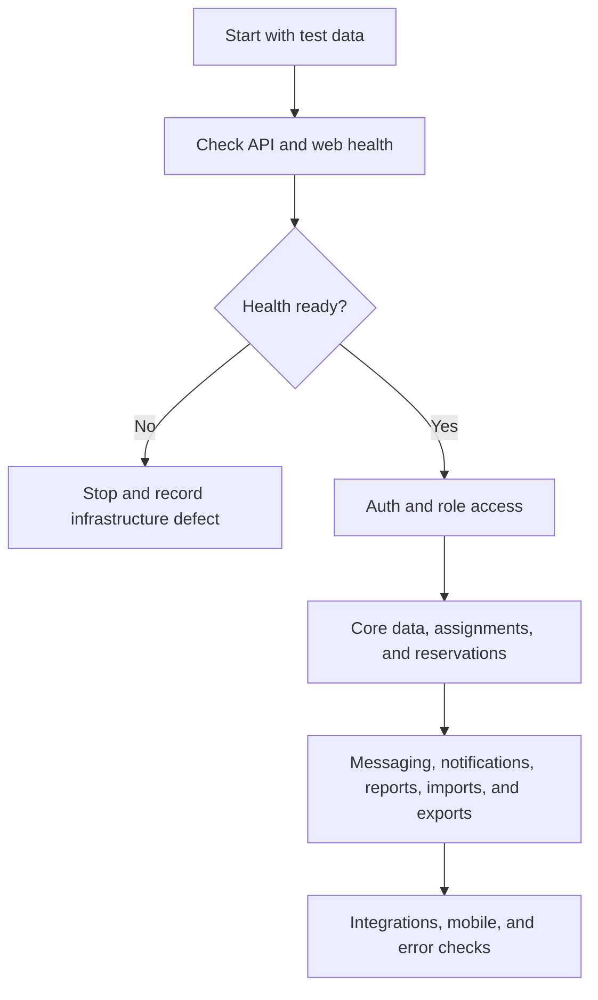

# TrackRoster feature test flow

**Purpose:** production acceptance checklist for the TrackRoster web app and API.

**How to use:** run the flow from top to bottom with synthetic accounts. Mark `[x]` only after the expected result is visible in the UI and the API request succeeds. Record the account, workspace, timestamp, and defect reference beside every failure.

**Test date:** ____________________ **Tester:** ____________________ **Environment / URL:** ____________________

**1. Master flow**

**Gate result:** `[ ] Pass` `[ ] Fail` **Defect / notes:** ________________________________________________

## 2. Test accounts and data

Create one synthetic workspace with at least two tenants or workspaces, two companies, two prospects, two contacts, one campaign, one territory, and one team. Use separate browser profiles for each role.

| Account / role       | Login tested | Workspace scope        | Expected home              | Result / defect |
| -------------------- | ------------ | ---------------------- | -------------------------- | --------------- |
| Super administrator  | `[ ]`        | Platform               | Platform overview / health |                 |
| Client administrator | `[ ]`        | Whole client workspace | Admin overview             |                 |
| Director             | `[ ]`        | Client or region       | Director overview          |                 |
| Manager              | `[ ]`        | Team                   | Manager overview           |                 |
| Prospector           | `[ ]`        | Assigned work          | My day / work queue        |                 |
| Observer / auditor   | `[ ]`        | Read-only oversight    | Observer overview / audit  |                 |

## 3. Environment and authentication

| Check                                      | Expected result                                           |    OK | Evidence / defect |
| ------------------------------------------ | --------------------------------------------------------- | ----: | ----------------- |
| API `GET /health`                          | HTTP 200 and `status: ok`                                 | `[ ]` |                   |
| API `GET /health/ready`                    | HTTP 200; PostgreSQL and Redis are up                     | `[ ]` |                   |
| Web application                            | Login page loads without console error                    | `[ ]` |                   |
| Login with valid credentials               | Correct role home opens                                   | `[ ]` |                   |
| Invalid password                           | Clear error; no session created                           | `[ ]` |                   |
| Logout                                     | Session is cleared and protected routes redirect to login | `[ ]` |                   |
| Expired session                            | User is redirected to login and can sign in again         | `[ ]` |                   |
| Workspace picker                           | Only permitted workspaces are shown                       | `[ ]` |                   |
| Invitation acceptance                      | Invite opens, accepts once, and cannot be reused          | `[ ]` |                   |
| MFA challenge / recovery                   | Valid code succeeds; invalid code is rejected             | `[ ]` |                   |
| Profile, language, timezone, notifications | Save, refresh, and re-open retain values                  | `[ ]` |                   |

## 4. Role and authorization matrix

Run each action with every role. A denied action must return a permission error and must not change data.

| Capability                       | Super admin | Client admin | Director | Manager | Prospector | Observer |
| -------------------------------- | :---------: | :----------: | :------: | :-----: | :--------: | :------: |
| View own dashboard               |    `[ ]`    |    `[ ]`     |  `[ ]`   |  `[ ]`  |   `[ ]`    |  `[ ]`   |
| Manage users, roles, and scopes  |    `[ ]`    |    `[ ]`     |  `[ ]`   |  `[ ]`  |   `[ ]`    |  `[ ]`   |
| Manage companies / organizations |    `[ ]`    |    `[ ]`     |  `[ ]`   |  `[ ]`  |   `[ ]`    |  `[ ]`   |
| Create and edit prospects        |    `[ ]`    |    `[ ]`     |  `[ ]`   |  `[ ]`  |   `[ ]`    |  `[ ]`   |
| Assign work to a team            |    `[ ]`    |    `[ ]`     |  `[ ]`   |  `[ ]`  |   `[ ]`    |  `[ ]`   |
| Claim and release reservations   |    `[ ]`    |    `[ ]`     |  `[ ]`   |  `[ ]`  |   `[ ]`    |  `[ ]`   |
| Approve collision overrides      |    `[ ]`    |    `[ ]`     |  `[ ]`   |  `[ ]`  |   `[ ]`    |  `[ ]`   |
| Export data                      |    `[ ]`    |    `[ ]`     |  `[ ]`   |  `[ ]`  |   `[ ]`    |  `[ ]`   |
| View audit / observer pages      |    `[ ]`    |    `[ ]`     |  `[ ]`   |  `[ ]`  |   `[ ]`    |  `[ ]`   |

**Negative test:** change the URL or ID to an object from the other tenant. Expected result: `403` or `404`, with no data leak.

## 5. Shared data workflows

### Companies and organizations

- `[ ]` List companies; search, status filters, incomplete profile filter, and name sort all change the visible order.
- `[ ]` Open a company; detail appears in the side panel without leaving the list.
- `[ ]` Edit name, short name, status, phone, email, website, sectors, and coordination rules.
- `[ ]` Save; the form closes, the list and detail refresh, and values survive a hard refresh.
- `[ ]` Clear optional fields; cleared values remain empty after refresh.
- `[ ]` Open the same company in two sessions; the second save returns a conflict with a latest-data recovery path. Reload, keep edits, save again, and verify the change is stored.
- `[ ]` Create and archive a company; archived status and filtering remain correct.

### Prospects, contacts, addresses, and consent

- `[ ]` Search and filter prospects; open a prospect detail page.
- `[ ]` Edit a prospect field; save; verify the record, list, and timestamp update without a manual page reload.
- `[ ]` Add, edit, clear, and remove a contact.
- `[ ]` Add, edit, and remove an address; verify region and postal-code validation.
- `[ ]` Record phone, email, SMS, and visit permissions; verify blocked channels cannot be used.
- `[ ]` Add and remove tags and custom fields.
- `[ ]` Archive and restore a prospect; verify it moves between active and archived views.
- `[ ]` Repeat the two-session conflict test and verify changed fields are preserved only after explicit review.

### Campaigns, teams, territories, and assignments

- `[ ]` Create, edit, activate, pause, and close a campaign.
- `[ ]` Add or remove campaign members, companies, prospects, and territories.
- `[ ]` Create and edit a team; add and suspend a member; verify capacity changes.
- `[ ]` Create a territory and assign it to a team or member.
- `[ ]` Preview an assignment batch; commit it; verify assignment ownership and audit event.
- `[ ]` Reassign or revoke an assignment as an authorized manager; verify a prospector cannot perform it.

## 6. Reservations, collisions, actions, and follow-ups

| Scenario              | Steps                                                     | Expected result                                                    |  OK   |
| --------------------- | --------------------------------------------------------- | ------------------------------------------------------------------ | :---: |
| Reservation claim     | Two prospectors claim the same establishment at once      | Exactly one succeeds; the other receives a stable conflict result  | `[ ]` |
| Reservation heartbeat | Keep a reservation open, then refresh                     | Lock remains until expiry or release                               | `[ ]` |
| Release / expiry      | Release or wait for expiry                                | Establishment becomes available again                              | `[ ]` |
| Cooldown              | Contact a company, then try another contact too soon      | Rule blocks or delays according to settings                        | `[ ]` |
| Consent block         | Mark a channel as refused, then attempt contact           | Channel is blocked and reason is visible                           | `[ ]` |
| Manager override      | Prospector requests override; manager approves or rejects | Decision is audited and policy is enforced                         | `[ ]` |
| Action logging        | Start, edit, complete, and correct an action              | Timeline is appended; historical meaning is not silently rewritten | `[ ]` |
| Follow-up             | Schedule, reschedule, complete, and cancel a follow-up    | Dates, overdue state, and notifications update                     | `[ ]` |
| Dashboard             | Complete activity as prospector and manager               | Counters and performance views reflect the change                  | `[ ]` |

## 7. Messaging and notifications

- `[ ]` Create a direct and team conversation.
- `[ ]` Confirm the selected conversation row, thread header, and participant panel use the same contact name.
- `[ ]` Send, edit, and delete a message where permitted.
- `[ ]` Upload an attachment; verify the message and attachment state after refresh.
- `[ ]` Mark a conversation read; unread and waiting counts update.
- `[ ]` Mute and unmute a conversation; verify the setting persists.
- `[ ]` Confirm the message composer sends on Enter and inserts a newline on Shift+Enter.
- `[ ]` Confirm removed per-message emoji, reply, and three-dot controls are absent.
- `[ ]` Open notifications; mark one and all as read; verify counts update.
- `[ ]` Trigger a permission, assignment, follow-up, and collision notification; verify the correct recipients.

## 8. Imports, exports, reports, maps, and integrations

- `[ ]` Upload a valid CSV/XLSX; map columns; preview; resolve duplicates; finalize; verify created and updated rows.
- `[ ]` Upload malformed data; verify row-level issues and that finalization is blocked until resolved.
- `[ ]` Repeat import finalization; verify idempotency and no duplicate records.
- `[ ]` Create an export with filters; preview scope; start job; download file; verify tenant and role restrictions.
- `[ ]` Open manager reports: overview, workload, actions, funnel, conversions, follow-ups, coverage, collisions, data quality, territories, and forecast.
- `[ ]` Open map and route pages; verify markers, territory scope, route stops, start, complete, and stop updates.
- `[ ]` Configure an integration; run connection test and sync; verify success or a clear provider error.
- `[ ]` Schedule a report; verify delivery history and the expected provider configuration.

## 9. Admin settings and operational pages

- `[ ]` Rules and settings: contact reservations, objectives, and workspace tabs load.
- `[ ]` Change a rule or objective; save; refresh; verify persistence and unsaved-change handling.
- `[ ]` Audit log records create, update, delete, assignment, reservation, override, import, export, and permission events.
- `[ ]` Imports, scripts and emails, companies, users, roles, and access scopes are reachable only by authorized roles.
- `[ ]` Error state: stop the API or use an invalid request; UI shows a retry message and does not lose entered form values.
- `[ ]` Loading state: slow the network; skeletons appear and controls do not double-submit.

## 10. Responsive and browser checks

| Viewport           | Critical paths                                                |  OK   | Notes |
| ------------------ | ------------------------------------------------------------- | :---: | ----- |
| 1440 × 900 desktop | Login, company edit, prospect edit, messaging, import, export | `[ ]` |       |
| 1024 × 768 tablet  | Navigation collapse, tables, drawers, forms                   | `[ ]` |       |
| 390 × 844 phone    | Login, work queue, prospect action, reservation, messaging    | `[ ]` |       |
| Safari             | Auth, forms, uploads, downloads                               | `[ ]` |       |
| Chrome             | Auth, forms, uploads, downloads                               | `[ ]` |       |
| Firefox / Edge     | Auth, forms, uploads, downloads                               | `[ ]` |       |

## 11. Release evidence and sign-off

Record the exact build and service evidence:

- Git commit: ____________________
- API build / typecheck: `[ ]` API integration tests: `[ ]`
- Web build / typecheck: `[ ]` Web smoke test: `[ ]`
- Migration applied: `[ ]` Migration command / release log: ____________________
- Render deployment: `[ ]` deployment ID: ____________________
- Vercel deployment: `[ ]` deployment ID: ____________________
- Production `/health`: `[ ]` Production `/health/ready`: `[ ]`
- Critical defects open: `[ ]` none `[ ]` listed here: ____________________

**Final decision:** `[ ]` Approved `[ ]` Approved with known defects `[ ]` Rejected

**Tester signature:** ____________________ **Reviewer signature:** ____________________ **Date:** ____________________
